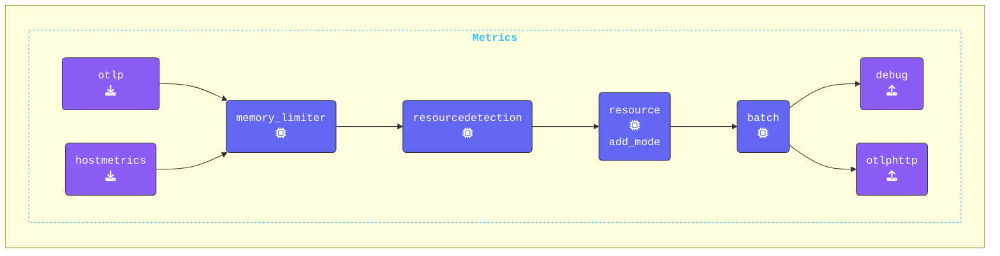

{}

**`otlphttp` exporterを追加する**: [**OTLP/HTTP Exporter**](https://help.splunk.com/en/splunk-observability-cloud/manage-data/splunk-distribution-of-the-opentelemetry-collector/get-started-with-the-splunk-distribution-of-the-opentelemetry-collector/collector-components/exporters/otlphttp-exporter) は、**OTLP/HTTP** プロトコルを使用してagentからgatewayにデータを送信するために使用されます。

1. **Agentターミナル** ウィンドウに切り替えます。
2. 新しく生成された `gateway-logs.out`、`gateway-metrics.out`、`gateway-traces.out` がディレクトリに存在することを確認します。
3. エディタで `agent.yaml` ファイルを開きます。
4. `exporters:` セクションに `otlphttp` exporterの設定を追加します:

```yaml
  otlphttp:                            # Exporter Type
    endpoint: "http://localhost:5318"  # Gateway OTLP endpoint
```

**Batch Processorの設定を追加する**: [**Batch Processor**](https://github.com/open-telemetry/opentelemetry-collector/blob/main/processor/batchprocessor/README.md) は、span、metrics、またはlogsを受け取り、それらをバッチにまとめます。バッチ化することで、データをより効率的に圧縮し、データ送信に必要な送信接続の数を減らすことができます。すべてのcollectorでbatch processorを設定することが強く推奨されます。

1. `processors:` セクションに `batch` processorの設定を追加します:

```yaml
  batch:                               # Processor Type
```

**Pipelinesを更新する**:

1. **Hostmetrics Receiverを有効化**:
    - `metrics` pipelineに `hostmetrics` を追加します。[**HostMetrics Receiver**](https://github.com/open-telemetry/opentelemetry-collector-contrib/tree/main/receiver/hostmetricsreceiver#readme) は、現在の設定では1時間に1回ホストCPUメトリクスを生成します。
2. **Batch Processorを有効化**:
    - `traces`、`metrics`、`logs` pipelineに（`resource/add_mode` processorの後に）`batch` processorを追加します。
3. **OTLPHTTP Exporterを有効化**:
    - `traces`、`metrics`、`logs` pipelineに `otlphttp` exporterを追加します。

```yaml
  pipelines:
    traces:
      receivers:
      - otlp                           # OTLP Receiver
      processors:
      - memory_limiter                 # Memory Limiter processor
      - resourcedetection              # Add system attributes to the data
      - resource/add_mode              # Add collector mode metadata
      - batch                          # Batch processor
      exporters:
      - debug                          # Debug Exporter
      - file                           # File Exporter
      - otlphttp                       # OTLP/HTTP Exporter
    metrics:
      receivers:
      - otlp
      - hostmetrics                    # Host Metrics Receiver
      processors:
      - memory_limiter
      - resourcedetection
      - resource/add_mode
      - batch
      exporters:
      - debug
      - otlphttp
    logs:
      receivers:
      - otlp
      processors:
      - memory_limiter
      - resourcedetection
      - resource/add_mode
      - batch
      exporters:
      - debug
      - otlphttp
```

{}

**[otelbin.io](https://www.otelbin.io/)** を使用してagentの設定を検証します。参考までに、pipelinesの `metrics:` セクションは次のようになります:


