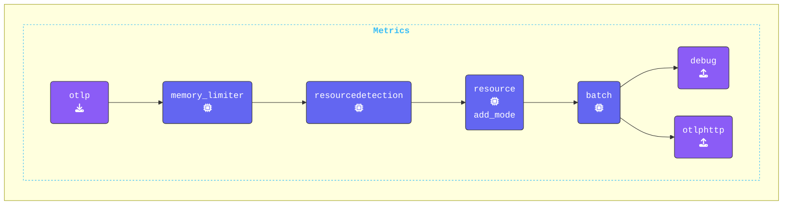

この演習では、`agent.yaml` ファイルの `extensions:` セクションを更新します。このセクションは OpenTelemetry の設定 YAML の一部であり、OpenTelemetry Collector の挙動を拡張または変更するオプションコンポーネントを定義します。

これらのコンポーネントはテレメトリデータを直接処理するわけではありませんが、Collector の機能を強化する有用な機能やサービスを提供します。

{}

**`agent.yaml` の更新**: **Agent ターミナル** ウィンドウで、`file_storage` エクステンションを追加し、`checkpoint` という名前を付けます。

```yaml
  file_storage/checkpoint:             # Extension Type/Name
    directory: "./checkpoint-dir"      # Define directory
    create_directory: true             # Create directory
    timeout: 1s                        # Timeout for file operations
    compaction:                        # Compaction settings
      on_start: true                   # Start compaction at Collector startup
      # Define compaction directory
      directory: "./checkpoint-dir/tmp"
      max_transaction_size: 65536      # Max. size limit before compaction occurs
```

**既存の `otlphttp` エクスポーターに `file_storage` を追加**: `otlphttp:` エクスポーターを変更してリトライおよびキューイングのメカニズムを設定し、障害発生時にデータを保持して再送できるようにします。

```yaml
  otlphttp: 
    endpoint: "http://localhost:5318"
    retry_on_failure:
      enabled: true                    # Enable retry on failure
    sending_queue:                     # 
      enabled: true                    # Enable sending queue
      num_consumers: 10                # No. of consumers
      queue_size: 10000                # Max. queue size
      storage: file_storage/checkpoint # File storage extension
```

**`services` セクションの更新**: 既存の `extensions:` セクションに `file_storage/checkpoint` エクステンションを追加します。これによりエクステンションが有効になります。

```yaml
service:
  extensions:
  - health_check
  - file_storage/checkpoint            # Enabled extensions for this collector
```

**`metrics` パイプラインの更新**: この演習では、デバッグやログのノイズを減らすために、Metrics パイプラインから `hostmetrics` レシーバーを削除します。

```yaml
    metrics:
      receivers:
      - otlp
      # - hostmetrics                  # Hostmetrics Receiver
```

{}

**[otelbin.io](https://www.otelbin.io/)** を使って `agent` の設定を検証してください。参考までに、パイプラインの `metrics:` セクションは以下のようになります。


