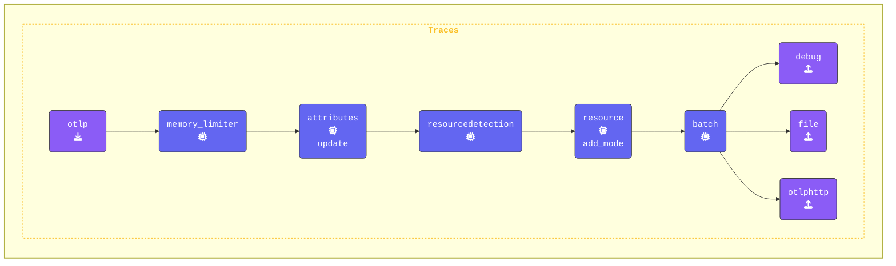

このステップでは、`agent.yaml` を変更して `attributes` プロセッサーと `redaction` プロセッサーを追加します。これらのプロセッサーは、スパン属性内の機密データがログ出力やエクスポートされる前に適切に処理されるようにするために役立ちます。

これまでに、コンソールに表示されるスパン属性の一部に個人情報や機密データが含まれていることに気付いたかもしれません。次は、これらの情報を効果的にフィルタリングおよび編集（redact）するために必要なプロセッサーを設定します。

```text
<snip>
Attributes:
     -> user.name: Str(George Lucas)
     -> user.phone_number: Str(+1555-867-5309)
     -> user.email: Str(george@deathstar.email)
     -> user.account_password: Str(LOTR>StarWars1-2-3)
     -> user.visa: Str(4111 1111 1111 1111)
     -> user.amex: Str(3782 822463 10005)
     -> user.mastercard: Str(5555 5555 5555 4444)
  {"kind": "exporter", "data_type": "traces", "name": "debug"}
```

{}

**Agent terminal** ウィンドウに切り替え、エディタで `agent.yaml` ファイルを開きます。テレメトリデータのセキュリティとプライバシーを強化するために、Attributes Processor と Redaction Processor の 2 つのプロセッサーを追加します。

**`attributes` プロセッサーの追加**: [**Attributes Processor**](https://github.com/open-telemetry/opentelemetry-collector-contrib/tree/main/processor/attributesprocessor) を使用すると、スパン属性（タグ）の値を更新、削除、ハッシュ化することで変更できます。これは、エクスポートされる前に機密情報を難読化する際に特に有用です。

このステップでは、以下を行います:

1. `user.phone_number` 属性を静的な値 `("UNKNOWN NUMBER")` に **Update** します。
2. `user.email` 属性を **Hash** 化して、元のメールアドレスが露出しないようにします。
3. `user.password` 属性を **Delete** して、スパンから完全に削除します。

```yaml
  attributes/update:
    actions:                           # Actions
      - key: user.phone_number         # Target key
        action: update                 # Update action
        value: "UNKNOWN NUMBER"        # New value
      - key: user.email                # Target key
        action: hash                   # Hash the email value
      - key: user.password             # Target key
        action: delete                 # Delete the password
  ```

**`redaction` プロセッサーの追加**: [**The Redaction Processor**](https://github.com/open-telemetry/opentelemetry-collector-contrib/tree/main/processor/redactionprocessor) は、クレジットカード番号やその他の個人を特定できる情報（PII）など、定義済みのパターンに基づいてスパン属性内の機密データを検出して編集（redact）します。

このステップでは、以下のように設定します:

- `allow_all_keys: true` を設定して、すべての属性が処理されるようにします（`false` に設定した場合、明示的に許可されたキーのみが保持されます）。

- `blocked_values` に正規表現を定義して、**Visa** および **MasterCard** のクレジットカード番号を検出して編集（redact）します。

- `summary: debug` オプションは、デバッグ目的で編集（redaction）処理に関する詳細情報をログに記録します。

```yaml
  redaction/redact:
    allow_all_keys: true               # If false, only allowed keys will be retained
    blocked_values:                    # List of regex patterns to block
      - '\b4[0-9]{3}[\s-]?[0-9]{4}[\s-]?[0-9]{4}[\s-]?[0-9]{4}\b'       # Visa
      - '\b5[1-5][0-9]{2}[\s-]?[0-9]{4}[\s-]?[0-9]{4}[\s-]?[0-9]{4}\b'  # MasterCard
    summary: debug                     # Show debug details about redaction
```

**`traces` パイプラインの更新**: 両方のプロセッサーを `traces` パイプラインに統合します。最初は redaction プロセッサーをコメントアウトしておくようにしてください（後の別の演習で有効化します）:

> [!NOTE]
> この演習では `redaction/redact` プロセッサーをコメントアウトしたままにしておいてください。今後の演習で有効化します。

```yaml
    traces:
      receivers:
      - otlp
      processors:
      - memory_limiter
      - attributes/update              # Update, hash, and remove attributes
      #- redaction/redact               # Redact sensitive fields using regex
      - resourcedetection
      - resource/add_mode
      - batch
      exporters:
      - debug
      - file
      - otlphttp
```

{}

**[otelbin.io](https://www.otelbin.io/)** を使用してエージェント設定を検証します。参考までに、パイプラインの `traces:` セクションは次のようになります:


