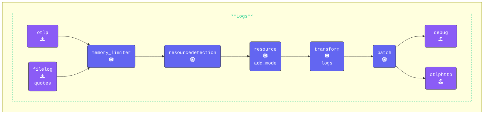

{}
**`transform` プロセッサーの追加**: **Agent terminal** ウィンドウに切り替えて `agent.yaml` を編集し、以下の `transform` プロセッサーを追加します。

```yaml
  transform/logs:                      # Processor Type/Name
    log_statements:                    # Log Processing Statements
      - context: resource              # Log Context
        statements:                    # List of attribute keys to keep
          - keep_keys(attributes, ["com.splunk.sourcetype", "host.name", "otelcol.service.mode"])
```

`-context: resource` キーを使用することで、ログの `resourceLog` 属性を対象としています。

この設定により、関連するリソース属性（`com.splunk.sourcetype`、`host.name`、`otelcol.service.mode`）のみが保持され、ログの効率が向上し、不要なメタデータが削減されます。

**ログ重大度マッピングのためのコンテキストブロックの追加**: ログレコードの `severity_text` および `severity_number` フィールドを適切に設定するために、`log_statements` 内に `log` コンテキストブロックを追加します。この設定では、ログ本文から `level` 値を抽出し、`severity_text` にマッピングして、ログレベルに対応する `severity_number` を割り当てます。

```yaml
      - context: log                   # Log Context
        statements:                    # Transform Statements Array
          - set(cache, ParseJSON(body)) where IsMatch(body, "^\\{")  # Parse JSON log body into a cache object
          - flatten(cache, "")                                        # Flatten nested JSON structure
          - merge_maps(attributes, cache, "upsert")                   # Merge cache into attributes, updating existing keys
          - set(severity_text, attributes["level"])                   # Set severity_text from the "level" attribute
          - set(severity_number, 1) where severity_text == "TRACE"    # Map severity_text to severity_number
          - set(severity_number, 5) where severity_text == "DEBUG"
          - set(severity_number, 9) where severity_text == "INFO"
          - set(severity_number, 13) where severity_text == "WARN"
          - set(severity_number, 17) where severity_text == "ERROR"
          - set(severity_number, 21) where severity_text == "FATAL"
```

`merge_maps` 関数は、2つのマップ（ディクショナリ）を1つに結合するために使用されます。ここでは、`cache` オブジェクト（ログ本文から解析された JSON データを含む）を `attributes` マップにマージします。

- **パラメータ**:
  - `attributes`: データがマージされる対象のマップです。
  - `cache`: 解析された JSON データを含むソースマップです。
  - `"upsert"`: このモードでは、`attributes` マップ内にキーが既に存在する場合、その値が `cache` の値で更新されます。キーが存在しない場合は挿入されます。

このステップは非常に重要で、ログ本文に含まれるすべての関連フィールド（例: `level`、`message` など）が `attributes` マップに追加され、後続の処理やエクスポートで利用可能になることを保証します。

**主な変換処理のまとめ**:

- **JSON の解析**: ログ本文から構造化データを抽出します。
- **JSON のフラット化**: ネストされた JSON オブジェクトをフラットな構造に変換します。
- **属性のマージ**: 抽出したデータをログの属性に統合します。
- **重大度テキストのマッピング**: ログの level 属性から severity_text を割り当てます。
- **重大度番号の割り当て**: 重大度レベルを標準化された数値に変換します。

最終的に、`resource` 用と `log` 用の2つのコンテキストブロックを含む **1つの** `transform` プロセッサーが構成されている必要があります。

この設定により、ログの重大度が正しく抽出、標準化、構造化され、効率的な処理が可能になります。

{}
すべての JSON フィールドをトップレベル属性にマッピングするこの方法は、**OTTL のテストとデバッグ** にのみ使用してください。本番環境のシナリオでは高カーディナリティを引き起こします。
{}

**`logs` パイプラインの更新**: `transform/logs:` プロセッサーを `logs:` パイプラインに追加します。

```yaml
    logs:
      receivers:
      - otlp
      - filelog/quotes
      processors:
      - memory_limiter
      - resourcedetection
      - resource/add_mode
      - transform/logs                 # Transform logs processor
      - batch
      exporters:
      - debug
      - otlphttp
```

{}

[**https://otelbin.io**](https://otelbin.io/) を使用してエージェント設定を検証します。参考までに、パイプラインの `logs:` セクションは以下のようになります。


