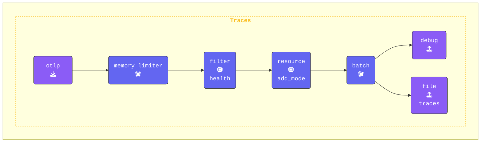

{}

**Gateway terminal** ウィンドウに切り替え、`gateway.yaml` ファイルを開きます。`processors` セクションを以下の設定で更新します。

1. **`filter` プロセッサーを追加する**:  
   `/_healthz` という名前の span を除外するように gateway を構成します。`error_mode: ignore` ディレクティブは、フィルタリング中に発生したエラーを無視することを保証し、パイプラインがスムーズに実行され続けるようにします。`traces` セクションでは、フィルタリングルールを定義し、特に `/_healthz` という名前の span を除外対象としています。

   ```yaml
     filter/health:                       # Defines a filter processor
       error_mode: ignore                 # Ignore errors
       traces:                            # Filtering rules for traces
         span:                            # Exclude spans named "/_healthz"
          - 'name == "/_healthz"'
   ```

2. **`filter` プロセッサーを `traces` パイプラインに追加する**:  
   `filter/health` プロセッサーを `traces` パイプラインに含めます。最適なパフォーマンスを得るために、フィルターはできるだけ早い段階、つまり `memory_limiter` の直後、`batch` プロセッサーの前に配置します。設定は以下のようになります。

   ```yaml
     traces:
       receivers:
         - otlp
       processors:
         - memory_limiter
         - filter/health             # Filters data based on rules
         - resource/add_mode
         - batch
       exporters:
         - debug
         - file/traces
   ```

この設定により、ヘルスチェック関連の span (`/_healthz`) がパイプラインの早い段階でフィルタリングされ、テレメトリーデータ内の不要なノイズが削減されます。

{}

**[otelbin.io](https://www.otelbin.io/)** を使用して agent の構成を検証します。参考までに、パイプラインの `traces:` セクションは以下のようになります。


