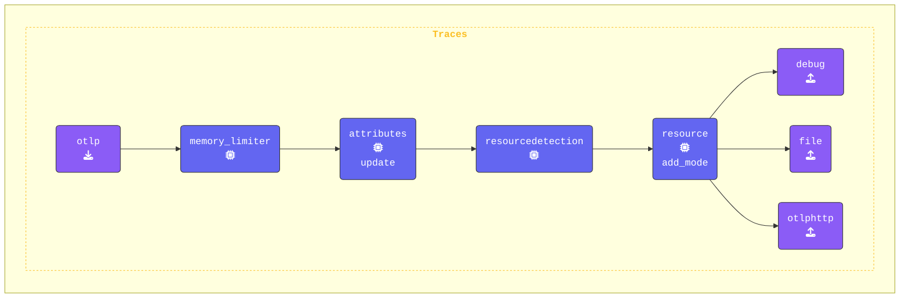

このステップでは、`agent.yaml` を変更して `attributes` プロセッサーと `redaction` プロセッサーを追加します。これらのプロセッサーは、スパン属性内の機密データがログ出力やエクスポートされる前に、適切に処理されるようにするのに役立ちます。

これまでに、コンソールに表示されるスパン属性の中に、個人情報や機密データが含まれていることに気づいたかもしれません。ここでは、これらの情報を効果的にフィルタリングしたり、編集 (redact) したりするために必要なプロセッサーを設定していきます。

```text
Attributes:
     -> user.name: Str(George Lucas)
     -> user.phone_number: Str(+1555-867-5309)
     -> user.email: Str(george@deathstar.email)
     -> user.account_password: Str(LOTR>StarWars1-2-3)
     -> user.visa: Str(4111 1111 1111 1111)
     -> user.amex: Str(3782 822463 10005)
     -> user.mastercard: Str(5555 5555 5555 4444)
  {"kind": "exporter", "data_type": "traces", "name": "debug"}
```

{}

**Agent ターミナル** ウィンドウに切り替えて、エディターで `agent.yaml` ファイルを開きます。テレメトリーデータのセキュリティとプライバシーを強化するため、2 つのプロセッサーを追加します。

**1. `attributes` プロセッサーの追加**: [**Attributes Processor**](https://github.com/open-telemetry/opentelemetry-collector-contrib/tree/main/processor/attributesprocessor) は、スパン属性 (タグ) の値を更新、削除、ハッシュ化することで変更できます。これは、機密情報をエクスポート前に難読化する場合に特に役立ちます。

このステップでは、以下のことを行います。

1. `user.phone_number` 属性を、固定値 `("UNKNOWN NUMBER")` に **更新** します。
2. `user.email` 属性を **ハッシュ化** して、元のメールアドレスが露出しないようにします。
3. `user.password` 属性を **削除** して、スパンから完全に取り除きます。

```yaml
  attributes/update:
    actions:                           # Actions
      - key: user.phone_number         # Target key
        action: update                 # Update action
        value: "UNKNOWN NUMBER"        # New value
      - key: user.email                # Target key
        action: hash                   # Hash the email value
      - key: user.password             # Target key
        action: delete                 # Delete the password
  ```

**2. `redaction` プロセッサーの追加**: [**Redaction Processor**](https://github.com/open-telemetry/opentelemetry-collector-contrib/tree/main/processor/redactionprocessor) は、クレジットカード番号やその他の個人を特定できる情報 (PII) などの事前定義されたパターンに基づいて、スパン属性内の機密データを検出し、編集 (redact) します。

このステップでは、以下を行います。

- すべての属性が処理されるように `allow_all_keys: true` を設定します (`false` に設定した場合は、明示的に許可されたキーだけが保持されます)。

- **Visa** および **MasterCard** のクレジットカード番号を検出し編集するための正規表現を、`blocked_values` で定義します。

- `summary: debug` オプションを指定すると、編集処理に関する詳細情報がデバッグ用にログ出力されます。

```yaml
  redaction/redact:
    allow_all_keys: true               # If false, only allowed keys will be retained
    blocked_values:                    # List of regex patterns to block
      - '\b4[0-9]{3}[\s-]?[0-9]{4}[\s-]?[0-9]{4}[\s-]?[0-9]{4}\b'       # Visa
      - '\b5[1-5][0-9]{2}[\s-]?[0-9]{4}[\s-]?[0-9]{4}[\s-]?[0-9]{4}\b'  # MasterCard
    summary: debug                     # Show debug details about redaction
```

**`traces` パイプラインを更新する**: 両方のプロセッサーを `traces` パイプラインに統合します。最初は redaction プロセッサーをコメントアウトしておくことを忘れないでください (後の別の演習で有効化します)。設定は以下のようになります。

```yaml
    traces:
      receivers:
      - otlp
      processors:
      - memory_limiter
      - attributes/update              # Update, hash, and remove attributes
      #- redaction/redact               # Redact sensitive fields using regex
      - resourcedetection
      - resource/add_mode
      - batch
      exporters:
      - debug
      - file
      - otlphttp
```

{}

**[otelbin.io](https://www.otelbin.io/)** を使用して、エージェントの設定を検証します。参考までに、パイプラインの `traces:` セクションは以下のようになります。


