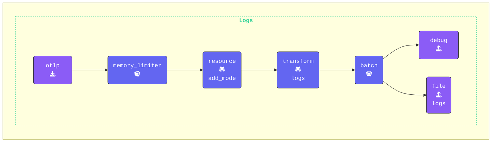

{}
**`transform` プロセッサーを追加する**: **Gateway terminal** ウィンドウに切り替えて `gateway.yaml` を編集し、以下の `transform` プロセッサーを追加します。

```yaml
  transform/logs:                      # Processor Type/Name
    log_statements:                    # Log Processing Statements
      - context: resource              # Log Context
        statements:                    # List of attribute keys to keep
          - keep_keys(attributes, ["com.splunk.sourcetype", "host.name", "otelcol.service.mode"])
```

`-context: resource` キーを使うことで、ログの `resourceLog` 属性を対象としています。

この設定により、関連するリソース属性（`com.splunk.sourcetype`、`host.name`、`otelcol.service.mode`）のみが保持され、ログの効率が向上し、不要なメタデータが削減されます。

**ログ重要度マッピング用のコンテキストブロックを追加する**: ログレコードの `severity_text` および `severity_number` フィールドを適切に設定するため、`log_statements` 内に `log` コンテキストブロックを追加します。この設定では、ログ本文から `level` 値を抽出して `severity_text` にマッピングし、ログレベルに応じて対応する `severity_number` を割り当てます。

```yaml
      - context: log                   # Log Context
        statements:                    # Transform Statements Array
          - set(cache, ParseJSON(body)) where IsMatch(body, "^\\{")  # Parse JSON log body into a cache object
          - flatten(cache, "")                                        # Flatten nested JSON structure
          - merge_maps(attributes, cache, "upsert")                   # Merge cache into attributes, updating existing keys
          - set(severity_text, attributes["level"])                   # Set severity_text from the "level" attribute
          - set(severity_number, 1) where severity_text == "TRACE"    # Map severity_text to severity_number
          - set(severity_number, 5) where severity_text == "DEBUG"
          - set(severity_number, 9) where severity_text == "INFO"
          - set(severity_number, 13) where severity_text == "WARN"
          - set(severity_number, 17) where severity_text == "ERROR"
          - set(severity_number, 21) where severity_text == "FATAL"
```

`merge_maps` 関数は、2つのマップ（辞書）を1つに結合するために使用します。ここでは、`cache` オブジェクト（ログ本文から解析された JSON データを含む）を `attributes` マップに結合します。

- **パラメータ**:
  - `attributes`: データの結合先となるターゲットマップ。
  - `cache`: 解析された JSON データを含むソースマップ。
  - `"upsert"`: このモードでは、`attributes` マップ内に既に存在するキーがあれば、その値が `cache` の値で更新されます。キーが存在しない場合は新たに挿入されます。

このステップは重要です。なぜなら、ログ本文の関連フィールド（例: `level`、`message` など）がすべて `attributes` マップに追加され、後続の処理やエクスポートで利用できるようになるためです。

**主要な変換処理のまとめ**:

- **Parse JSON**: ログ本文から構造化データを抽出します。
- **Flatten JSON**: ネストされた JSON オブジェクトをフラットな構造に変換します。
- **Merge Attributes**: 抽出されたデータをログ属性に統合します。
- **Map Severity Text**: ログの level 属性から severity_text を割り当てます。
- **Assign Severity Numbers**: 重要度レベルを標準化された数値に変換します。

> [!IMPORTANT]
> `transform` プロセッサーは **1つだけ** 持ち、その中に2つのコンテキストブロック（一方は `resource` 用、もう一方は `log` 用）を含める必要があります。

この設定により、ログの重要度が正しく抽出、標準化、構造化され、効率的な処理が可能になります。

{}
すべての JSON フィールドをトップレベル属性にマッピングするこの方法は、**OTTL のテストおよびデバッグ目的のみ** で使用してください。本番環境では高カーディナリティを引き起こします。
{}

**`logs` パイプラインを更新する**: `logs:` パイプラインに `transform/logs:` プロセッサーを追加し、設定が以下のようになるようにします。

```yaml
    logs:                         # Logs pipeline
      receivers:
      - otlp                      # OTLP receiver
      processors:                 # Processors for logs
      - memory_limiter
      - resource/add_mode
      - transform/logs
      - batch
      exporters:
      - debug                     # Debug exporter
      - file/logs
```

{}

エージェントの設定を [**https://otelbin.io**](https://otelbin.io/) で検証してください。参考までに、パイプラインの `logs:` セクションは以下のようになります。


