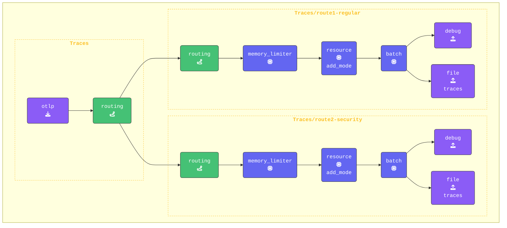

{}

**元の `traces` パイプラインをルーティングを使用するように更新します**:

1. `routing` を有効にするため、元の `traces` パイプラインを更新して `routing` を唯一のエクスポーターとして使用します。これにより、すべてのスパンデータが評価のために **Routing Connector** を通過し、その後接続されたパイプラインへ送られます。また、**すべての** プロセッサーを削除し、空の配列（`[]`）に置き換えます。これらは `traces/route1-regular` および `traces/route2-security` パイプラインで処理され、それぞれのルートでカスタムの動作を実現できるようになります。`traces:` の構成は以下のようになります:

    ```yaml
    traces:                       # Traces pipeline
      receivers:
      - otlp                      # OTLP receiver
      processors: []              # Processors for traces
      exporters:
      - routing
    ```

**既存の `traces` パイプラインの下に、`route1-regular` と `route2-security` の両方のトレースパイプラインを追加します**:

1. **Route1-regular パイプラインを構成する**: このパイプラインは、コネクター内のルーティングテーブルで **一致しなかった** すべてのスパンを処理します。
これは唯一のレシーバーとして `routing` を使用しており、元のトレースパイプラインから `connection` を通じてデータを受け取る点に注目してください。

    ```yaml
        traces/route1-regular:         # Default pipeline for unmatched spans
          receivers: 
          - routing                    # Receive data from the routing connector
          processors:
          - memory_limiter             # Memory Limiter Processor
          - resource/add_mode          # Adds collector mode metadata
          - batch
          exporters:
          - debug                      # Debug Exporter 
          - file/traces/route1-regular # File Exporter for unmatched spans 
    ```

2. **route2-security パイプラインを追加する**: このパイプラインは、ルーティングルール `"[deployment.environment"] == "security-applications"` に一致するすべてのスパンを処理します。このパイプラインもレシーバーとして `routing` を使用します。このパイプラインを `traces/route1-regular` の下に追加してください。

    ```yaml
        traces/route2-security:         # Default pipeline for unmatched spans
          receivers: 
          - routing                     # Receive data from the routing connector
          processors:
          - memory_limiter              # Memory Limiter Processor
          - resource/add_mode           # Adds collector mode metadata
          - batch
          exporters:
          - debug                       # Debug exporter
          - file/traces/route2-security # File exporter for unmatched spans
    ```

{}

エージェント構成を **[otelbin.io](https://www.otelbin.io/)** で検証します。参考として、パイプラインの `traces:` セクションは以下のようになります:


