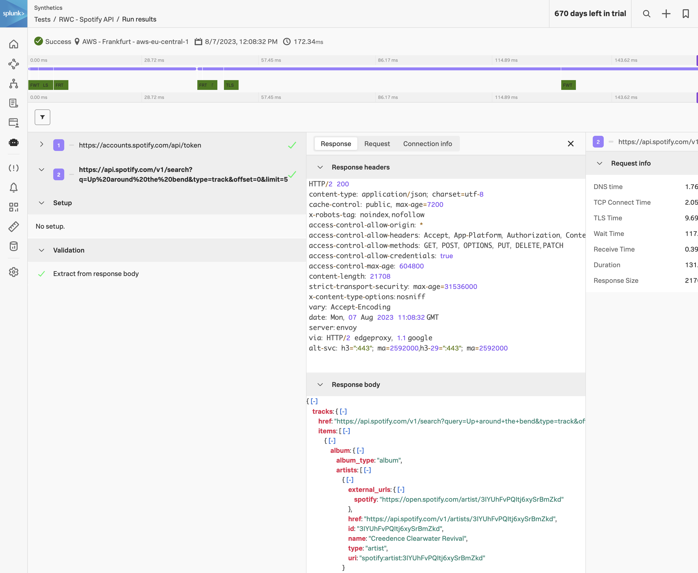

**API Test** は、APIエンドポイントの機能とパフォーマンスを柔軟に確認する手段を提供します。API ファースト開発へのシフトによって、コアとなるフロントエンド機能を支えるバックエンドサービスを監視する必要性は一層高まりました。Real Browser Test でリグレッションが顕在化したころには、その背後にある API はすでにしばらく前から壊れていることがよくあります。

複数ステップにわたる API 連携をテストしたい場合でも、個々のエンドポイントのパフォーマンスを可視化したい場合でも、API Test は目的の達成に役立ちます。

## API Test と Real Browser Test の違い

API Test は **ヘッドレス** で動作します。ブラウザも、JavaScript エンジンも、DOM もありません。テストランナーは生の HTTP リクエストを発行し、レスポンスを解析して、それに対して検証ルールを実行します。これには次の3つの実用上の効果があります。

- **1回あたりの実行が安価で高速。** 一般的な API テストの実行は、RBT が要する10〜30秒ではなく、数十〜数百ミリ秒で完了します。これにより高頻度な監視が現実的になり、多くのチームでは重要な API テストを毎分実行しています。
- **レンダリングのシグナルがない。** 何もレンダリングしないため、ペイント時間やレイアウトシフトを計測することはできません。実ユーザーが結果をどう *体験* するかを把握する必要がある場合は、引き続きそのジャーニーをカバーする RBT が必要です。
- **ステップの連結が容易。** あるレスポンスから抽出した変数を次のリクエストで名前指定で参照できるため、「ログイン、ユーザープロファイル取得、アクション実行、結果検証」のような実際のビジネストランザクションを自然にモデリングできます。

## API Test を選ぶべきとき

- **バックエンドの SLO。** サービスが依存する API のエンドポイント可用性とレイテンシ。
- **認証フロー。** OAuth トークン発行、SAML アサーション交換、セッション生成 — いずれも複数ステップで重要であり、ブラウザテストから推測するよりも、明示的に検証する方が容易です。
- **JSON コントラクト検証。** レスポンスに特定のフィールドが含まれていること、配列の要素数が期待どおりであること、値が正規表現に一致することをアサートできます。クライアントに到達する前に、破壊的なスキーマ変更を検知できます。
- **合成ビジネストランザクション。** 実ユーザーが実行する一連の API 呼び出しを、実際にその操作を行う人間がいない場合でも、エンドツーエンドで再現できます。

本章では、公開されている Spotify Web API に対する2ステップの API Test を構築します。最初のステップでは **OAuth 2 Client Credentials** 認証を実行し、レスポンスからベアラートークンを抽出します。2番目のステップではそのトークンを用いて Spotify の検索エンドポイントを呼び出し、最初に一致したトラックの ID を抽出します。「認証 → 認証付きアクション」というこのパターンは、実際のバックエンド監視ユースケースの大部分をカバーします。
