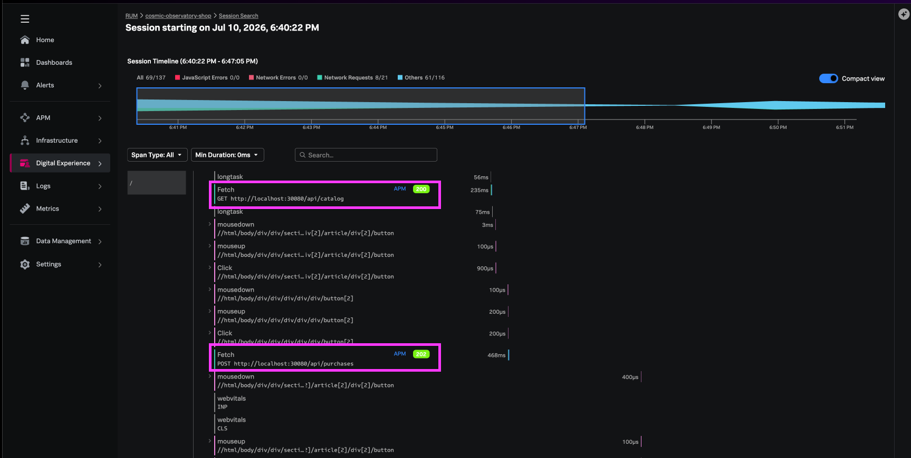

このステップでは、WebアプリケーションからフルフィルメントサービスまでのE2E相関がどのように見えるかを確認します。

## Webアプリケーションからリクエストを生成する

### 新しいWebリクエストを送信する

1. http://(your-instance-url)):30080 を開きます
2. Buy now → Confirm & place order をクリックします

{}
**traceIDをコピーしてください** - 次のステップでAPM E2E相関を検証するために使用します
{}

## Splunk RUMで確認する

1. **Digital Experience → Session Search** に移動します
2. セッションを見つけます（environment `workshop-context-prop`）
3. セッションタイムラインをクリックします
4. `purchases` fetchイベントを選択します
5. 以下を確認します
   - レスポンスタイムが表示されていること
   - **Backend Trace** リンクがAPMに遷移すること
   - Trace IDがブラウザの `traceparent` ヘッダーと一致すること

