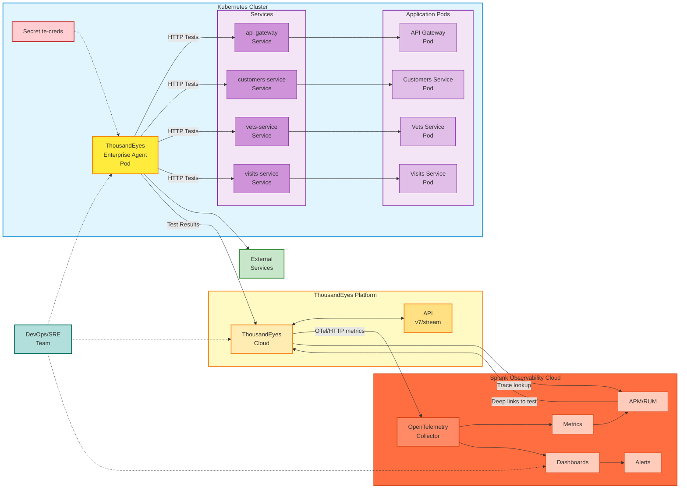

## ThousandEyes エージェントの種類

### Enterprise Agents

Enterprise Agents は、自社インフラ内に展開するソフトウェアベースの監視エージェントです。次の機能を提供します。

- **インサイドアウトの可視性**: 内部ネットワークから外部サービスへの監視・テストを実施
- **配置のカスタマイズ性**: ユーザーやアプリケーションの存在する場所に展開可能
- **完全なテスト機能**: HTTP、ネットワーク、DNS、音声などのテストタイプに対応
- **常時稼働の監視**: スケジュールされたテストを継続的に実行するエージェント

このワークショップでは、Enterprise Agent をコンテナ化されたワークロードとして Kubernetes クラスター内に展開します。

### Endpoint Agents

Endpoint Agents は、エンドユーザーのデバイス（ノートパソコンやデスクトップ）にインストールする軽量なエージェントです。次の機能を提供します。

- **実ユーザー視点**: 実際のユーザー端末からの監視
- **ブラウザベースの監視**: 実ユーザーエクスペリエンスのメトリクスを取得
- **セッションデータ**: ユーザー視点でのアプリケーションパフォーマンスの詳細な洞察

このワークショップでは、**Enterprise Agent** の展開のみを扱います。

## アーキテクチャ

## アーキテクチャコンポーネント

### 1. Kubernetes クラスター

- **Secret (te-creds)**: 認証用の base64 エンコードされた `TEAGENT_ACCOUNT_TOKEN` を保管します
- **ThousandEyes Enterprise Agent Pod**:
  - コンテナイメージ: `thousandeyes/enterprise-agent:latest`
  - ホスト名: `te-agent-aleccham`（カスタマイズ可能）
  - セキュリティ機能: `NET_ADMIN`、`SYS_ADMIN`（ネットワークテストに必須）
  - メモリ割り当て: 2GB リクエスト、3.5GB リミット
  - ネットワークモード: IPv4 のみ（環境変数 `TEAGENT_INET: "4"` で設定）
  - イメージプルポリシー: `Always`（最新イメージの取得を保証）
  - 初期化コマンド: `/sbin/my_init`（エージェントの正常な初期化に必須）
- **内部サービス**: REST API、マイクロサービス、データベース、gRPC サービスなどの Kubernetes ワークロード

### 2. テスト対象

- **内部サービス**: Kubernetes クラスター内のサービスを監視
- **外部サービス**: 以下のような外部依存サービスをテスト
  - 決済ゲートウェイ（Stripe、PayPal）
  - サードパーティ API
  - SaaS アプリケーション
  - CDN エンドポイント
  - 公開ウェブサイト

### 3. ThousandEyes プラットフォーム

- **ThousandEyes Cloud**: 以下を担う中央プラットフォーム
  - エージェントの登録と管理
  - テストの設定とスケジューリング
  - メトリクスの収集と集約
  - 組み込みのアラートエンジン
- **ThousandEyes API**: プログラムからアクセスするための RESTful API（v7/stream エンドポイント）

### 4. テストタイプとメトリクス

Enterprise Agent は次のテストを実行します。

- **HTTP/HTTPS テスト**: ウェブページの可用性、応答時間、ステータスコード
- **DNS テスト**: 名前解決時間、レコード検証
- **ネットワーク層テスト**: レイテンシ、パケットロス、パスの可視化
- **音声/RTP テスト**: 音声トラフィックの品質メトリクス

収集されるメトリクスには次のものが含まれます。

- HTTP サーバー可用性 (%)
- スループット (bytes/s)
- リクエスト所要時間 (秒)
- ページロード完了率 (%)
- エラーコードと失敗理由

### 5. Splunk Observability Cloud との統合

- **OpenTelemetry メトリクスストリーム**:
  - エンドポイント: `https://ingest.{realm}.signalfx.com/v2/datapoint/otlp`
  - プロトコル: HTTP または gRPC
  - フォーマット: Protobuf
  - 認証: `X-SF-Token` ヘッダー
  - シグナルタイプ: メトリクス (OpenTelemetry v2)
- **分散トレーシング統合**:
  - ThousandEyes テストタイプ: 分散トレーシングを有効にした **HTTP Server** または **API**
  - ThousandEyes コネクターのターゲット: `https://api.{realm}.signalfx.com`
  - 認証: `X-SF-Token` ヘッダーに Splunk **API** トークン
  - 結果: ThousandEyes から関連する Splunk APM トレースを開けるようになり、Splunk APM トレースから元の ThousandEyes テストへリンクできるようになります
- **オブザーバビリティ機能**:
  - **メトリクス**: ThousandEyes データのリアルタイム可視化
  - **ダッシュボード**: 統合ビューを備えた事前構築済みの ThousandEyes ダッシュボード
  - **APM/RUM 統合**: 合成テストとアプリケーショントレースおよびリアルユーザーモニタリングを相関分析
  - **アラート**: 相関ルールを備えた一元的なアラート管理

### 6. データフロー

1. エージェントは Kubernetes Secret のトークンを使用して認証します
2. エージェントは内部および外部のターゲットに対してスケジュールされたテストを実行します
3. テスト結果が ThousandEyes Cloud へ送信されます
4. ThousandEyes は OpenTelemetry プロトコルでメトリクスを Splunk へストリーミングします
5. 分散トレーシングを有効にした HTTP Server および API テストでは、ThousandEyes はリクエストに `b3`、`traceparent`、`tracestate` ヘッダーを挿入します
6. インストルメント済みのアプリケーションは、結果として生成されたトレースを Splunk APM へ送信します
7. ThousandEyes から関連する Splunk トレースを開けるようになり、Splunk APM から元の ThousandEyes テストへリンクできるようになります
8. 調査の際には、DevOps、ネットワーク、アプリケーションの各チームが両方のビューを横断して連携します

## テスト機能

このデプロイメントで、以下のことが可能になります。

- ✅ **内部サービスのテスト**: クラスター内部から Kubernetes サービス、API、マイクロサービスを監視
- ✅ **外部依存サービスのテスト**: 決済ゲートウェイ、サードパーティ API、SaaS プラットフォームへの接続性を検証
- ✅ **パフォーマンスの測定**: クラスター視点でレイテンシ、可用性、パフォーマンスメトリクスを取得
- ✅ **問題のトラブルシューティング**: 問題の発生源がインフラ、ネットワーク経路、インストルメント済みアプリケーションサービスのいずれにあるかを特定

{}
この構成は、ThousandEyes エージェントデプロイメントとして**正式にサポートされているものではありません**。ただし、本番に近い環境でテスト済みであり、非常に良好に動作します。
{}
