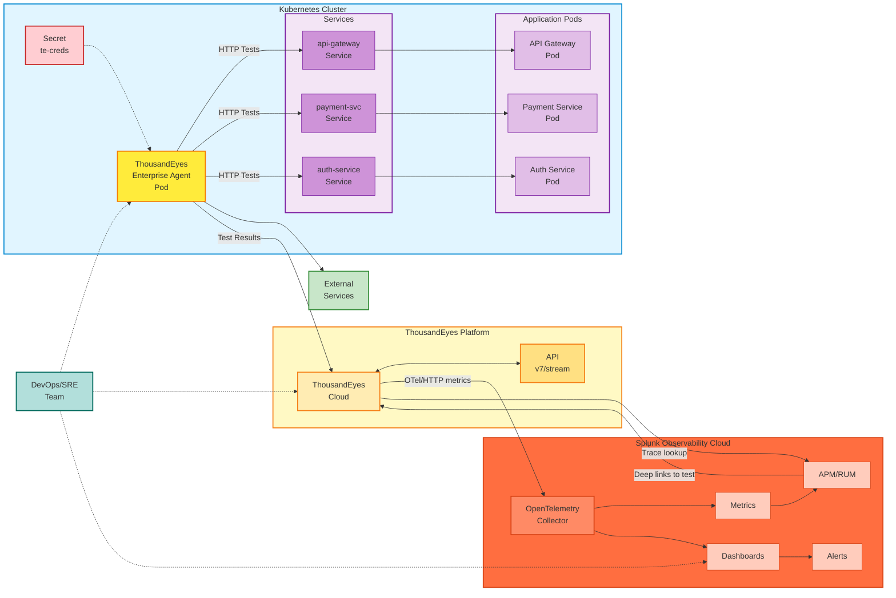

## ThousandEyes エージェントの種類

### Enterprise Agents

Enterprise Agentsは、お客様のインフラストラクチャ内にデプロイするソフトウェアベースの監視エージェントです。以下の機能を提供します：

- **内部から外部への可視性**: 内部ネットワークから外部サービスへの監視とテスト
- **カスタマイズ可能な配置**: ユーザーやアプリケーションが存在する場所にデプロイ
- **完全なテスト機能**: HTTP、ネットワーク、DNS、音声、その他のテストタイプ
- **継続的な監視**: スケジュールされたテストを実行する常時稼働エージェント

このワークショップでは、Enterprise AgentをKubernetesクラスター内のコンテナ化されたワークロードとしてデプロイします。

### Endpoint Agents

Endpoint Agentsは、エンドユーザーデバイス（ラップトップ、デスクトップ）にインストールされる軽量エージェントで、以下の機能を提供します：

- **実際のユーザー視点**: 実際のユーザーエンドポイントからの監視
- **ブラウザベースの監視**: リアルユーザーエクスペリエンスメトリクスの取得
- **セッションデータ**: ユーザーの視点からのアプリケーションパフォーマンスに関する詳細なインサイト

このワークショップでは、**Enterprise Agent** のデプロイのみを対象としています。

## アーキテクチャ

## アーキテクチャコンポーネント

### 1. Kubernetes クラスター

- **Secret (te-creds)**: 認証用のbase64エンコードされた `TEAGENT_ACCOUNT_TOKEN` を保存
- **ThousandEyes Enterprise Agent Pod**:
  - コンテナイメージ: `thousandeyes/enterprise-agent:latest`
  - ホスト名: `te-agent-aleccham`（カスタマイズ可能）
  - セキュリティ権限: `NET_ADMIN`、`SYS_ADMIN`（ネットワークテストに必要）
  - メモリ割り当て: 2GBリクエスト、3.5GB上限
  - ネットワークモード: IPv4のみ（環境変数 `TEAGENT_INET: "4"` で設定）
  - イメージプルポリシー: `Always`（最新イメージのプルを保証）
  - Initコマンド: `/sbin/my_init`（エージェントの適切な初期化に必要）
- **内部サービス**: REST API、マイクロサービス、データベース、gRPCサービスを含むKubernetesワークロード

### 2. テスト対象

- **内部サービス**: Kubernetesクラスター内のサービスを監視
- **外部サービス**: 以下のような外部依存関係をテスト：
  - 決済ゲートウェイ（Stripe、PayPal）
  - サードパーティAPI
  - SaaSアプリケーション
  - CDNエンドポイント
  - 公開ウェブサイト

### 3. ThousandEyes Platform

- **ThousandEyes Cloud**: 以下のための中央プラットフォーム：
  - エージェントの登録と管理
  - テストの設定とスケジューリング
  - メトリクスの収集と集約
  - 組み込みアラートエンジン
- **ThousandEyes API**: プログラムによるアクセスのためのRESTful API（v7/streamエンドポイント）

### 4. テストタイプとメトリクス

Enterprise Agentは以下を実行します：

- **HTTP/HTTPS テスト**: ウェブページの可用性、応答時間、ステータスコード
- **DNS テスト**: 名前解決時間、レコード検証
- **ネットワーク層テスト**: レイテンシ、パケットロス、パス可視化
- **Voice/RTP テスト**: 音声トラフィックの品質メトリクス

収集されるメトリクスには以下が含まれます：

- HTTPサーバー可用性（%）
- スループット（bytes/s）
- リクエスト時間（秒）
- ページロード完了率（%）
- エラーコードと失敗理由

### 5. Splunk Observability Cloud との統合

- **OpenTelemetry Metrics Stream**:
  - エンドポイント: `https://ingest.{realm}.signalfx.com/v2/datapoint/otlp`
  - プロトコル: HTTPまたはgRPC
  - フォーマット: Protobuf
  - 認証: `X-SF-Token` ヘッダー
  - シグナルタイプ: Metrics（OpenTelemetry v2）
- **分散トレーシング統合**:
  - ThousandEyesテストタイプ: 分散トレーシングが有効な **HTTP Server** または **API**
  - ThousandEyesコネクタターゲット: `https://api.{realm}.signalfx.com`
  - 認証: `X-SF-Token` ヘッダーにSplunk **API** トークン
  - 結果: ThousandEyesは関連するSplunk APMトレースを開くことができ、Splunk APMトレースは元のThousandEyesテストにリンクバックできます
- **オブザーバビリティ機能**:
  - **Metrics**: ThousandEyesデータのリアルタイム可視化
  - **Dashboards**: 統合ビューを備えた事前構築済みThousandEyesダッシュボード
  - **APM/RUM 統合**: シンセティックテストとアプリケーショントレースおよびリアルユーザーモニタリングの相関
  - **Alerting**: 相関ルールを備えた一元化されたアラート管理

### 6. データフロー

1. エージェントがKubernetes Secretからのトークンを使用して認証
2. エージェントが内部および外部ターゲットに対してスケジュールされたテストを実行
3. テスト結果がThousandEyes Cloudに送信
4. ThousandEyesがOpenTelemetryプロトコルを介してSplunkにメトリクスをストリーミング
5. 分散トレーシングが有効なHTTP ServerおよびAPIテストの場合、ThousandEyesはリクエストに `b3`、`traceparent`、`tracestate` ヘッダーを挿入
6. 計装されたアプリケーションが結果のトレースをSplunk APMに送信
7. ThousandEyesは関連するSplunkトレースを開くことができ、Splunk APMは元のThousandEyesテストにリンクバック可能
8. DevOps、ネットワーク、アプリケーションチームが調査中に両方のビューで協力

## テスト機能

このデプロイにより、以下が可能になります：

- ✅ **内部サービスのテスト**: クラスター内からKubernetesサービス、API、マイクロサービスを監視
- ✅ **外部依存関係のテスト**: 決済ゲートウェイ、サードパーティAPI、SaaSプラットフォームへの接続性を検証
- ✅ **パフォーマンスの測定**: クラスターの視点からレイテンシ、可用性、パフォーマンスメトリクスを取得
- ✅ **問題のトラブルシューティング**: 問題がインフラストラクチャ、ネットワークパス、または計装されたアプリケーションサービスのいずれに起因するかを特定

{}
これはThousandEyesエージェントの**公式にサポートされた**デプロイ設定**ではありません**。ただし、本番環境に近い環境でテストされており、非常にうまく動作します。
{}
