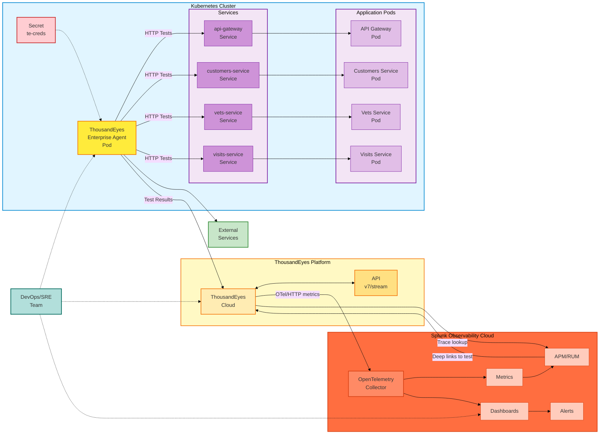

## ThousandEyes エージェントタイプ

### Enterprise Agent

Enterprise Agent は、自社のインフラストラクチャ内にデプロイするソフトウェアベースの監視エージェントです。以下の機能を提供します

- **内部からの可視性**: 内部ネットワークから外部サービスへの監視とテスト
- **カスタマイズ可能な配置**: ユーザーとアプリケーションが存在する場所にデプロイ
- **フルテスト機能**: HTTP、ネットワーク、DNS、音声、その他のテストタイプ
- **永続的な監視**: スケジュールされたテストを実行し続けるエージェント

このワークショップでは、Enterprise Agent を Kubernetes クラスター内のコンテナ化されたワークロードとしてデプロイします。

### Endpoint Agent

Endpoint Agent は、エンドユーザーのデバイス（ラップトップ、デスクトップ）にインストールされる軽量なエージェントで、以下の機能を提供します

- **実際のユーザー視点**: 実際のユーザーエンドポイントからの監視
- **ブラウザベースの監視**: リアルユーザーエクスペリエンスメトリクスのキャプチャ
- **セッションデータ**: ユーザーの視点からのアプリケーションパフォーマンスに関する詳細なインサイト

このワークショップでは、**Enterprise Agent** のデプロイのみに焦点を当てます。

## アーキテクチャ

## アーキテクチャコンポーネント

### 1. Kubernetes クラスター

- **Secret (te-creds)**: 認証用の base64 エンコードされた `TEAGENT_ACCOUNT_TOKEN` を保存します
- **ThousandEyes Enterprise Agent Pod**:
  - コンテナイメージ: `thousandeyes/enterprise-agent:latest`
  - ホスト名: `te-agent-aleccham`（カスタマイズ可能）
  - セキュリティケーパビリティ: `NET_ADMIN`、`SYS_ADMIN`（ネットワークテストに必要）
  - メモリ割り当て: 2GB リクエスト、3.5GB リミット
  - ネットワークモード: IPv4 のみ（環境変数 `TEAGENT_INET: "4"` で設定）
  - イメージプルポリシー: `Always`（最新のイメージが確実にプルされます）
  - Init コマンド: `/sbin/my_init`（エージェントの適切な初期化に必要）
- **内部サービス**: REST API、マイクロサービス、データベース、gRPC サービスを含む Kubernetes ワークロード

### 2. テスト対象

- **内部サービス**: Kubernetes クラスター内のサービスを監視します
- **外部サービス**: 以下のような外部依存関係をテストします
  - 決済ゲートウェイ（Stripe、PayPal）
  - サードパーティ API
  - SaaS アプリケーション
  - CDN エンドポイント
  - パブリック Web サイト

### 3. ThousandEyes Platform

- **ThousandEyes Cloud**: 以下の機能を提供する中央プラットフォーム
  - エージェントの登録と管理
  - テストの設定とスケジューリング
  - メトリクスの収集と集約
  - 組み込みアラートエンジン
- **ThousandEyes API**: プログラマティックアクセスのための RESTful API（v7/stream エンドポイント）

### 4. テストタイプとメトリクス

Enterprise Agent は以下を実行します

- **HTTP/HTTPS テスト**: Web ページの可用性、レスポンスタイム、ステータスコード
- **DNS テスト**: 名前解決時間、レコード検証
- **ネットワークレイヤーテスト**: レイテンシー、パケットロス、パス可視化
- **Voice/RTP テスト**: 音声トラフィックの品質メトリクス

収集されるメトリクスは以下の通りです

- HTTP サーバー可用性（%）
- スループット（bytes/s）
- リクエスト時間（秒）
- ページロード完了率（%）
- エラーコードと失敗理由

### 5. Splunk Observability Cloud との統合

- **OpenTelemetry Metrics Stream**:
  - エンドポイント: `https://ingest.{realm}.signalfx.com/v2/datapoint/otlp`
  - プロトコル: HTTP または gRPC
  - フォーマット: Protobuf
  - 認証: `X-SF-Token` ヘッダー
  - シグナルタイプ: Metrics（OpenTelemetry v2）
- **分散トレーシング統合**:
  - ThousandEyes テストタイプ: 分散トレーシングが有効な **HTTP Server** または **API**
  - ThousandEyes コネクターターゲット: `https://api.{realm}.signalfx.com`
  - 認証: `X-SF-Token` ヘッダーの Splunk **API** トークン
  - 結果: ThousandEyes から関連する Splunk APM トレースを開くことができ、Splunk APM トレースから元の ThousandEyes テストにリンクバックできます
- **オブザーバビリティ機能**:
  - **Metrics**: ThousandEyes データのリアルタイム可視化
  - **Dashboards**: 統合ビューを備えた構築済み ThousandEyes ダッシュボード
  - **APM/RUM 統合**: シンセティックテストとアプリケーショントレースおよびリアルユーザーモニタリングの相関
  - **Alerting**: 相関ルールを備えた一元的なアラート管理

### 6. データフロー

1. エージェントが Kubernetes Secret のトークンを使用して認証します
2. エージェントが内部および外部のターゲットに対してスケジュールされたテストを実行します
3. テスト結果が ThousandEyes Cloud に送信されます
4. ThousandEyes が OpenTelemetry プロトコル経由で Splunk にメトリクスをストリーミングします
5. 分散トレーシングが有効な HTTP Server および API テストでは、ThousandEyes がリクエストに `b3`、`traceparent`、`tracestate` ヘッダーを挿入します
6. インストルメント済みアプリケーションが結果のトレースを Splunk APM に送信します
7. ThousandEyes から関連する Splunk トレースを開くことができ、Splunk APM から元の ThousandEyes テストにリンクバックできます
8. DevOps、ネットワーク、アプリケーションチームが調査中に両方のビューを使用して連携します

## テスト機能

このデプロイにより、以下のことが可能になります

- ✅ **内部サービスのテスト**: クラスター内から Kubernetes サービス、API、マイクロサービスを監視します
- ✅ **外部依存関係のテスト**: 決済ゲートウェイ、サードパーティ API、SaaS プラットフォームへの接続性を検証します
- ✅ **パフォーマンスの測定**: クラスターの視点からレイテンシー、可用性、パフォーマンスメトリクスをキャプチャします
- ✅ **問題のトラブルシューティング**: 問題がインフラストラクチャ、ネットワークパス、またはインストルメント済みアプリケーションサービスのいずれに起因するかを特定します

{}
これは ThousandEyes エージェントの**公式にサポートされたデプロイ構成ではありません**。ただし、本番環境に近い環境でテスト済みであり、非常にうまく動作します。
{}
