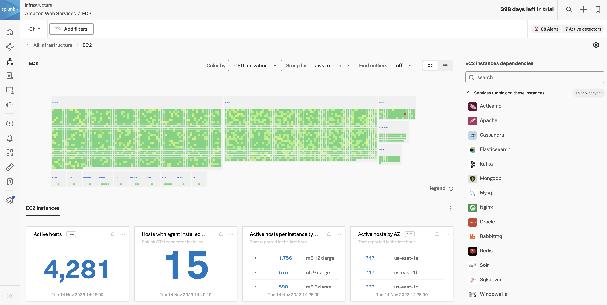

Splunk Infrastructure Monitoring（IM）は、ハイブリッドクラウド環境向けの市場をリードする監視および可観測性サービスです。特許取得済みのストリーミングアーキテクチャに基づいて構築されており、従来のソリューションよりもはるかに短時間で、より高い精度でインフラストラクチャ、サービス、アプリケーション全体のパフォーマンスを視覚化および分析するための**リアルタイム**ソリューションをエンジニアリングチームに提供します。

**OpenTelemetry 標準化：** データの完全な制御を提供し、ベンダーロックインから解放し、独自のエージェントの実装から解放します。  
**Splunk の OTel コレクター：** シームレスなインストールと動的な構成により、スタック全体を数秒で自動検出し、クラウド、サービス、システム全体の可視性を提供します。  
**300 以上の使いやすい標準コンテンツ：** 事前構築されたナビゲーターとダッシュボードにより、環境全体の即時の視覚化を提供し、すべてのデータとリアルタイムで対話できます。  
**Kubernetes ナビゲーター：** ノード、ポッド、コンテナの包括的な標準的な階層ビューを即座に提供します。わかりやすいインタラクティブなクラスターマップで、最も初心者の Kubernetes ユーザーでもすぐに使いこなせます。  
**AutoDetect アラートとディテクター：** 最も重要なメトリクスを標準で自動的に識別し、テレメトリデータが取り込まれた瞬間から正確にアラートを出すディテクターのアラート条件を作成し、重要な通知のために数秒でリアルタイムのアラート機能を使用します。  
**ダッシュボード内のログビュー：** 共通のフィルターと時間制御を使用して、ログメッセージとリアルタイムメトリクスを 1 ページに組み合わせ、より迅速なコンテキスト内トラブルシューティングを実現します。  
**メトリクスパイプライン管理：** 再計装なしに取り込み時点でメトリクスの量を制御し、必要なデータのみを保存して分析するための集約およびデータ削除ルールのセットを使用します。メトリクスの量を削減し、可観測性のコストを最適化します。

