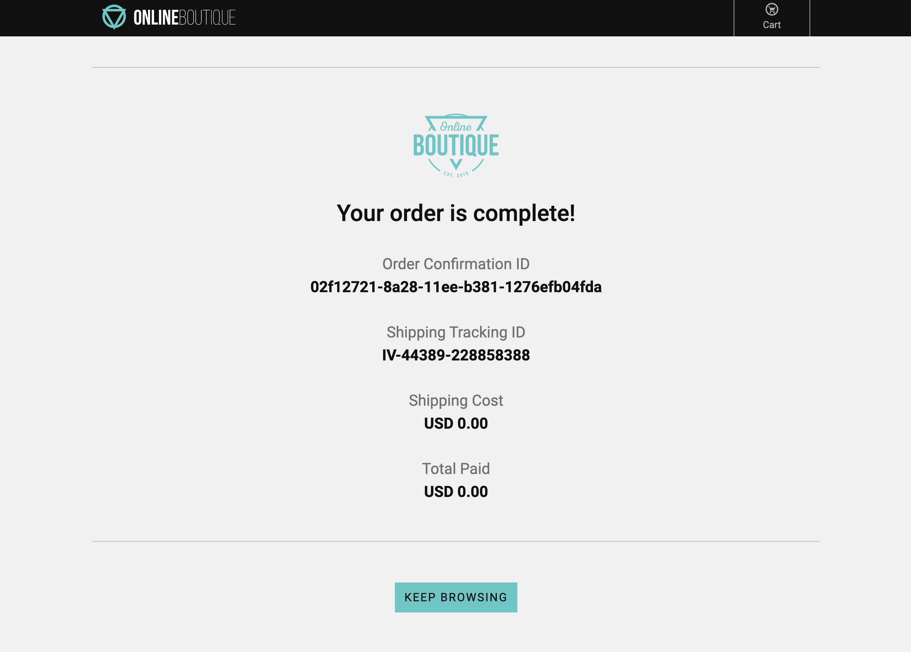

{}

あなたは**流行に敏感な都会のプロフェッショナル**で、有名な Online Boutique で次の新奇なアイテムを購入したいと熱望しています。Online Boutique は、ヒップスターのニーズに応えてくれる場所だと聞いています。

{}

Online Boutique を操作してみましょう。これは Splunk Observability Cloud と連携されたサンプル E コマースアプリ（閲覧、カート、チェックアウト）です。

アプリケーションはすでにデプロイされており、インストラクターから Online Boutique Web サイトへのリンクが提供されます。例:

* **http://<s4r-workshop-i-xxx.splunk>.show:81/**。アプリケーションはポート **80** と **443** でも動作しているため、ポート **81** に接続できない場合や、それらのポートを使用したい場合はそれらを利用できます。

{}

* Online Boutique へのリンクを取得したら、いくつかの商品を閲覧し、カートに追加して、最後にチェックアウトを行ってください。
* この演習を数回繰り返してください。可能であれば、異なるブラウザ、モバイルデバイス、タブレットを使用してください。これにより、探索できるデータがより多く生成されます。

{}

{}

ページの読み込みを待っている間、ページ上でマウスカーソルを動かしてください。これにより、このワークショップの後半で探索できるデータがより多く生成されます。

{}

{}

* チェックアウトプロセスについて何か気づきましたか？完了するまでに時間がかかったように感じたものの、最終的には完了したのではないでしょうか？このような場合は、**Order Confirmation ID** をコピーして、後で必要になるためローカルのどこかに保存してください。
* ショッピングに使用したブラウザセッションを閉じてください。

{}

これは、ユーザーエクスペリエンスが悪い場合に感じることであり、潜在的な顧客満足度の問題であるため、すぐに対応してトラブルシューティングを行う必要があります。

それでは、**Splunk RUM** でデータがどのように見えるかを確認しに行きましょう。
