このラボでは [Chrome Selenium IDE](https://chrome.google.com/webstore/detail/selenium-ide/mooikfkahbdckldjjndioackbalphokd?hl=en) エクステンションを使用したSplunkデモインスタンスに対する合成トランザクションと、Splunk Synthetic Monitoring Real Browser Check (RBC)を作成します。

## 1. 前提

[https://monitoring.rigor.com](https://monitoring.rigor.com) と [https://optimization.rigor.com](https://optimization.rigor.com) にログインできることを確認します。また、 **O11y Workshop** のようなアカウントにアサインされていることを確認します。

Splunk Synthetic Monitoring アカウントの個人情報を編集し、タイムゾーンとメール通知を編集します。Splunk Synthetic Monitoring はデフォルトで通知しますが、モニターの設定で通知をオフにすることができます。

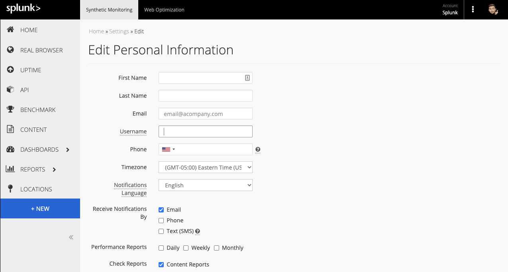

[Chrome Selenium IDE](https://chrome.google.com/webstore/detail/selenium-ide/mooikfkahbdckldjjndioackbalphokd?hl=en-US) エクステンションをあなたの **Chrome** ブラウザーに追加します。インストールした後、エクステンションをクリックすることで次の画面が表示されます。

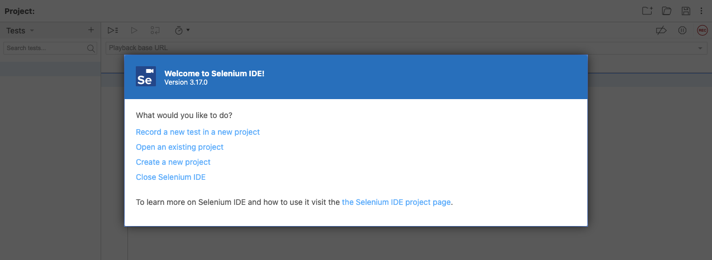

## 2. Selenium IDE の使用

[http://splunk.o11ystore.com](http://splunk.o11ystore.com) にアクセスし、Selenium IDEを使いウェブトランザクションを記録する準備が整いました。

**Record a new test in a new project** をクリックしプロジェクト名に **[あなたのイニシャル] - O11y Store** （例：RWC - O11y Store）と入力します。

!!! 質問 「Selenium IDEとは何ですか？」
    - Selenium IDE は、オープンソースの Web 用の記録と再生のテスト自動化ツールです。
    - SeleniumはWebアプリケーションをテストするためのポータブルなフレームワークです。
    - Selenium はテストスクリプト言語 (Selenium IDE) を学ぶ必要なしに機能テストを作成するための再生ツールを提供します。
    - C#、Groovy、Java、Perl、PHP、Python、Ruby、Scalaなどの多くの一般的なプログラミング言語でテストを記述するためのテストドメイン固有の言語（Selenese）を提供します。
    - テストはほとんどの最新のWebブラウザで実行できます。
    - Seleniumは、Windows、Linux、macOS上で動作します。
    - Apache License 2.0の下で公開されているオープンソースソフトウェアです。

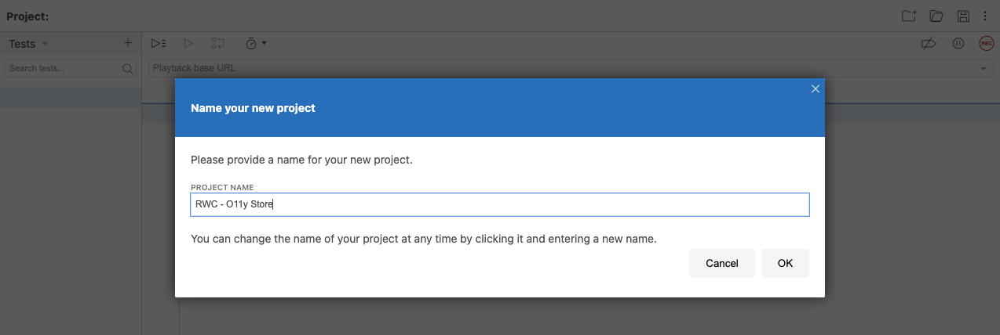

Base URLに [http://splunk.o11ystore.com](http://splunk.o11ystore.com) と入力します。

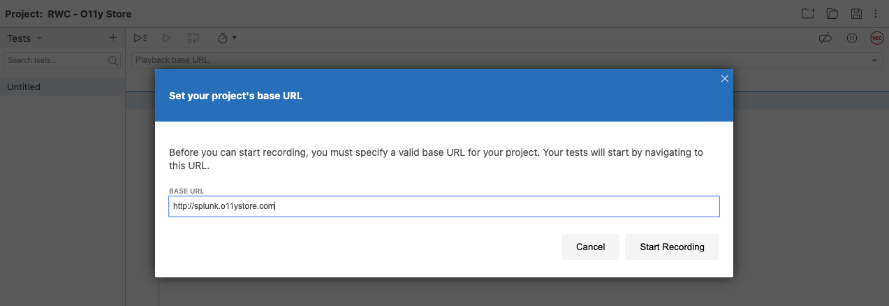

Start Recording{: .label-button .sfx-ui-button-grey} をクリックすると [splunk.o11ystore.com](http://splunk.o11ystore.com)  が開かれた新しいウインドウが立ち上がります。 **Vintage Camera Lens** をクリックし、 **Add To Cart** をクリックし、次に **Place Order** をクリックします。

ウインドウを閉じ、Selenium IDEに戻りレコーディングを停止します。最後にテストケースに名前を付けます。 **[あなたのイニシャル] - Checkout Flow (Desktop)** （例：RWC - Checkout Flow (Desktop)）

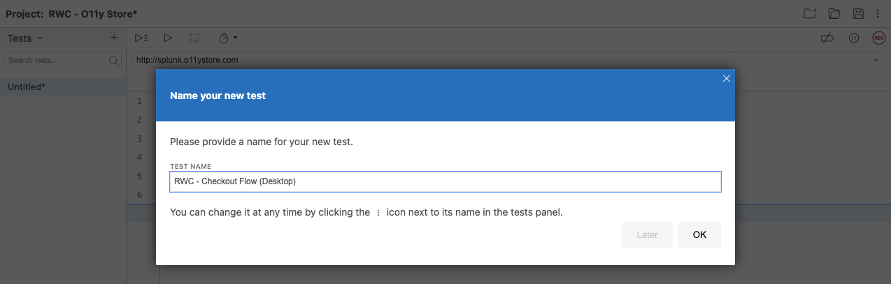

あなたのSelenium IDEプロジェクトは、このようになります。

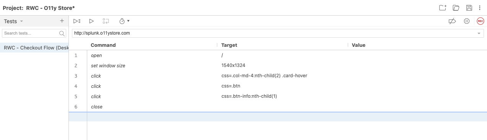

再生ボタンを押してレコーディングをテストし、レコーディングがトランザクションを正常に完了することを確認してください。

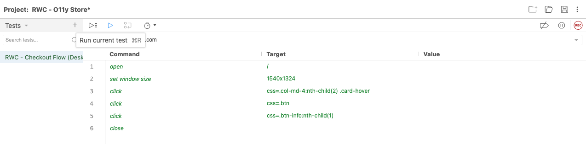

Selenium IDE プロジェクトをダウンロードフォルダに `Workshop.side` という名前で保存します。

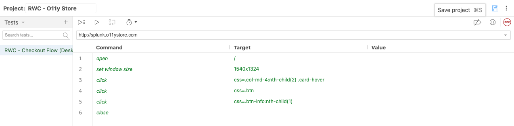

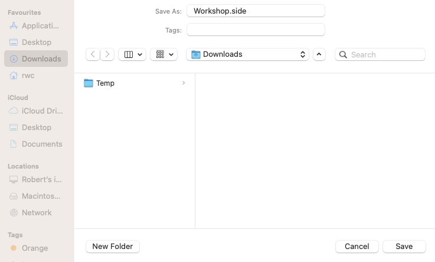

## 3. Real Browser Check の作成

[https://monitoring.rigor.com](https://monitoring.rigor.com) からSplunk Synthetic Monitoringにログインします。 **REAL BROWSER** をクリックし、 **+New**{: .label-button .sfx-ui-button-blue} をクリックします。

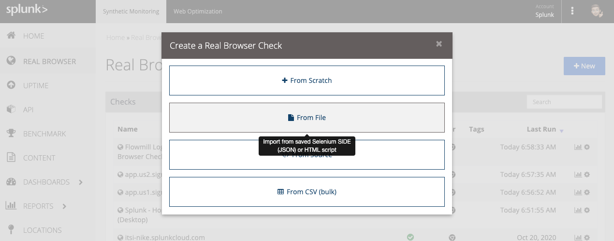

「**From File**」をクリックしレコーディングファイルを選択し、Importをクリックします。

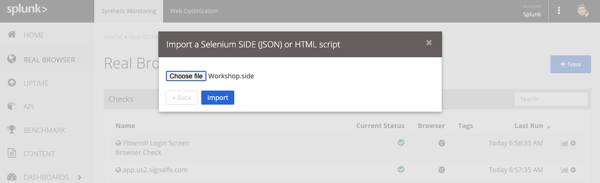

**Frequency** を **5 Minutes** にセットします。

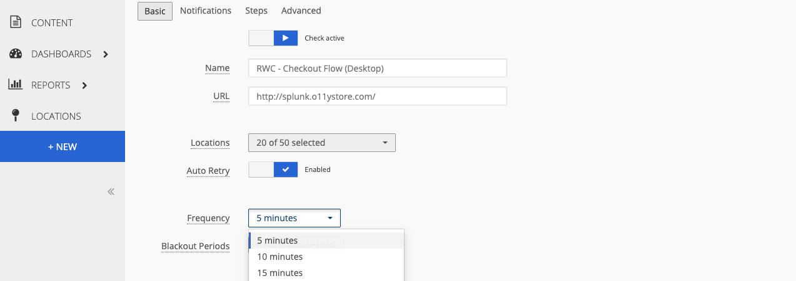

各Stepをクリックし、次のように分かりやすい名前を付けてあげます。
Step 1 (Click Camera)

Step 2 (Add to Cart)

Step 3 (Place Order)

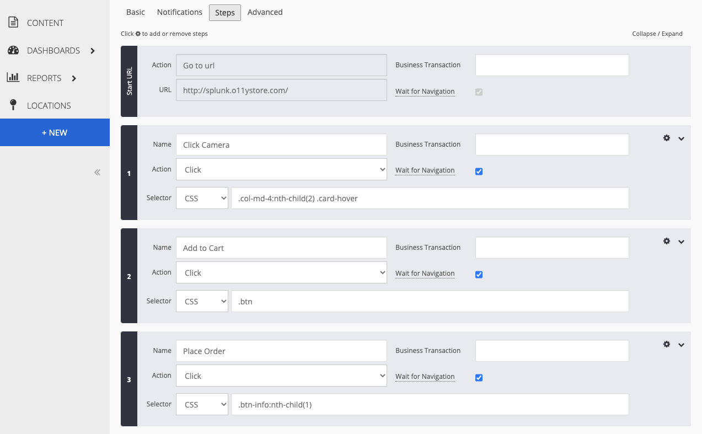

次に **+ Add Step** をクリックし、バリデーション用のステップを追加します。これはチェックアウトが成功したかどうかを確かめるものです。

**Name** に **Confirm Order** と入力し、 **Action** を **Wait for text present** に変更し、 **Value** に **Your order is complete!** と入力します。ここまでで **Start Url** と4つのステップが作られました。

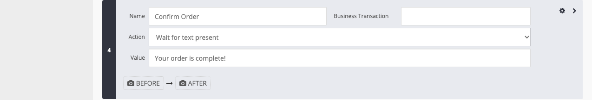

{}
Step作成時には非常に強力な [Business Transaction](https://help.rigor.com/hc/en-us/articles/360049442854-How-Do-I-Use-Business-Transactions) 機能の利用もご検討ください。*「Business Transactionとは、Real Browserスクリプト内の連続したステップをまとめたものです。これらのトランザクションは、フローの類似部分を論理的にグループ化し、ユーザーは複数のステップとページ（複数可）のパフォーマンスを1つのビジネストランザクションにまとめて表示できるようにします。"*
{}

**Advanced** をクリックし、 **Viewport Size** が **Default desktop: 1366 x 768** であることを確認します。

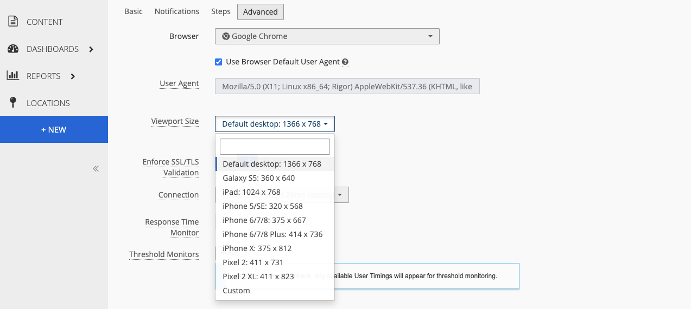

「**Test**」をクリックしモニター設定をテストします。テストが正常に完了した後、Step 4の「**AFTER**」をクリックし、注文完了のスクリーンショットを取得できたことを確認してください。

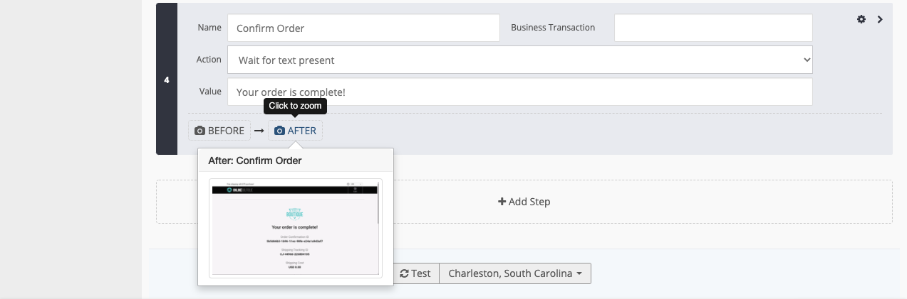

**Create**{: .label-button .sfx-ui-button-blue} をクリックし、Real Browser Monitorを保存します。5から10分後にモニターが動作し、以下のようなチェック成功が表示されることを確認します。

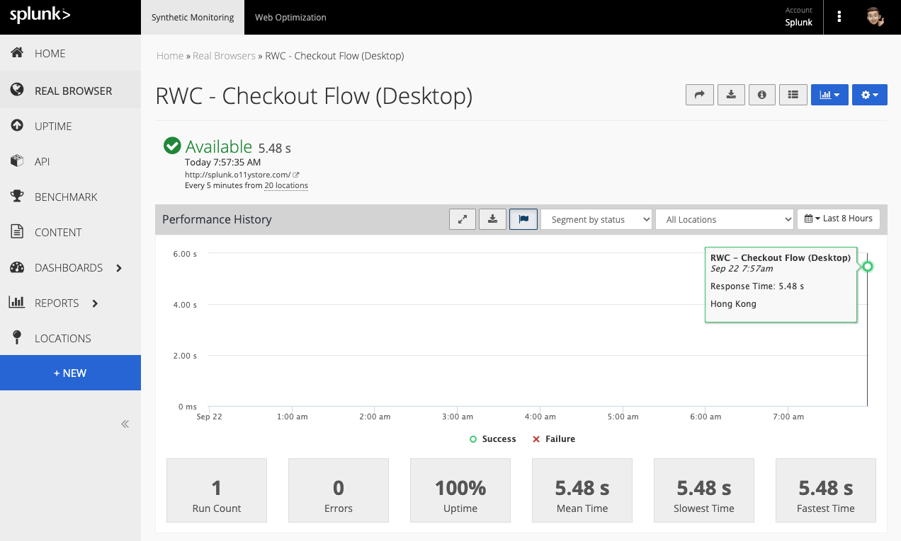

{}
**Run Now** を実行することでモニターを即座に実行できます。

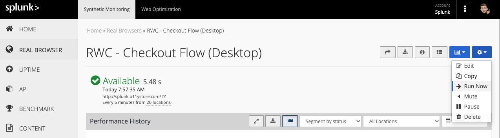
{}

**Segment by location** をクリックし、見た目の変化を確認してください。クリックすることで各ロケーションのon/offが可能です。

!!! 問題です！
    **Response Time** が一番低いロケーションはどこでしょうか？

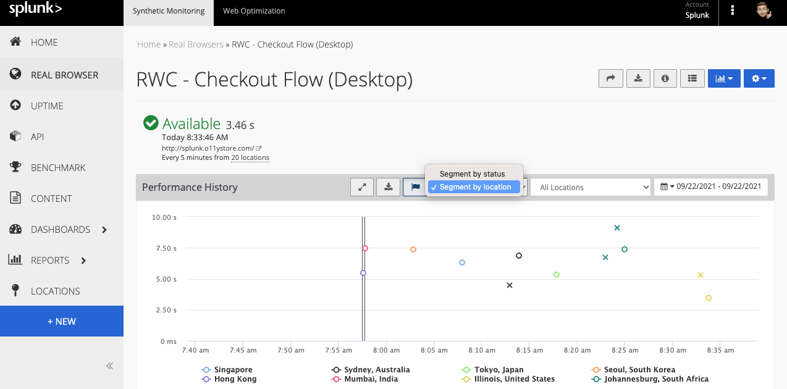

成功した円のうちどれかをクリックし、実行結果にドリルダウンします。

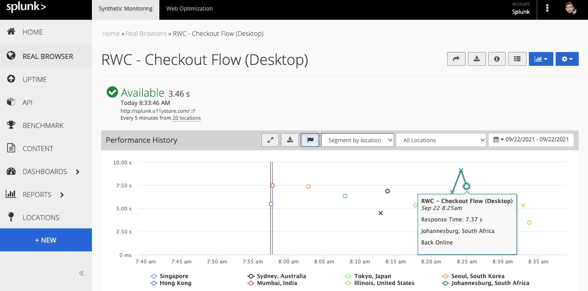

**CONFIGURE METRICS/HIDE METRICS** ドロップダウンで、取得しているメトリクスを確認してみてください。

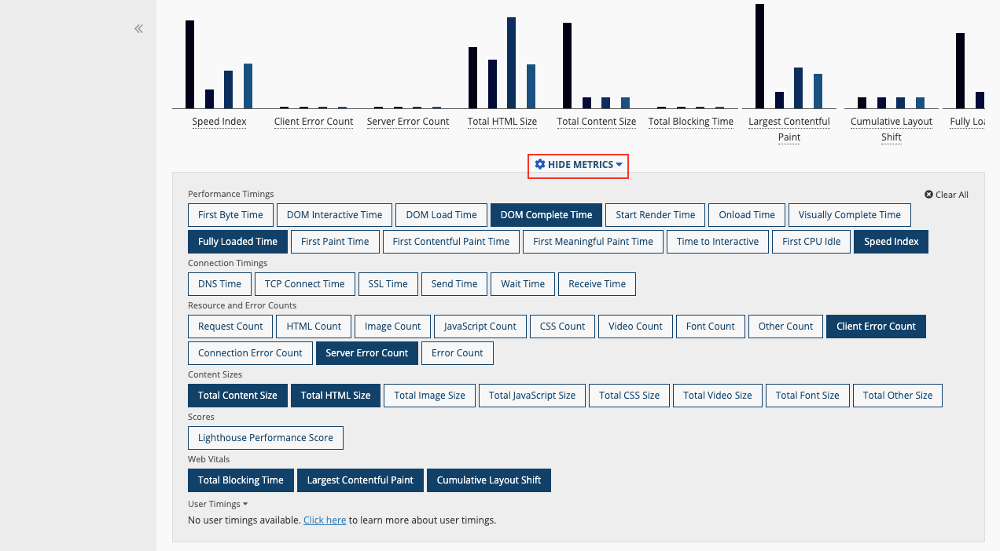

ドロップダウンの **Page 2** をクリックし、 **Filmstrip** と **Waterfall Chart** までスクロールダウンして結果を確認してください。

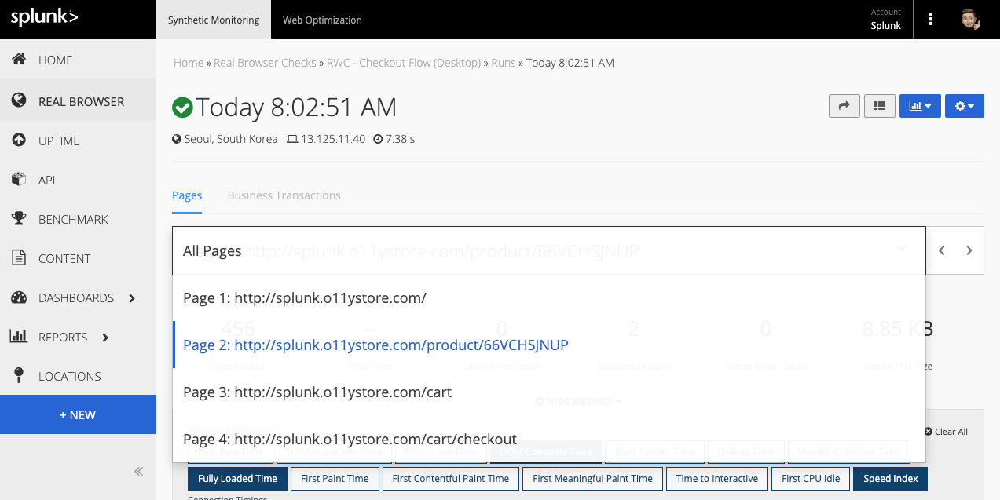

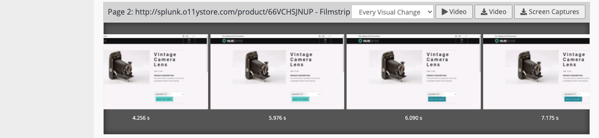

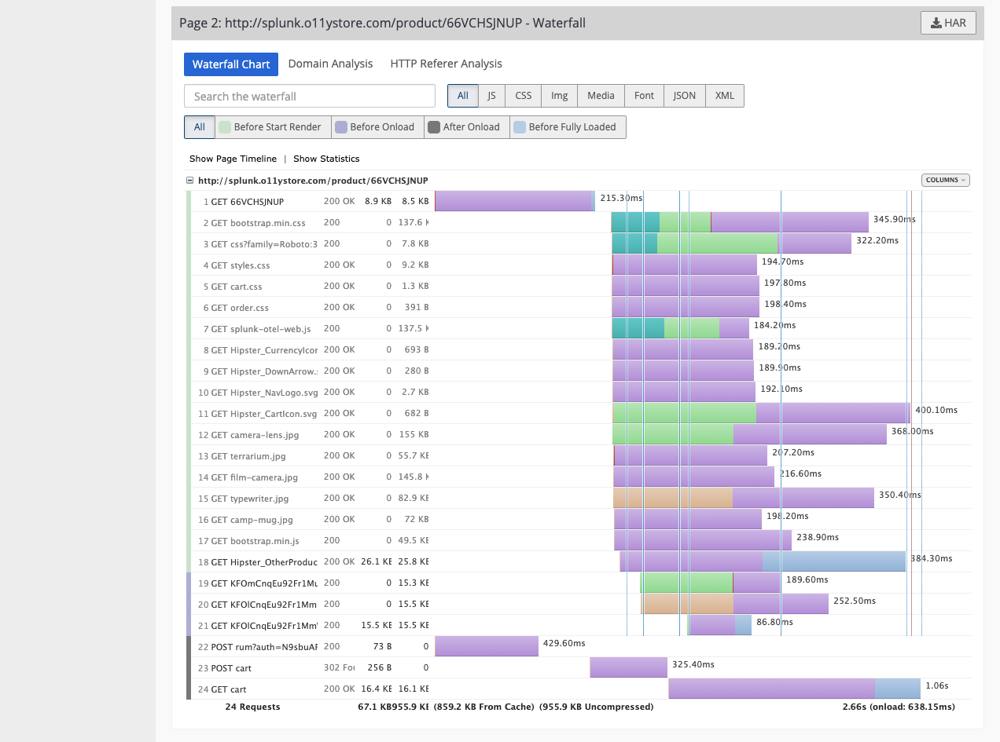

**Click Here to Analyze with Optimization** をクリックするとSplunk Synthetic Monitoring Optimizationへのログインができます。もし **このオプションが表示されない場合** 、この [ページ](https://optimization.rigor.com/s/2373818/?sh=3AF8C48AADD6D3E5F5DAA8B4B7BB7F45) にアクセスしてください。

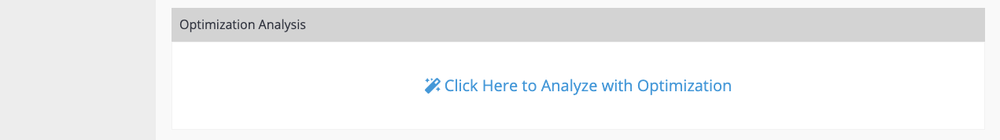

「**Best Practices Score**」タブをクリックします。スクロールダウンし、結果を確認します。

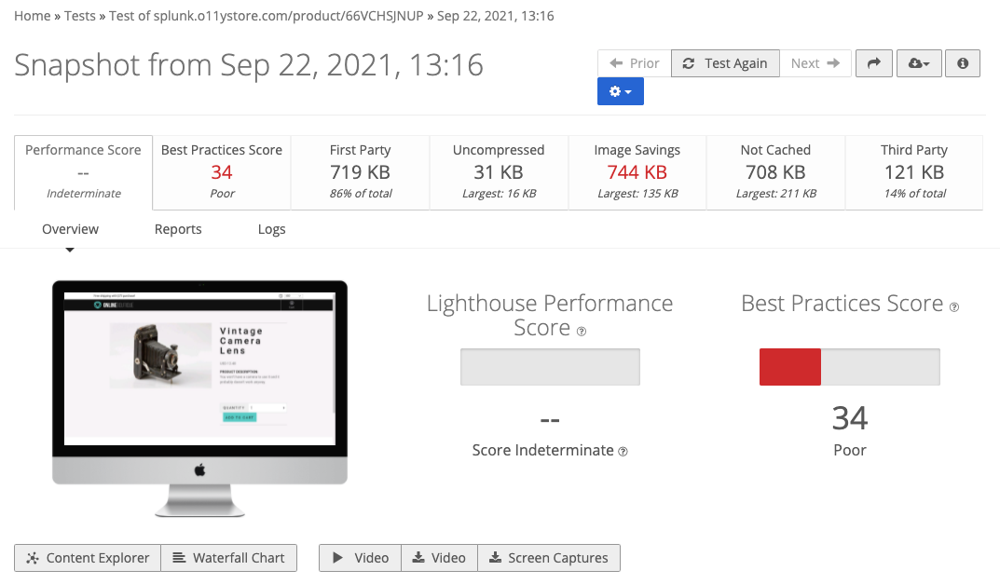

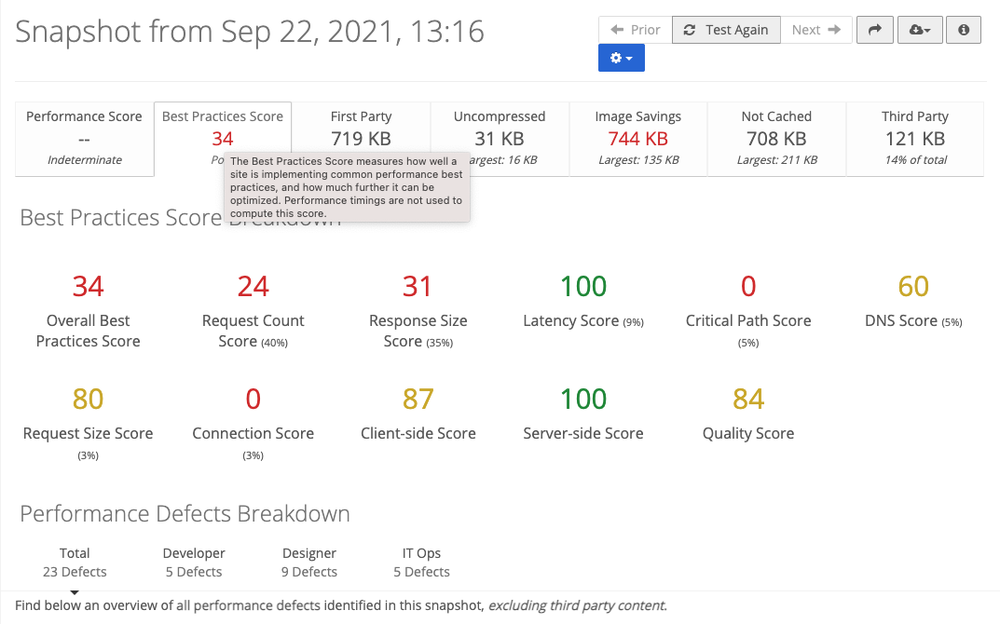

時間をとって、結果をレビューしてみてください。他の項目もクリックしてみてください。

## 4. Mobile Check の作成

作成したRBC (Real Browser Check）をコピーします。

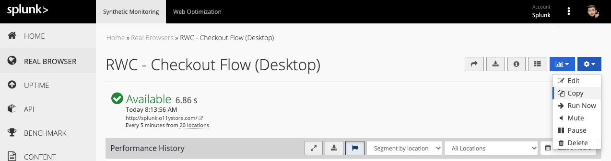

名前を **RWC - Checkout Flow (Tablet)** のように変更します。

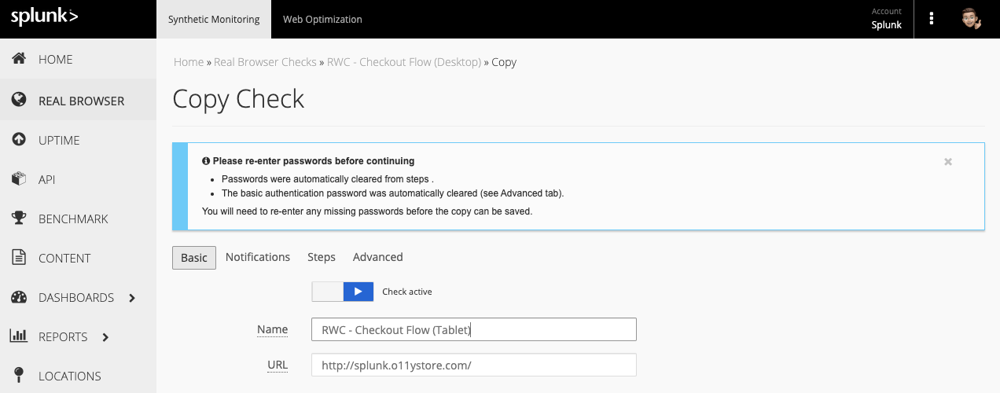

**Advanced** タブ配下で以下の3つの設定を変更し、新しいモバイル用のRBCを作成します。

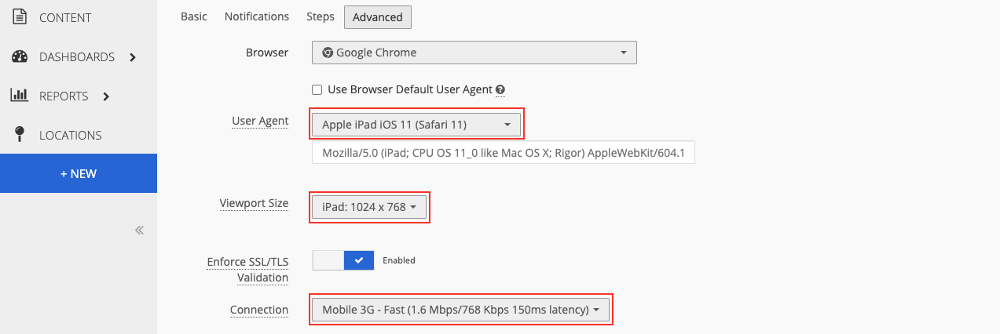

新しいモニター設定をテスト＆確認します。

{}
Step作成時には非常に強力な [Business Transaction](https://help.rigor.com/hc/en-us/articles/360049442854-How-Do-I-Use-Business-Transactions) 機能の利用もご検討ください。*「Business Transactionとは、Real Browserスクリプト内の連続したステップをまとめたものです。これらのトランザクションは、フローの類似部分を論理的にグループ化し、ユーザーは複数のステップとページ（複数可）のパフォーマンスを1つのビジネストランザクションにまとめて表示できるようにします。"*
{}

## 5. リソース

- [Getting Started With Selenium IDE](https://help.rigor.com/hc/en-us/articles/115004652007?flash_digest=b1ef7d1a07b68d5279ee5fef8adb87fb878cf010)

- [Splunk Synthetic Monitoring Scripting Guide](http://www2.rigor.com/scripting-guide)

- [How Can I Fix A Broken Script?](https://help.rigor.com/hc/en-us/articles/115004443988-How-Can-I-Fix-A-Broken-Script)

- [Introduction to the DOM](https://developer.mozilla.org/en-US/docs/Web/API/Document_Object_Model/Introduction) (Document Object Model (DOM)

- [Selenium IDE](https://www.selenium.dev/selenium-ide/)
