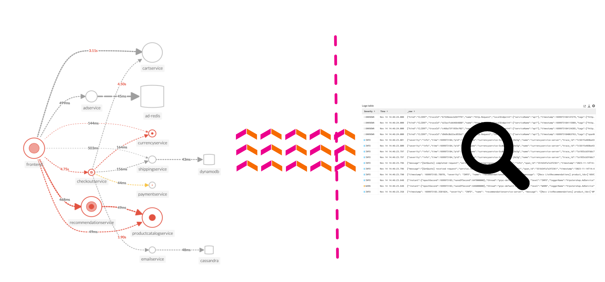

O Log Observer Connect permite que você traga perfeitamente os mesmos dados de log da sua plataforma Splunk para uma interface intuitiva e **sem código** projetada para ajudá-lo a encontrar e corrigir problemas rapidamente. Você pode realizar facilmente análises baseadas em logs e correlacioná-los perfeitamente com as métricas em tempo real do Splunk Infrastructure Monitoring e os rastreamentos do Splunk APM em um só lugar.

**Visibilidade de ponta a ponta:** Combinando os poderosos recursos de registro da Splunk Platform com os rastreamentos e métricas em tempo real do Splunk Observability Cloud para obter insights mais profundos e mais contexto do seu ambiente híbrido.

**Realize investigações rápidas e fáceis baseadas em logs:** Reutilizando logs que já foram ingeridos no Splunk Cloud Platform ou Enterprise em uma interface simplificada e intuitiva (sem necessidade de conhecer o SPL!) com painéis personalizáveis ​​e prontos para uso

**Obtenha maiores economias de escala e eficiência operacional:** Centralizando o gerenciamento de logs entre as equipes, dividindo dados e silos de equipe e obtendo melhor suporte geral

