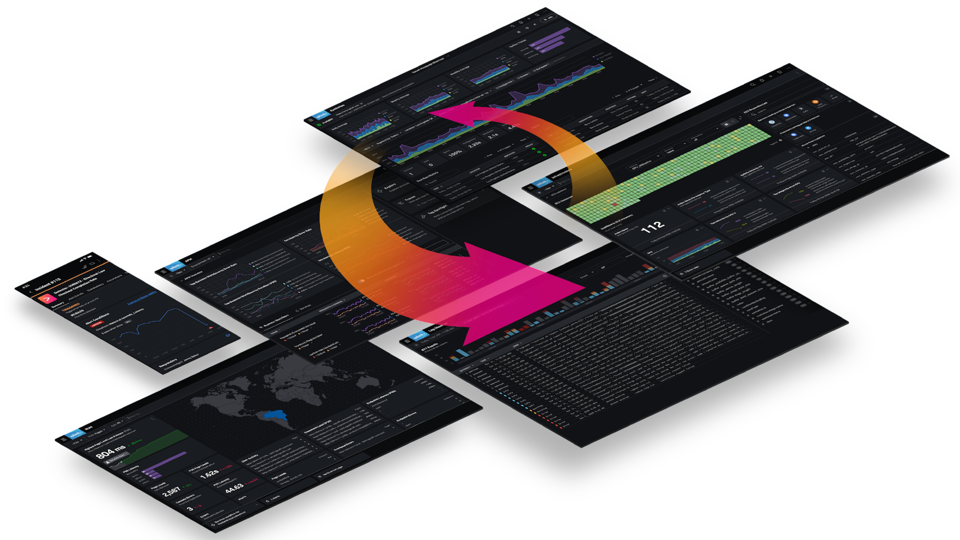

Neste workshop, demonstraremos como o Splunk Observability Cloud gera valor para nossos clientes de serviços financeiros graças à sua capacidade de fornecer monitoramento em tempo real, com fidelidade total e impulsionado por IA em todo o ecossistema digital, desde a infraestrutura e as aplicações até as experiências dos usuários. Ele foi desenvolvido especificamente para ambientes modernos, nativos da nuvem e baseados em microsserviços. Você terá a oportunidade de explorar alguns dos recursos mais poderosos da plataforma, que a diferenciam de outras soluções de observabilidade:

- **Infrastructure Monitoring**
- **Visibilidade completa de traces de ponta a ponta com o Application Performance Monitoring (APM) NoSample e de fidelidade total**
- **Consultas de logs sem código**
- **Análise de causa raiz com análise de tags e stacks de erros**
- **Related Content para navegação fluida entre os componentes**

Um dos principais pontos fortes do Splunk Observability Cloud é sua capacidade de unificar dados de telemetria, criando uma imagem abrangente da experiência do usuário final e de toda a sua pilha de aplicativos.

O workshop se concentrará em uma aplicação de transferência bancária baseada em microsserviços e implantada no Kubernetes. Os usuários podem iniciar uma transferência bancária, e todas as verificações necessárias de usuário, saldo e conformidade serão realizadas. Essa aplicação é totalmente instrumentada com OpenTelemetry para capturar dados detalhados de desempenho.

**O que é OpenTelemetry?**
OpenTelemetry é uma coleção de ferramentas, APIs e kits de desenvolvimento de software (SDKs) de código aberto projetados para ajudá-lo a instrumentar, gerar, coletar e exportar dados de telemetria, como métricas, rastreamentos e logs. Esses dados permitem uma análise aprofundada do desempenho e comportamento do seu software.

A comunidade OpenTelemetry está crescendo rapidamente, apoiada por empresas líderes como Splunk, Google, Microsoft e Amazon. Atualmente tem o segundo maior número de contribuidores dentro da Cloud Native Computing Foundation, atrás apenas do Kubernetes.

