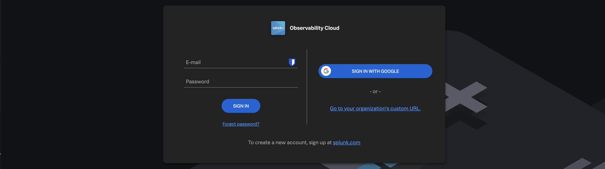

Vamos analisar os dados de usuários reais fornecidos pela telemetria recebida das sessões de navegador de todos os participantes do workshop. O objetivo é encontrar uma sessão de navegador, celular ou tablet com baixo desempenho e começar o processo de troubleshooting.

{}

* Você deve ter recebido um e-mail da Splunk convidando você para a Workshop Org. Se não encontrar o e-mail, confira as pastas Spam/Lixo eletrônico ou avise o instrutor.
* Para continuar, clique no botão Join Now ou no link fornecido no e-mail.
* Se você já concluiu o processo de cadastro, pode pular o restante e acessar diretamente o Splunk Observability Cloud para fazer login:
  * **[https://app.eu0.signalfx.com](https://app.eu0.signalfx.com (EMEA))**
  * **[https://app.us1.signalfx.com](https://app.us1.signalfx.com (APAC/AMER))**

* Você chegará à página inicial do Splunk Observability Cloud.

{}
