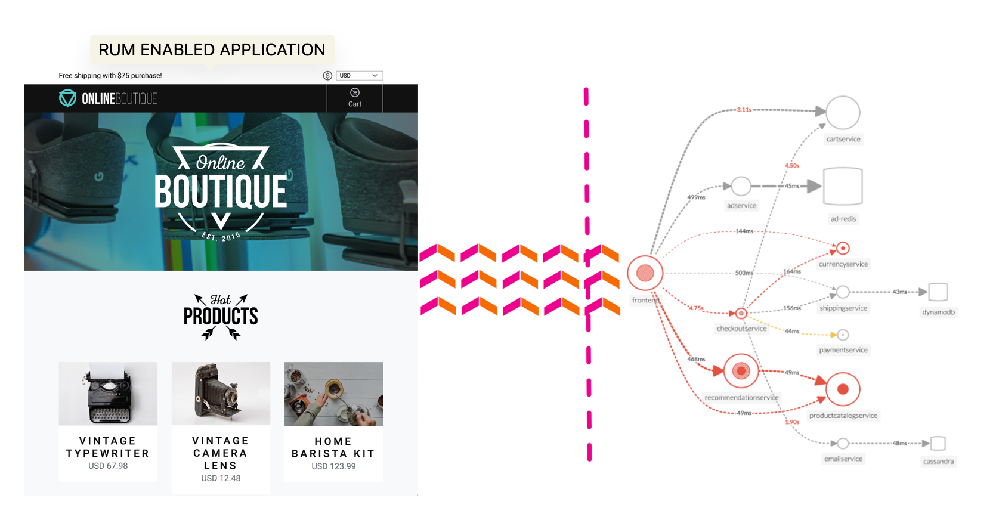

Splunk RUM é a única solução **NoSample** RUM ponta a ponta do setor - fornecendo visibilidade da experiência completa do usuário em cada sessão web e móvel para combinar exclusivamente todos os rastreamentos de front-end com métricas, rastreamentos e logs de back-end conforme eles acontecem. As equipes de operações e engenharia de TI podem definir rapidamente o escopo, priorizar e isolar erros, medir como o desempenho afeta os usuários reais e otimizar as experiências do usuário final, correlacionando métricas de desempenho com reconstruções de vídeo de todas as interações do usuário.

**Análise completa da sessão do usuário:** A análise de streaming captura sessões completas do usuário de aplicativos de uma ou várias páginas, medindo o impacto no cliente de cada recurso, imagem, alteração de rota e chamada de API.
**Correlacione problemas com mais rapidez:** A cardinalidade infinita e a análise completa de transações ajudam você a identificar e correlacionar problemas com mais rapidez em sistemas distribuídos complexos.
**Isole latência e erros:** identifique facilmente latência, erros e baixo desempenho para cada alteração de código e implantação. Avalie como o conteúdo, as imagens e as dependências de terceiros impactam seus clientes.
**Avalie e melhore o desempenho da página:** aproveite os principais sinais vitais da web para medir e melhorar a experiência de carregamento da página, a interatividade e a estabilidade visual. Encontre e corrija erros de JavaScript impactantes e entenda facilmente quais páginas devem ser melhoradas primeiro.
**Explore métricas significativas:** visualize instantaneamente o impacto do cliente com métricas em fluxos de trabalho específicos, tags personalizadas e sugestões automáticas de tags não indexadas para encontrar rapidamente a causa raiz dos problemas.
**Otimize a experiência do usuário final:** correlacione métricas de desempenho com reconstruções de vídeo de todas as interações do usuário para otimizar as experiências do usuário final.

