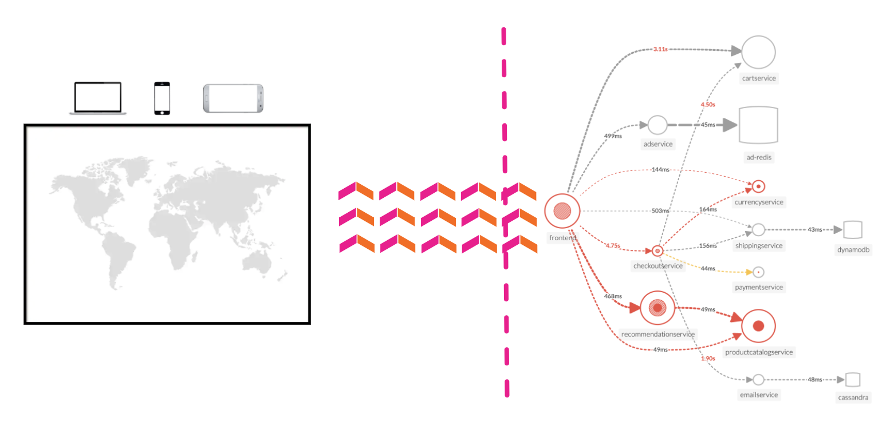

O Splunk APM fornece **NoSample** visibilidade ponta a ponta de cada serviço e sua dependência para resolver problemas mais rapidamente em monólitos e microsserviços. As equipes podem detectar imediatamente problemas de novas implantações, solucionar problemas com confiança ao definir o escopo e isolar a origem de um problema e otimizar o desempenho do serviço ao compreender como os serviços de back-end impactam os usuários finais e os fluxos de trabalho de negócios.

**Monitoramento e alertas em tempo real:** O Splunk fornece painéis de serviço prontos para uso e detecta e alerta automaticamente sobre métricas RED (taxa, erro e duração) quando há uma mudança repentina.
**Mapas de telemetria dinâmicos:** visualize facilmente o desempenho do serviço em ambientes de produção modernos em tempo real. A visibilidade ponta a ponta do desempenho do serviço da infraestrutura, dos aplicativos, dos usuários finais e de todas as dependências ajuda a identificar rapidamente novos problemas e solucioná-los com mais eficiência.
**Tags e análise inteligentes:** visualize todas as tags do seu negócio, infraestrutura e aplicativos em um só lugar para comparar facilmente novas tendências em latência ou erros com seus valores de tags específicos.
**A solução de problemas direcionada por IA identifica os problemas mais impactantes:** Em vez de vasculhar manualmente painéis individuais, isole os problemas com mais eficiência. Identifique automaticamente as anomalias e as fontes de erros que mais impactam os serviços e os clientes.
**O rastreamento distribuído completo analisa cada transação:** Identifique problemas em seu ambiente nativo da nuvem com mais eficiência. O rastreamento distribuído do Splunk visualiza e correlaciona todas as transações de back-end e front-end no contexto com sua infraestrutura, fluxos de trabalho de negócios e aplicativos.
**Correlação de pilha completa:** No Splunk Observability, o APM vincula rastreamentos, métricas, logs e perfis para entender facilmente o desempenho de cada componente e sua dependência em sua pilha.
**Monitore o desempenho de consultas de banco de dados:** identifique facilmente como consultas de execução lenta e alta de bancos de dados SQL e NoSQL afetam seus serviços, endpoints e fluxos de trabalho de negócios, sem necessidade de instrumentação.

