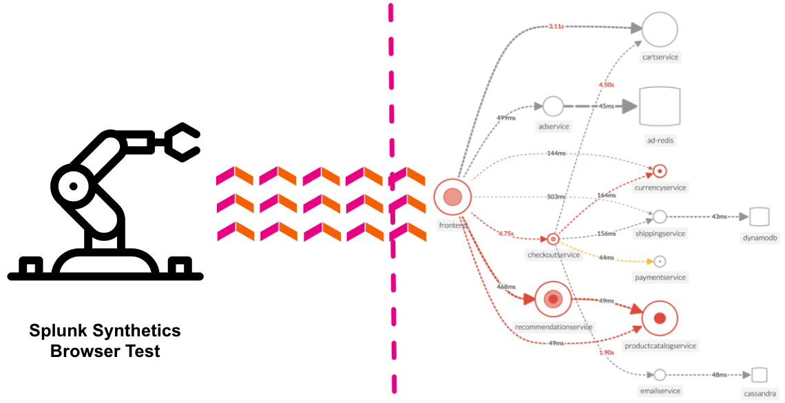

O Splunk Synthetic Monitoring fornece visibilidade de URLs, APIs e serviços web críticos para resolver problemas com mais rapidez. As equipes de operações e engenharia de TI podem facilmente detectar, alertar e priorizar problemas, simular jornadas de usuários em várias etapas, medir o impacto nos negócios de implantações de novos códigos e otimizar o desempenho da web com recomendações guiadas passo a passo para garantir melhores experiências digitais.

**Ensure Availability:** Monitore e alerte proativamente sobre a integridade e a disponibilidade de serviços críticos, URLs e APIs com testes de navegador personalizáveis ​​para simular fluxos de trabalho de várias etapas que compõem a experiência do usuário.
**Improve Metrics:** Core Web Vitals e métricas de desempenho modernas permitem que os usuários visualizem todos os seus defeitos de desempenho em um só lugar, meçam e melhorem o carregamento da página, a interatividade e a estabilidade visual, e encontrem e corrijam erros de JavaScript para melhorar o desempenho da página.
**Front-end para back-end:** Integrações com Splunk APM, Monitoramento de Infraestrutura, On-Call e ITSI ajudam as equipes a visualizar o tempo de atividade do endpoint em relação aos serviços de back-end, a infraestrutura subjacente e dentro da coordenação de resposta a incidentes para que possam solucionar problemas em todo o ambiente, em uma única UI.
**Detect and Alert:** Monitore e simule experiências do usuário final para detectar, comunicar e resolver problemas de APIs, terminais de serviço e transações comerciais críticas antes que afetem os clientes.
**Business Performance:** Defina facilmente fluxos de usuário de várias etapas para transações comerciais importantes e comece a registrar e testar suas jornadas críticas de usuário em minutos. Rastreie e relate SLAs e SLOs para tempo de atividade e desempenho.
**Filmstrips and Video Playback:** Visualize gravações de tela, tiras de filme e capturas de tela junto com pontuações de desempenho modernas, benchmarking competitivo e métricas para visualizar experiências artificiais do usuário final. Otimize a rapidez com que você entrega conteúdo visual e melhore a estabilidade e a interatividade da página para implantar melhores experiências digitais.

