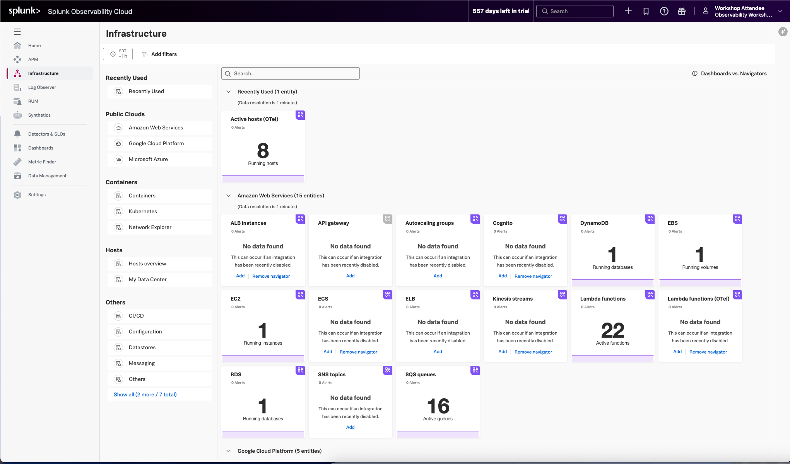

Splunk Infrastructure Monitoring (IM) é um serviço de monitoramento e observabilidade líder de mercado para ambientes de nuvem híbrida. Construído em uma arquitetura de streaming patenteada, ele fornece uma solução em **tempo real** para que as equipes de engenharia visualizem e analisem o desempenho em infraestrutura, serviços e aplicativos em uma fração do tempo e com maior precisão do que as soluções tradicionais.

**Padronização OpenTelemetry:** oferece controle total sobre seus dados, libertando você da dependência de fornecedores e da implementação de agentes proprietários.
**Splunk’s OTel Collector:** Instalação perfeita e configuração dinâmica, descobre automaticamente toda a sua pilha em segundos para visibilidade em nuvens, serviços e sistemas.
**Mais de 300 conteúdos OOTB fáceis de usar:** Navegadores e painéis pré-construídos fornecem visualizações imediatas de todo o seu ambiente para que você possa interagir com todos os seus dados em tempo real.
**Navegador Kubernetes:** fornece uma visão hierárquica pronta para uso, instantânea e abrangente de nós, pods e contêineres. Aprimore até mesmo o usuário mais novato do Kubernetes com mapas de cluster interativos e fáceis de entender.
**Alertas e detectores AutoDetect:** identifique automaticamente as métricas mais importantes, prontas para uso, para criar condições de alerta para detectores que alertam com precisão a partir do momento em que os dados de telemetria são ingeridos e usam recursos de alerta em tempo real para notificações importantes em segundos.
**Visualizações de log em painéis:** combine mensagens de log e métricas em tempo real em uma página com filtros comuns e controles de tempo para solucionar problemas mais rapidamente no contexto.
**Gerenciamento de pipeline de métricas:** controle o volume de métricas no ponto de ingestão sem reinstrumentação com um conjunto de regras de agregação e eliminação de dados para armazenar e analisar somente os dados necessários. Reduza o volume de métricas e otimize os gastos com observabilidade.

