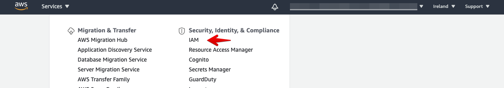
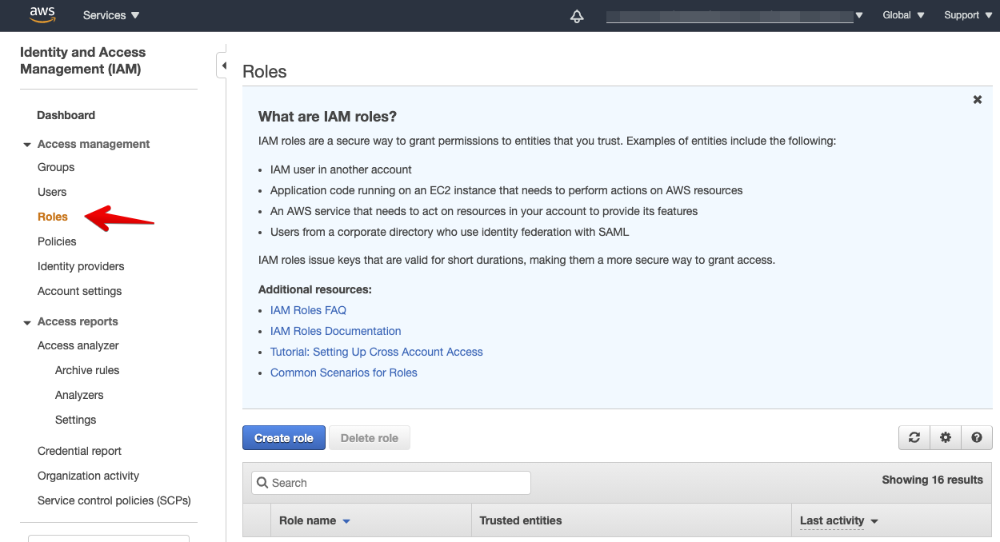
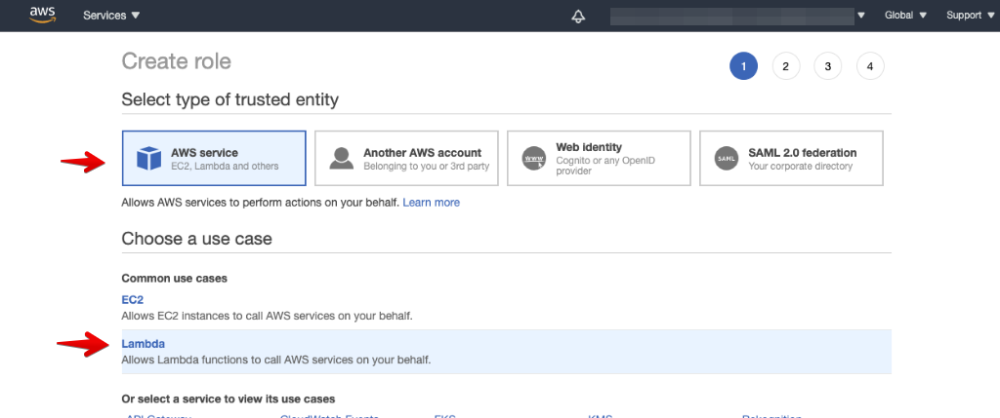
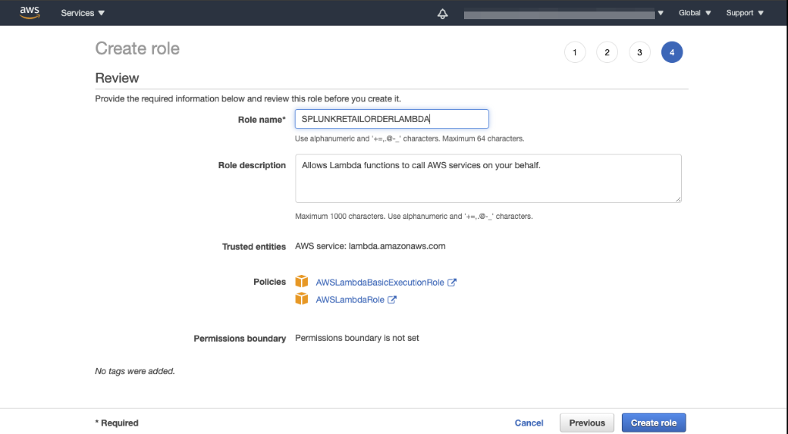

# Setting up your environnement

## 1. Validate APM availability
The goal of this workshop section is to send Traces and Spans to Splunk APM.
Please validate that you can see the option for Splunk APM in your environment by checking the menu bar for the option APM.  

{: .zoom}

Selecting the APM menu should  bring you to the APM Monitoring page:

{: .zoom}

!!! important "Enabling µAPM"

    **If you do not have the APM functionality available, then this section of the workshop cannot be completed!**

    Please reach out to the workshop leader for assistance
---
## 2. Cloning the repository
To start the workshop, we need the content locally , this can be done by creating a clone of the following repository:

=== "Shell Command"

    ```text
    git clone https://github.com/p-hagen-Signalfx/SplunkLambdaAPM.git
    ```

=== "Output"

    ```text
    lots of lines

    ```
---
## 3. Create or validate IAM Role

Before we can run the first test we need to make sure we have a security Role that allows us to use our Lambda's

If you already have a IAM Role containing both the AWSLambdaBasicExecutionRole & AWSLambdaRole policies then you can skip to the [next section](../Setup/Setup-Lambda/) 
otherwise log into your AWS account by going to the AWS management Console. 

{: .zoom}
Scroll down until you see the **IAM** service in the **Security, Identity, & Compliance** section and select it.
{: .zoom}
In the IAM menu on the left select Roles:
{: .zoom}
And then press the ** Create Role **{: .label-button  .AWS-blue} button 

This will bring you in the Create Role Screen

In the first screen select **AWS Service**  and **Lambda** use case as shown below:
{: .zoom}
At the bottom of the page press the ** Next:Permissions **{: .label-button  .AWS-blue}  button.

This brings us **Attach permission policies** section.

{: .zoom}
In the **Filter policies** search box type the following policy :

=== "Policy"
    ```text
    AWSLambdaBasicExecutionRole
    ```
{: .zoom}
Tick the  box in front of the *AWSLambdaBasicExecutionRole* policy then replace the text in the 
**Filter policies** search box with:

== "Policy"
    ```text
    AWSLambdaRole
    ```
{: .zoom}
Tick the  box in front of the *AWSLambdaRole* then press the ** Next: Tags **{: .label-button  .AWS-blue}  button.
On the optional Add Tags page press the press the ** Next: Review **{: .label-button  .AWS-blue}  button.
On the review page name the role **SPLUNKRETAILORDERLAMBDA** (or your preferred name, jusrt remeber to replace when needed)

Verify the Policies are set like below:
{: .zoom}
If satisfied its correct press the ** Create Role **{: .label-button  .AWS-blue}  button to create thr role.

In the next session we will create our first lambda and test it!


