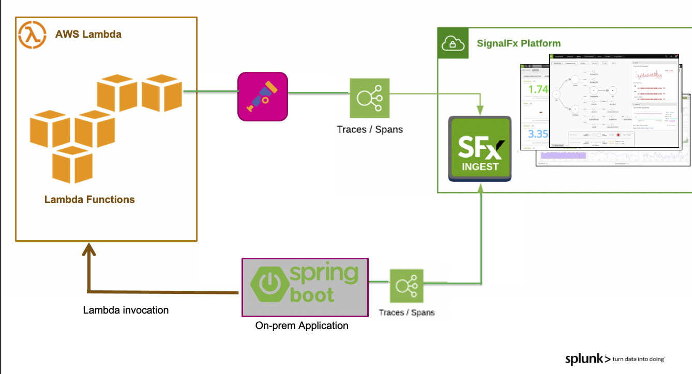

# µAPM with AWS Lambda (Developer Focused) 

!!! important "Enabling µAPM"

    **If you recently signed up for the 14 day free trial then this section of the workshop cannot be completed!**
    
    An Organization needs to be pre-provisioned as a µAPM entitlement is required for the purposes of this module. Please contact someone from SignalFx to get a trial instance with µAPM enabled if you don’t have one already.

    To check if you have an Organization with µAPM enabled, just login to SignalFx and check that you have the µAPM tab on the top navbar next to Dashboards.

---
## 1. AWS Lambda exercise & µAPM overview
This workshop section is focused on developer of serverless/Lambda application/functions and is going to guide them through the steps to add Tracing to Python and Node-Js Lambda Functions, and see traces flow from an on-prem Java application though the various Python and Node-Js Lambda Functions Based on SignalFx µAPM.

SignalFx µAPM captures end-to-end distributed transactions from your applications, including serverless apps (Lambda's) with trace spans sent directly to SignalFx or via an optional  OpenTelemetry Collector that  act as a central aggregation point prior to sending trace spans to SignalFx. (recommended).

In addition to proxying spans and infrastructure metrics, the OpenTelemetry Collector can also perform other functions, such as redacting sensitive tags prior to spans leaving your environment.

The following illustration shows the recommended deployment model: SignalFx auto-instrumentation libraries send spans to the OpenTelemetry Collector; the OpenTelemetry Collector forwards the spans to SignalFx.

{: .zoom}

---
## 2. AWS Lambda exercise requirements flow
During this workshop you will perform the following activities:

* Clone the repository to you local platform
* Create 4 AWS Functions(2 Python & 2 Node-js)  based of the code in the repository
* Create API-Gateway Triggers for the above Lambda's.
* Validate and test the application by running test cases
* Enable Tracing on local App
* Enable Tracing on First Python & Node-js Lambda Functions
* Enable Tracing on the other functions 
* Enrich the spans

---
## 3. AWS Lambda exercise requirements
This workshop section assumes that you have access to the following features as they are required for the workshop: 

* AWS account:
    * Ability to create  policies in AWS
    * Ability to create/run AWS Lambda's
    * Ability to create API-gateway endpoints and configure them
* GIT (to clone the Lambda repository)

Optionally:    
* Maven (to run the Java Spring boot application locally)
