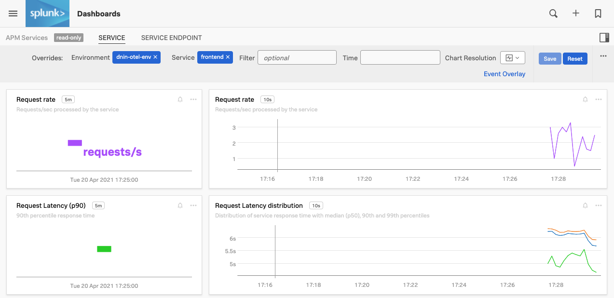
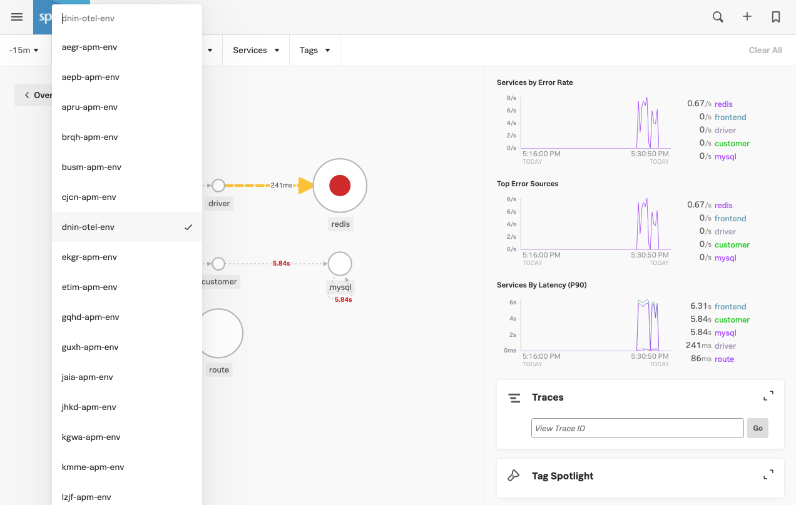

# Deploying Hot R.O.D. in K3s - Lab Summary

* Deploy the Hot R.O.D. application into Kubernetes (K3s)
* Verify the application is running
* Generate some artificial traffic
* See µAPM data in the UI

---

## 1. Deploy the Hot R.O.D. application into K3s

To deploy the Hot R.O.D. application into K3s apply the deployment.
  
=== "Shell Command"

    ```text
    cd ~/workshop
    sudo kubectl apply -f apm/hotrod/k8s/deployment.yaml 
    ```

=== "Output"

    ```text
    deployment.apps/hotrod created
    service/hotrod created
    ```

To ensure the Hot R.O.D. application is running:

=== "Shell Command"

    ```text
    sudo kubectl get pods
    ```

=== "Example Output"

    ```text
    NAME                      READY   STATUS    RESTARTS   AGE
    signalfx-agent-mmzxk      1/1     Running   0          110s
    hotrod-7cc9fc85b7-n765r   1/1     Running   0          41s
    ```

---

## 2. Viewing the Hot R.O.D. application in your browser

The application is viewable on port 8080 of the EC2 instance's IP address. The IP address is the one you used to SSH into the instance at the beginning of the workshop.

Open your web browser and go to `http://{==EC2-IP==}:8080/`, you will then be able to see the application running.


---

## 3. Generate some traffic to the application using Siege Benchmark

Return to your shell and create an environment variable for the IP address and port that the Hot R.O.D. application is exposed on:

=== "Shell Command"

    ```
    HOTROD_ENDPOINT=$(sudo kubectl get svc hotrod -n default -o jsonpath='{.spec.clusterIP}:{.spec.ports[0].port}')
    ```

Confirm the environment variable is set:

=== "Shell Command"

    ```
    curl $HOTROD_ENDPOINT
    ```

Then run the following command(s) to create load on the service:

=== "Shell Command"

    ```text
    siege -r2 -c20 "http://$HOTROD_ENDPOINT/dispatch?customer=392&nonse=0.17041229755366172"
    ```

Create some errors with an invalid customer number:

=== "Shell Command"

    ```text
    siege -r1 -c10 "http://$HOTROD_ENDPOINT/dispatch?customer=391&nonse=0.17041229755366172"
    ```

---

## 4. Validating the Hot R.O.D. application in SignalFx

Open the SignalFx UI, and go to you cluster in the Kubernetes Navigator. You should see the new Pod being started and container being deployed.

Usually it should only take around 20 seconds for the pod to transition into a Running state. When you click on the new pod in the SignalFx UI you should have a cluster that looks like below:

{: .zoom}

If you select the **WORKLOADS** tab again you should now see that there is a new replica set and a deployment added for hotrod:

{: .zoom}

Next, we want to validate that you are seeing the APM metrics in the UI.

For this we need to know the name of your application environment. In this workshop all the environments use your `{==hostname==}-apm-env`.

To find the hostname, on the AWS/EC2 instance run the following command:

=== "Shell Command"

    ```text
    echo "Your µAPM environment is: $(hostname)-apm-env"
    ```

=== "Example Output"

    ```text
    Your µAPM environment is: whul-apm-env
    ```
---

Now go to **Dashboards → µAPM → Service**.  Please select your environment you found in the previous task then select the frontend service and set time to -15m ()

{: .zoom}

!!! warning  "No Data in charts"
    If no data is visible, check that you have the right service **frontend**, and not front-end.

To load the dashboard with more data run the following command a few times to create load on the service:

=== "Shell Command"

    ```text
    siege -r2 -c20 "http://$HOTROD_ENDPOINT/dispatch?customer=392&nonse=0.17041229755366172"
    ```

With this automatically generated dashboard you can keep an eye out for the health of your service, it provides various performance related charts as well as relevant information on the underlying host and Kubernetes platform if applicable.

Take some time to explore the various charts in this dashboard

---

## 5. Verify that µAPM traces are reaching SignalFx

Open SignalFx in your browser and select the **µAPM** tab.

{: .zoom}

Select the **Troubleshooting** tab, and select your environment you found before and set the time to 15 minutes. This will show you the automatically generated Dependency Map for the Hot R.O.D. application.
It should look similar to the screenshot below:

{: .zoom}

The legend at the bottom of the page explains the different visualizations in the Dependency Map.

{: : .shadow .zoom}

* Service requests, error rate and root error rate.
* Request rate, latency and error rate

Also in this view you can see the overall Error and Latency rates over time charts.
