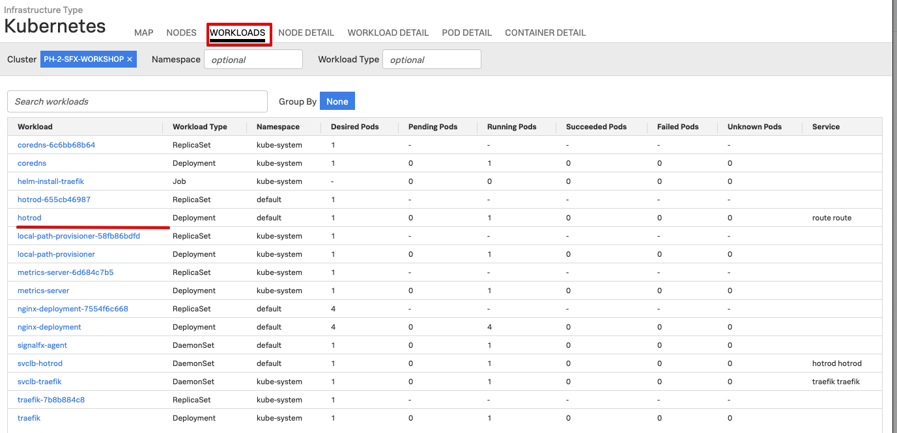
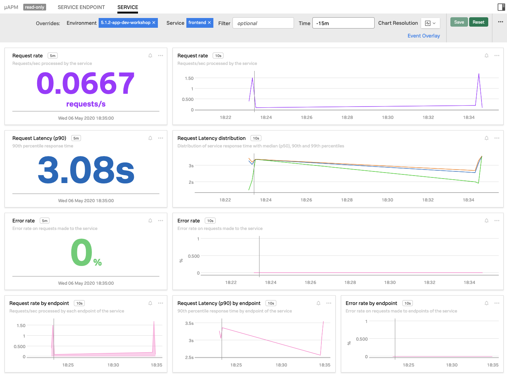
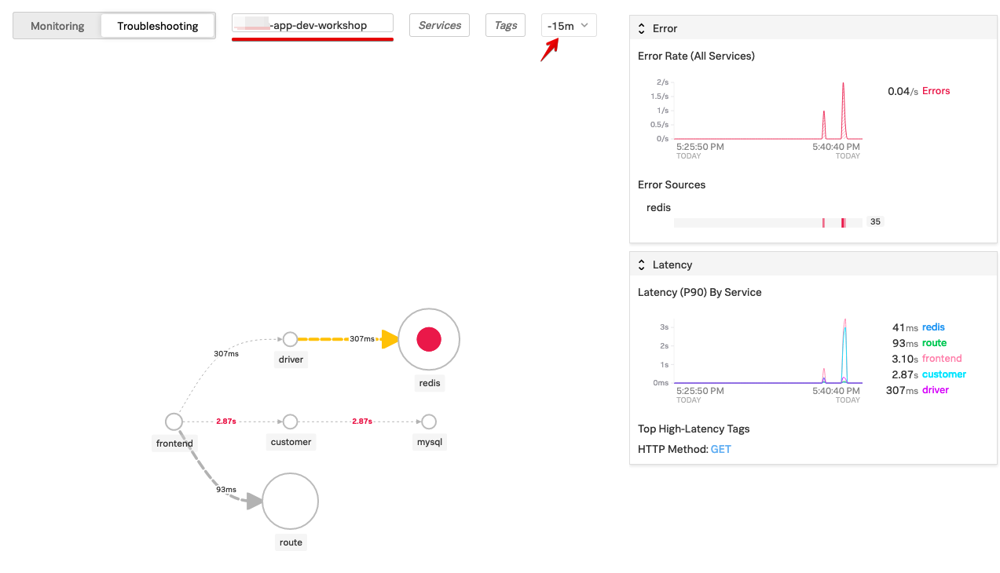

# Deploying Hot R.O.D. in K3s - Lab Summary

* Deploy application into K3s
* Verify the application is running
* Generate some artificial traffic
* See APM traces in the UI
* Run a troubleshooting exercise with uAPM

!!! note "Ensure you have a running instance"
    The setup part is already documented in the [Preparation](../../smartagent/prep/) and [Deploy the Smart Agent in K3s](../../smartagent/k3s/) steps. If you are using an AWS/EC2 instance, make sure it is available and skip to [Step 1](../../apm/hotrod/#1-deploy-the-hot-rod-application-into-k3s), otherwise ensure your Multipass instance is available and running before continuing.

    === "Input"

        ```
        multipass list
        ```

    === "Output"

        ```
        Name                     State             IPv4             Image
        d823-k3s                 Running           192.168.64.17    Ubuntu 18.04 LTS
        ```

---

## 1. Deploy the Hot R.O.D. application into K3s

To deploy the Hot R.O.D. application into K3s apply the deployment.
  
=== "Input"

    ```bash
    cd ~/workshop
    kubectl apply -f apm/hotrod/k8s/deployment.yaml 
    ```

=== "Output"

    ```text
    deployment.apps/hotrod created
    service/hotrod created
    ```

To ensure the Hot R.O.D. application is running:

=== "Input"

    ```bash
    kubectl get pods
    ```

=== "Output"

    ```text
    NAME                      READY   STATUS    RESTARTS   AGE
    signalfx-agent-mmzxk      1/1     Running   0          110s
    hotrod-7cc9fc85b7-n765r   1/1     Running   0          41s
    ```

---

## 2. Viewing the Hot R.O.D. application in your browser

!!! note "AWC/EC2 Users"
    If you are using an AWS/EC2 instance, the application will be available on port 8080 of the EC2 instance's IP address. Open your web browser and go to `http://{==EC2-IP==}:8080/`, you will then be able to see the application running.

    Then continue with the next section on how to [Generate Traffic](../../apm/hotrod/#3-generate-some-traffic-to-the-application-using-siege-benchmark).

In order to view the application in your web browser we need to find the `LoadBalancer` IP address and the port the application is listening on.

=== "Input"

    ```bash
    kubectl get svc
    ```

=== "Output"

    ```text
    NAME         TYPE           CLUSTER-IP     EXTERNAL-IP     PORT(S)          AGE
    kubernetes   ClusterIP      10.43.0.1      <none>          443/TCP          43m
    hotrod       LoadBalancer   10.43.32.97   {==192.168.64.35==}   8080:31521/TCP   40m
    ```

Make note of the `EXTERNAL-IP` (in the example above this is `192.168.64.35`). Open your web browser and type in `http://{==EXTERNAL-IP==}:8080`, you will then be able to see the application running. Click on customer name to order a car:


---

## 3. Generate some traffic to the application using Siege Benchmark

Return to your shell and create an environment variable for the IP address and port that the Hot R.O.D. application is exposed on:

=== "Input"

    ```
    HOTROD_ENDPOINT=$(kubectl get svc hotrod -n default -o jsonpath='{.spec.clusterIP}:{.spec.ports[0].port}')
    ```

Confirm the environment variable is set

=== "Input"

    ```
    curl $HOTROD_ENDPOINT
    ```

Then run the following command(s) to create load on the service:

=== "Input"

    ```bash
    siege -r2 -c20 "http://$HOTROD_ENDPOINT/dispatch?customer=392&nonse=0.17041229755366172"
    ```

Create some errors with an invalid customer number

=== "Input"

    ```bash
    siege -r1 -c10 "http://$HOTROD_ENDPOINT/dispatch?customer=391&nonse=0.17041229755366172"
    ```
---

## 4. Validating the Hot R.O.D. application in SignalFx

Open the SignalFx UI, and go to you cluster in the Kubernetes Navigator. You should see the new Pod being started and containers being deployed.

Usually it should only take around 20 seconds for the pod to transition into a Running state. When you click on the new pod in the SignalFx UI you should have a cluster that looks like below:

{: .zoom}

If you select the **WORKLOADS** tab again you should now see that there is a new replica set and a deployment added for hotrod:

{: .zoom}

Next, we want to validate that you are seeing the APM metrics in the UI.

For this we need to know the name of your application environment.
In this workshop all the environments use your hostname + "-SFX-WORKSHOP

To find the hostname, check the prompt of you instance, please go to your
instance (multipass or EC2) and run the following command.

=== "Input"

    ```bash
    echo "Your µAPM environment is: $(hostname)-app-dev-workshop"
    ```
 
=== "Output"

    ```text
    Your µAPM environment is: ip-172-31-30-133-app-dev-workshop
    ```
---
 
 Now go to **Dashboards → µAPM → Service**.  Please select your environment you found in the previous task then select the front end service and set time to -15m

{: .zoom}

To load the dashboard with more data run the following command a few times to create load on the service:

=== "Input"

    ```bash
    siege -r2 -c20 "http://$HOTROD_ENDPOINT/dispatch?customer=392&nonse=0.17041229755366172"
    ```

With this automatically generated dashboard you can keep an eye out for the health of you service, it provides various performance related charts as well as relevant information on the underlying host and kubernetes platform if applicable.
 
Take some time to explore the various charts in this dashboard

---

## 5. Verify that µAPM traces are reaching SignalFx

Open SignalFx in your browser and select the **µAPM** tab.

{: .zoom}

Select the **Troubleshooting** tab, and select your environment and set the time to 15 minutes. This will show you the Dependency Map for the Hot R.O.D. application.


