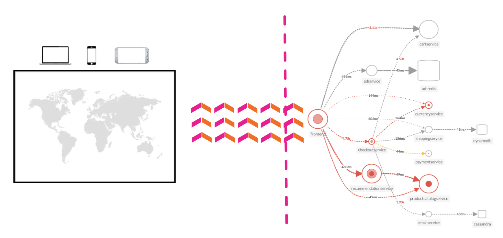

# APM Architecture Overview

Splunk APM is an application performance monitoring and troubleshooting solution for cloud-native, microservices-based applications. APM monitors applications by collecting traces. A trace is a collection of actions that occur to complete a transaction. Each action in a trace is known as a span.

APM collects and analyzes every span and trace that an application’s instrumentation generates. This provides full-fidelity, infinite cardinality exploration of trace data an application generates, enabling you to break down and analyze application performance along any dimension.

The following illustration shows the recommended deployment model: Splunk OpenTelemetry auto-instrumentation libraries send spans to the Splunk OpenTelemetry Collector which in turn forwards on to Splunk APM.

