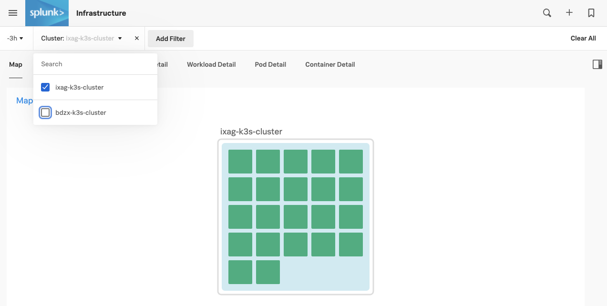
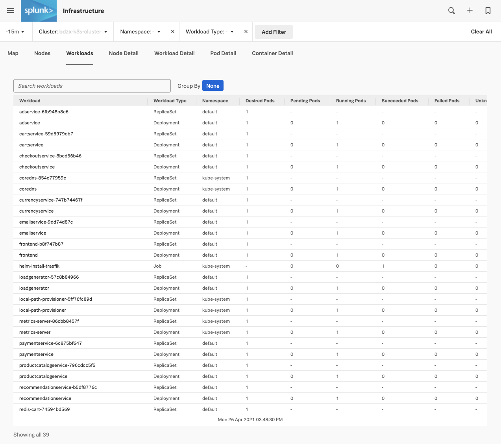
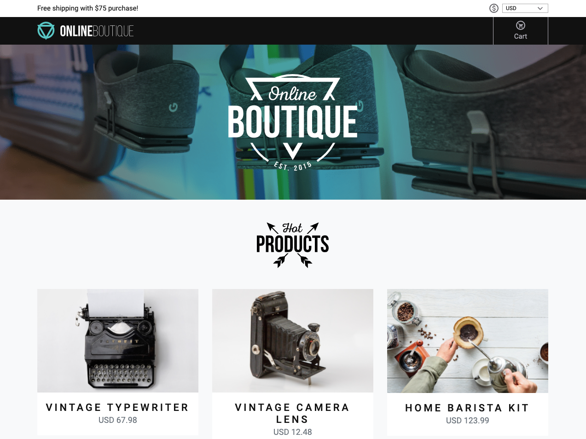
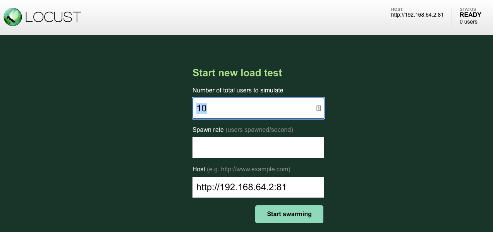
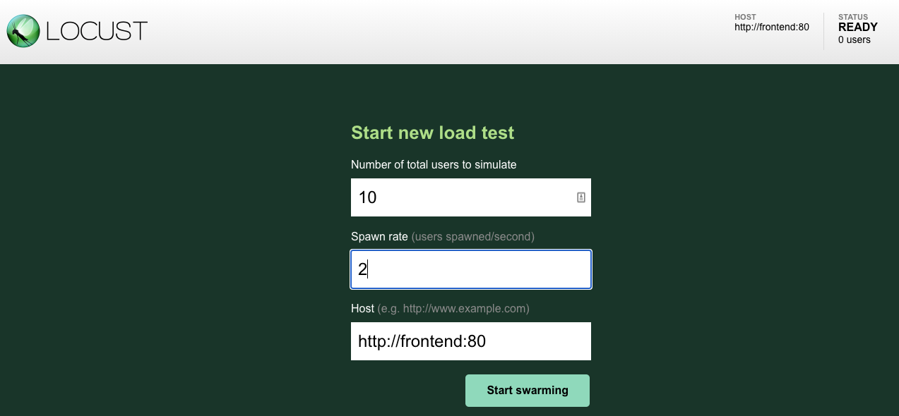
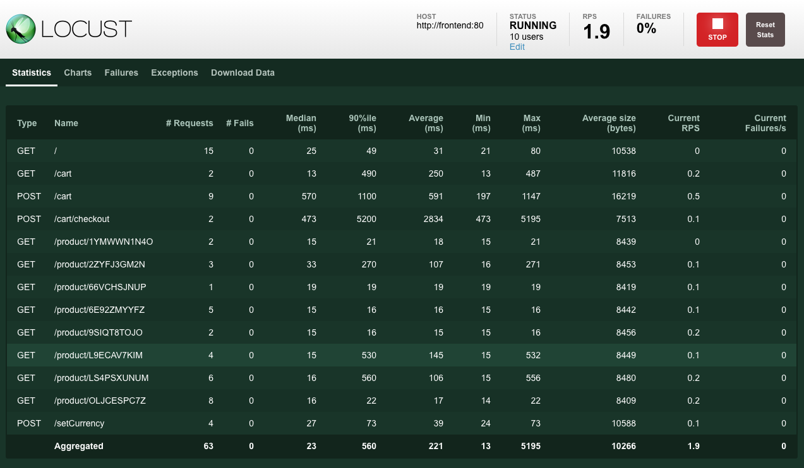
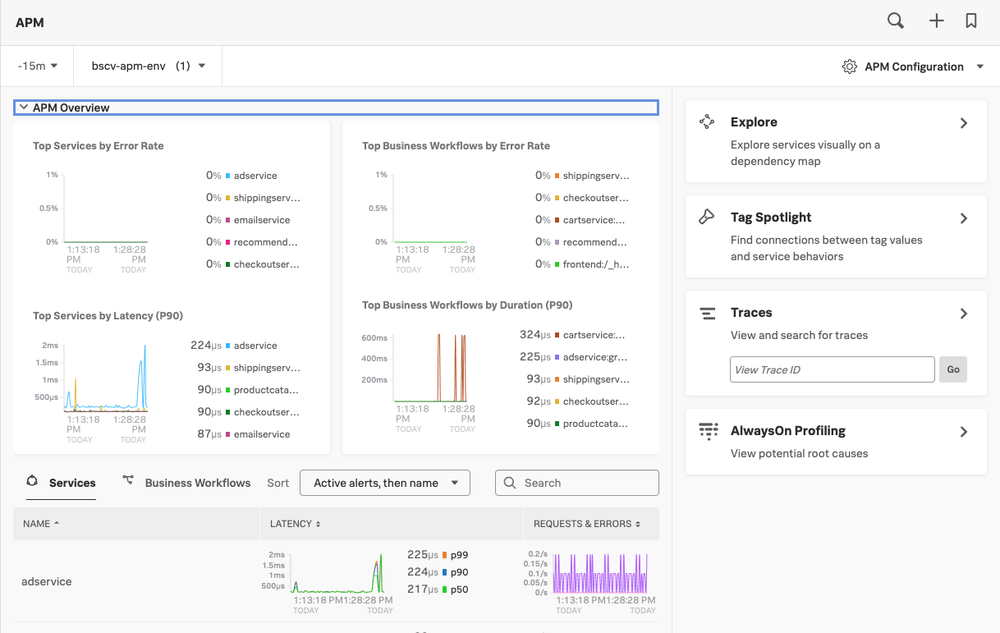
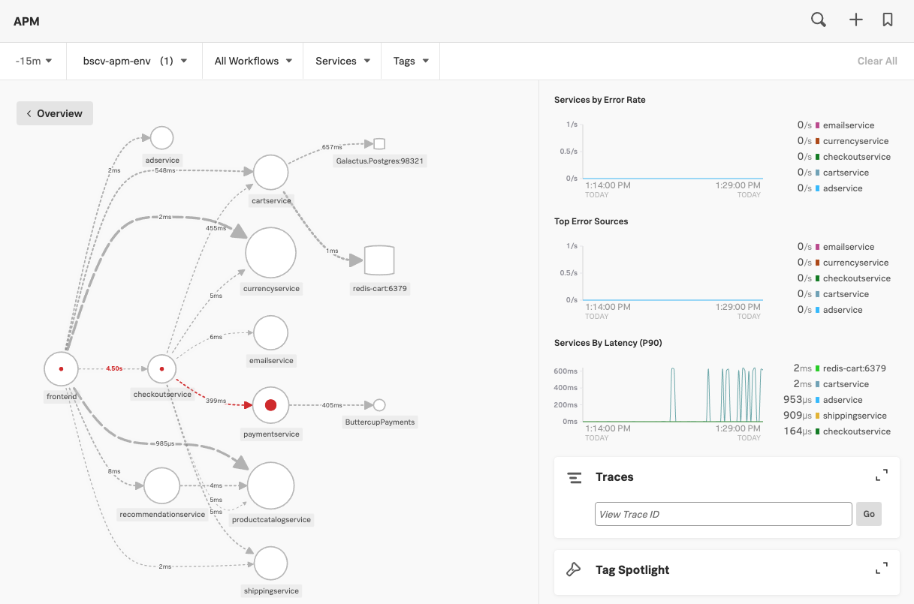
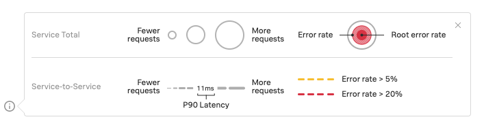
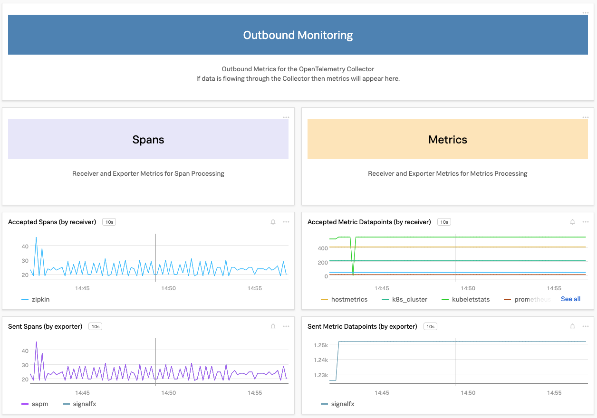

# Deploying the Online Boutique in K3s - Lab Summary

* Deploy the Online Boutique application into Kubernetes (K3s)
* Verify the application is running
* Generate some artificial traffic using Locust
* See APM metrics in the UI

---

## 1. Deploy Online Boutique

To deploy the Online Boutique application into K3s apply the deployment:

=== "Using OpenTelemetry Collector"

    ```text
    cd ~/workshop
    kubectl apply -f apm/microservices-demo/k8s/deployment.yaml
    ```

=== "Output"

    ```text
    deployment.apps/checkoutservice created
    service/checkoutservice created
    deployment.apps/redis-cart created
    service/redis-cart created
    deployment.apps/productcatalogservice created
    service/productcatalogservice created
    deployment.apps/loadgenerator created
    service/loadgenerator created
    deployment.apps/frontend created
    service/frontend created
    service/frontend-external created
    deployment.apps/paymentservice created
    service/paymentservice created
    deployment.apps/emailservice created
    service/emailservice created
    deployment.apps/adservice created
    service/adservice created
    deployment.apps/cartservice created
    service/cartservice created
    deployment.apps/recommendationservice created
    service/recommendationservice created
    deployment.apps/shippingservice created
    service/shippingservice created
    deployment.apps/currencyservice created
    service/currencyservice created
    ```

To ensure the Online Boutique application is running:

=== "Get Pods"

    ```text
    kubectl get pods
    ```

=== "Output"

    ```text
    NAME                                                          READY   STATUS    RESTARTS   AGE
    splunk-otel-collector-k8s-cluster-receiver-56585564cc-xclzj   1/1     Running   0          84s
    splunk-otel-collector-agent-hkshj                             1/1     Running   0          84s
    svclb-frontend-external-c74n6                                 1/1     Running   0          53s
    currencyservice-747b74467f-xxrl9                              1/1     Running   0          52s
    redis-cart-74594bd569-2jb6c                                   1/1     Running   0          54s
    adservice-6fb948b8c6-2xlrc                                    0/1     Running   0          53s
    recommendationservice-b5df8776c-sbt4h                         1/1     Running   0          53s
    shippingservice-6d6f7b8d87-5lg9g                              1/1     Running   0          53s
    svclb-loadgenerator-jxwct                                     1/1     Running   0          53s
    emailservice-9dd74d87c-wjdqr                                  1/1     Running   0          53s
    checkoutservice-8bcd56b46-bfj7d                               1/1     Running   0          54s
    productcatalogservice-796cdcc5f5-vhspz                        1/1     Running   0          53s
    paymentservice-6c875bf647-dklzb                               1/1     Running   0          53s
    frontend-b8f747b87-4tkxn                                      1/1     Running   0          53s
    cartservice-59d5979db7-bqf64                                  1/1     Running   1          53s
    loadgenerator-57c8b84966-7nr4f                                1/1     Running   3          53s
    ```

!!! info
    Usually it should only take around 1min 30secs for the pods to transition into a Running state.

---

## 3. Validate in the UI

From the top left hamburger menu, click **Infrastructure → Kubernetes**.

Use the **Cluster** dropdown so select your cluster, you should see the new pods started and containers deployed.

When you click on your cluster in the Splunk UI you should have a view that looks like below:



If you select the **WORKLOADS** tab again you should now see that there are a number of Deployments and ReplicaSets:



---

## 4. View Online Boutique

The Online Boutique is viewable on port 81 of the EC2 instance's IP address. The IP address is the one you used to SSH into the instance at the beginning of the workshop.

Open your web browser and go to `http://{==EC2-IP==}:81/` where you will then be able to see the Online Boutique running.



---

## 5. Generate traffic

The Online Boutique deployment contains a container running Locust that we can use to generate load traffic against the website to generate metrics, traces and spans.

Locust is available on port 82 of the EC2 instance's IP address. Open a new tab in your web browser and go to `http://{==EC2-IP==}:82/`, you will then be able to see the Locust running.



Set the **Spawn rate** to be 2 and click **Start Swarming**, this will start a gentle continous load on the application.





---

Now go to **Dashboards → APM Services → Service**.

For this we need to know the name of your application environment. In this workshop all the environments use: `{==hostname==}-apm-env`.

To find the hostname, on the AWS/EC2 instance run the following command:

=== "Shell Command"

    ```text
    echo $(hostname)-apm-env
    ```

=== "Output Example"

    ```text
    bdzx-apm-env
    ```

Select your environment you found in the previous step then select the `frontend` service and set time to Past 15 minutes.


With this automatically generated dashboard you can keep an eye out for the health of your service(s) using RED (Rate, Error & Duration) metrics. It provides various performance related charts as well as correlated information on the underlying host and Kubernetes pods (if applicable).

Take some time to explore the various charts in this dashboard

---

## 6. Verify Splunk APM metrics

From the top left hamburger menu, click APM, this will bring you to the APM Overview dashboard:



Select the **Explore** on the right hand side and select your environment you found before and set the time to 15 minutes. This will show you the automatically generated Dependency/Service Map for the Online Boutique application.

It should look similar to the screenshot below:



The legend at the bottom of the page explains the different visualizations in the Dependency/Service Map.

{: : .shadow .zoom}

* Service requests, error rate and root error rate.
* Request rate, latency and error rate

Also in this view you can see the overall Error and Latency rates over time charts.

## 7. OpenTelemetry Dashboard

Once the Open Telemetery Collector is deployed the platform will automatically provide a built in dashboard display OpenTelemetry Collector metrics.

From the top left hamburger menu, select **Dashboards → OpenTelemetry Collector** and validate metrics and spans are being sent:



## 8. OpenTelemetry zpages

To debug the traces being sent you can use the zpages extension. [zpages][zpages]{: target=_blank} are part of the OpenTelemetry collector and provide live data for troubleshooting and statistics. They are available on port `55679` of the EC2 instance's IP address. Open a new tab in your web browser and enter in `http://{==EC2-IP==}:55679/debug/tracez`, you will then be able to see the zpages output.

[zpages]: https://github.com/open-telemetry/opentelemetry-specification/blob/main/experimental/trace/zpages.md#tracez


Alternatively, from your shell prompt you can run a text based browser:

=== "Shell Command"

    ```
    lynx http://localhost:55679/debug/tracez
    ```
