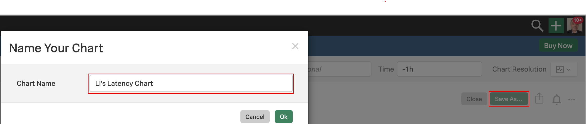
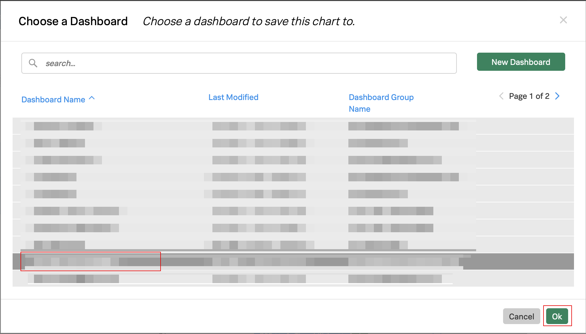
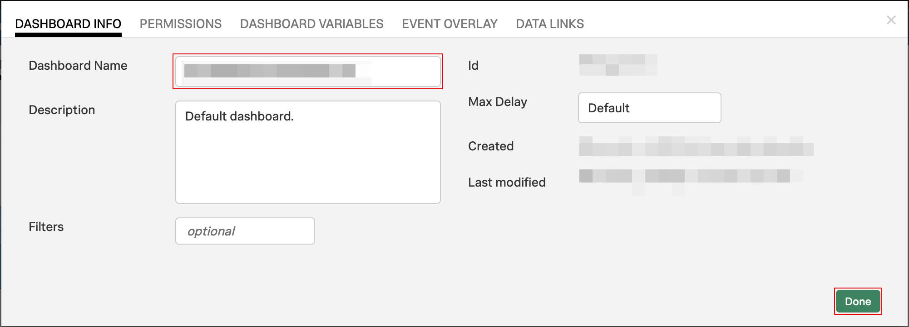
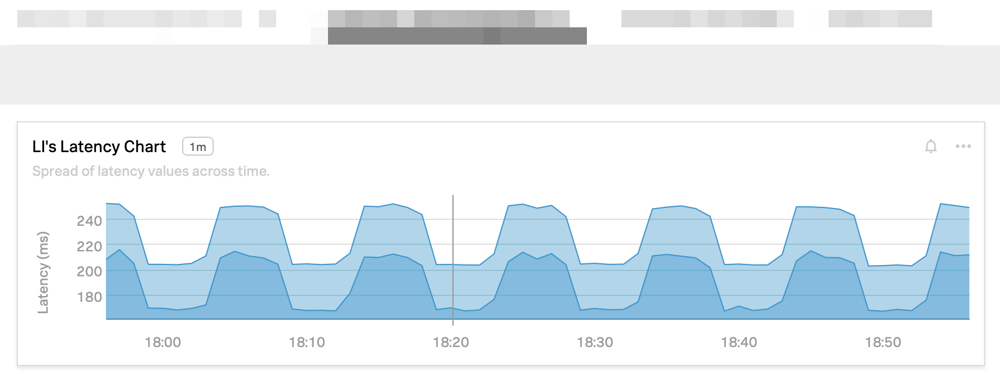

# Adding charts to dashboards

Let's now save our chart. Click on **Save as...**{: .label-button .sfx-ui-button-blue} and enter a name for your chart; use your initials like **`[YOUR INITIALS] Latency Chart`** and click **OK**.

In the next window, find your email address in the list and select it, then click **Ok**{: .label-button .sfx-ui-button-blue}.

You will immediately be transported to the dashboard created under your selected group (make sure the group name on the top left is your email address).

Last but not least, change the dashboard's name, by clicking the `...` icon on the top right and selecting **Rename**.

Enter a new name for your dashboard and click on **Done**{: .label-button .sfx-ui-button-blue}.

Congratulations! You have created your first chart and dashboard!

