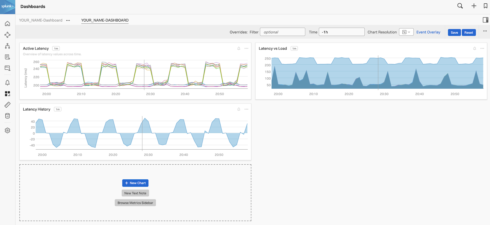
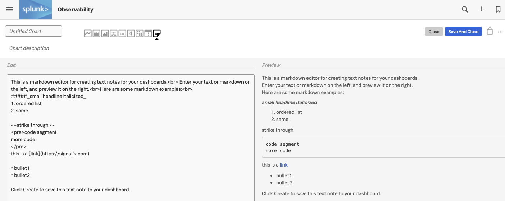
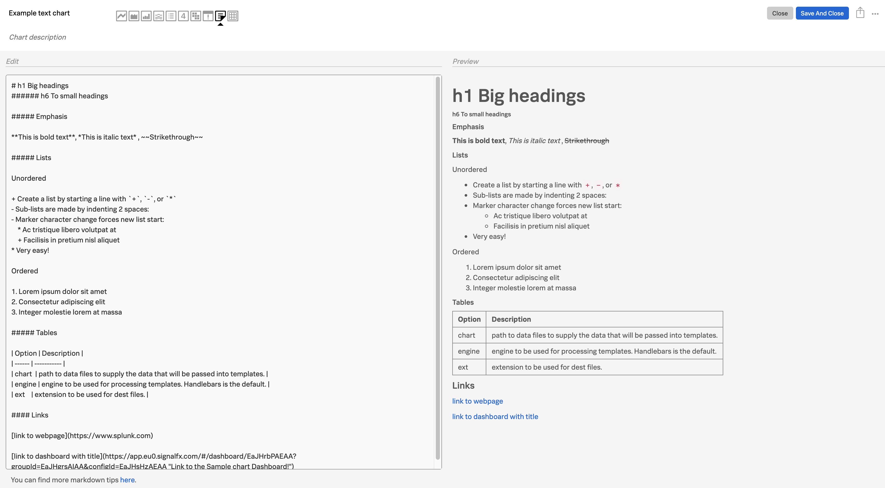
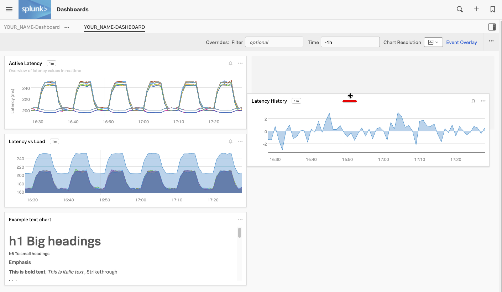
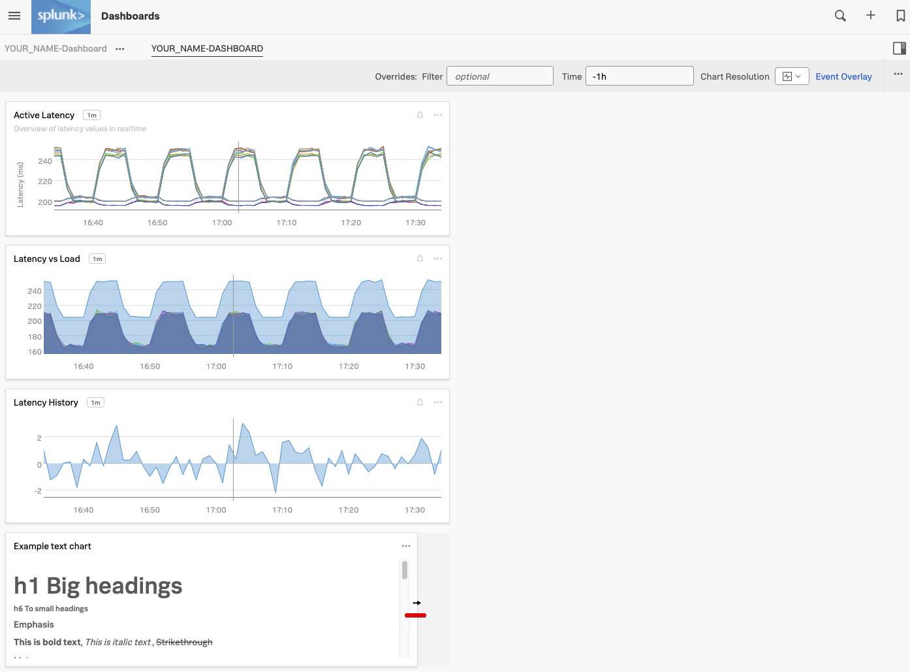
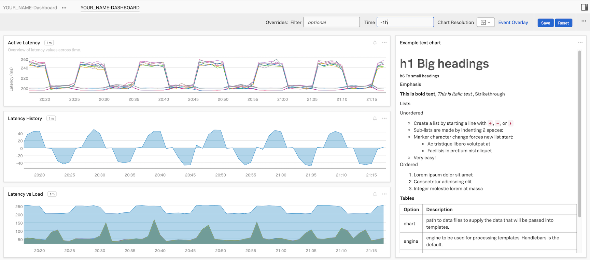

# ノートの追加とダッシュボードのレイアウト

## 1. メモの追加

ダッシュボードには、ダッシュボードの利用者を支援するための短い「説明」ペインを配置することがよくあります。

ここでは、**New Text Note**{: .label-button.sfx-ui-button-grey} ボタンをクリックして、ノートを追加してみましょう。



ノートエディターが開きます。



ノートに単なるテキスト以外のものを追加できるように、Splunk ではこれらのノート/ペインで Markdown を使用できるようにしています。
Markdown は、ウェブページでよく使われるプレーンテキストを使ってフォーマットされたテキストを作成するための軽量なマークアップ言語です。

これには以下が含まれます (ただし、これらに限定されません)。

* ヘッダー (様々なサイズで)
* 強調スタイル
* リストとテーブル
* リンク: 外部の Web ページ (ドキュメントなど) や他の Splunk IMT ダッシュボードへの直接リンクできます

以下は、ノートで使用できる上記のMarkdownオプションの例です。

=== "Markdown テキストのサンプル"

    ```text

    # h1 Big headings
    ###### h6 To small headings

    ##### Emphasis

    **This is bold text**, *This is italic text* , ~~Strikethrough~~

    ##### Lists

    Unordered

    + Create a list by starting a line with `+`, `-`, or `*`
    - Sub-lists are made by indenting 2 spaces:
    - Marker character change forces new list start:
        * Ac tristique libero volutpat at
        + Facilisis in pretium nisl aliquet
    * Very easy!

    Ordered

    1. Lorem ipsum dolor sit amet
    2. Consectetur adipiscing elit
    3. Integer molestie lorem at massa

    ##### Tables

    | Option | Description |
    | ------ | ----------- |
    | chart  | path to data files to supply the data that will be passed into templates. |
    | engine | engine to be used for processing templates. Handlebars is the default. |
    | ext    | extension to be used for dest files. |

    #### Links

    [link to webpage](https://www.splunk.com)

    [link to dashboard with title](https://app.eu0.signalfx.com/#/dashboard/EaJHrbPAEAA?groupId=EaJHgrsAIAA&configId=EaJHsHzAEAA "Link to the Sample chart Dashboard!")
    ```
上記をコピーボタンでコピーして、*Edit* ボックスにペーストしてください。
プレビューでどのように表示されるか確認できます。

---

## 2. チャートの保存

ノートチャートに名前を付けます。この例では、*Example text chart* としました。そして、**Save And Close**{: .label-button .sfx-ui-button-blue} ボタンを押します。

これでダッシュボードに戻ると、メモが追加されました。



---

## 3. チャートの順序とサイズ

デフォルトのチャートの順番やサイズを変更したい場合は、ウィンドウをドラッグして、チャートを好きな場所に移動したり、サイズを変更したりすることができます。

チャートの **上側の枠** にマウスポインタを移動すると、マウスポインタがドラッグアイコンに変わります。これで、チャートを任意の場所にドラッグすることができます。



ここでは、**Latency History**　チャートを　**Latency vs Load**　チャートの下に移動してください。

チャートのサイズを変更するには、側面または底面をドラッグします。



最後の練習として、ノートチャートの幅を他のチャートの3分の1程度にしてみましょう。チャートは自動的に、サポートしているサイズの1つにスナップします。他の3つのチャートの幅を、ダッシュボードの約3分の1にします。ノートを他のチャートの左側にドラッグして、他の23個のチャートに合わせてサイズを変更します。

最後に、時間を -1h に設定すると、以下のようなダッシュボードになります。



次は、ディテクターの登場です！
