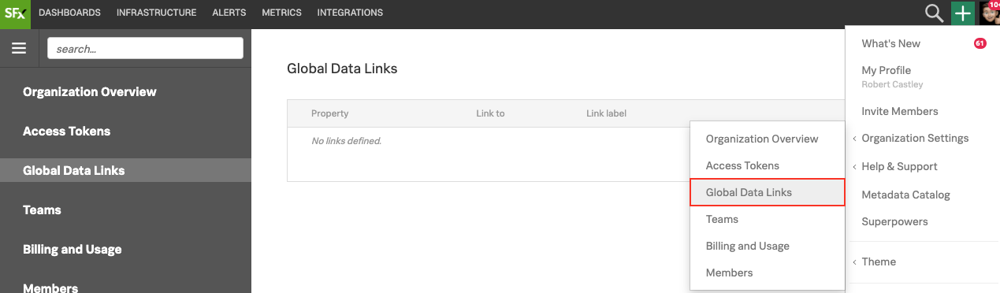
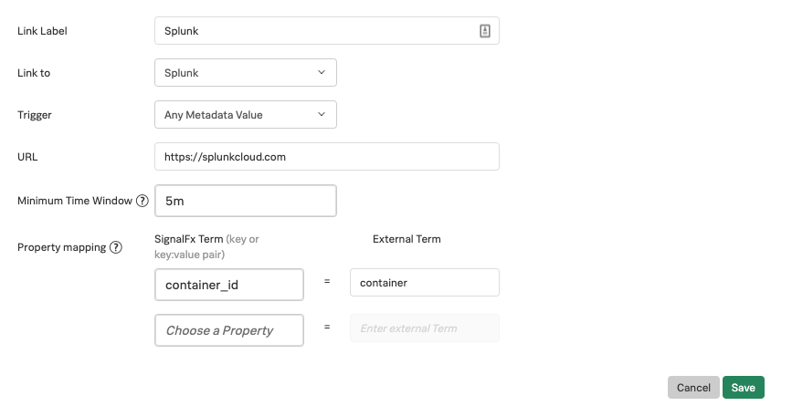
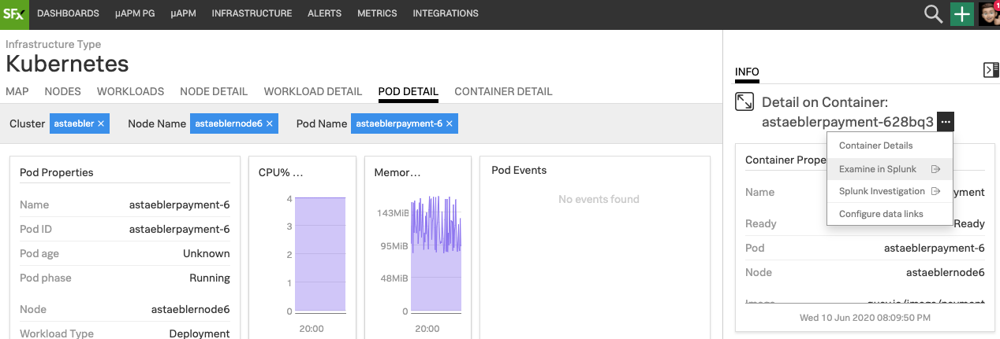
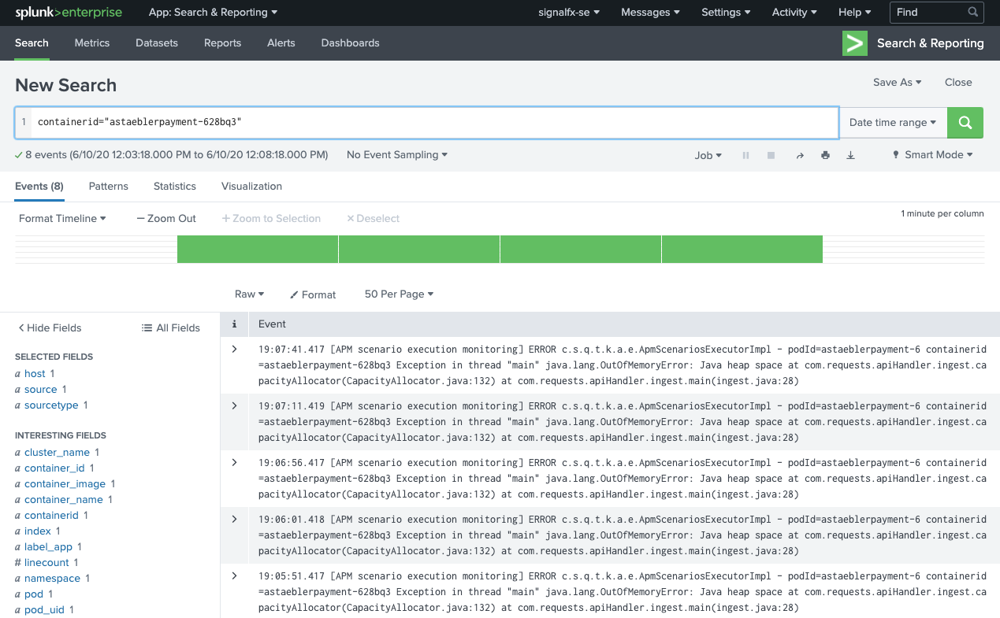

# Integration with Splunk

## 1. Introduction to Data links

Data Links allow you to create dynamic links on properties that appear in a chart’s data table and in list charts. Once enable this allows you to swiftly jump into external systems or SignalFx dashboards.

## 2. Configuring an integration with Splunk

!!! note "Informational exercise only"
    This module is purely informational and serves only to educate how to link from SignalFx into Splunk

Goto **Settings → Organizations Settings → Global Data Links** and click on **New Link**{: .label-button .sfx-ui-button-blue}

{: .zoom}

Here you will need to provide a **Link Label** e.g. Splunk. For the **Link to** use the dropdown and select **Splunk**.

For **Trigger** there are 3 possible options:

* _Any Metadata value_ - To display your link next to every property and every property value in a chart, select Any Metadata Value.
* _Any Value of_ - To display your link next to a specified property type, select Any Value of.
* _Property:Value Pair_ - To display your link next to a specified property value within a specified property type, select Property: Value Pair.

To maximize the integration with Splunk, you are probably best selecting **Any Metadata Value**

The **URL** value will be the your Splunk instance.

The **Minimum Time Window** will be the time interval between values assigned to `start_time` and `end_time` variables and is equal to either this window or, when linking from a data table, the chart resolution if that is wider.

For **Property mapping** this allows you define mappings between terms found in SignalFx and the external system. So, for example, SignalFx might have a property set called `container_id` but the external system uses `container`.

{: .zoom}

## 3. Using Data Links

Once the Data Link is configured any Data Table, List Chart or from Kubernetes Navigator will provide an ellipsis (***...***) allowing you to **Examine in Splunk**.

{: .zoom}

!!! note
    Please note that because we configured **Any Metadata value** not all Data Links will yield results as there might not be corresponding logs for the property value.

{: .zoom}
