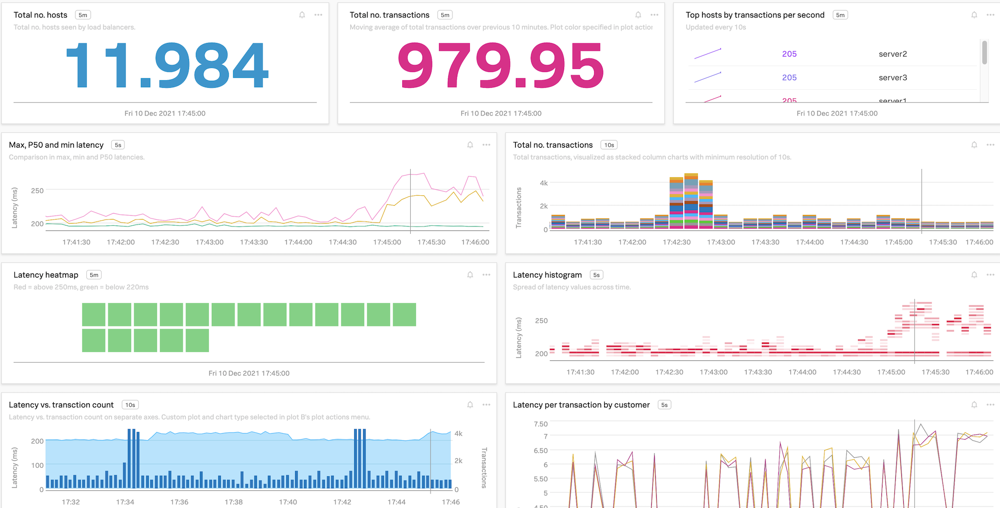
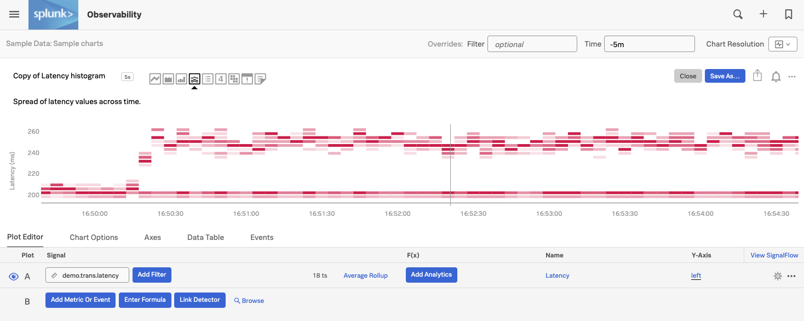
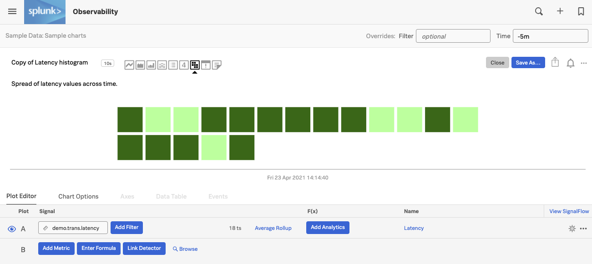
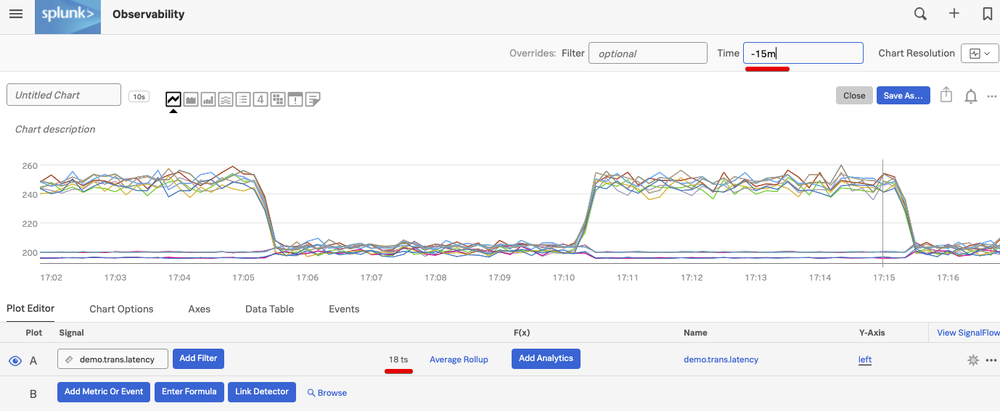
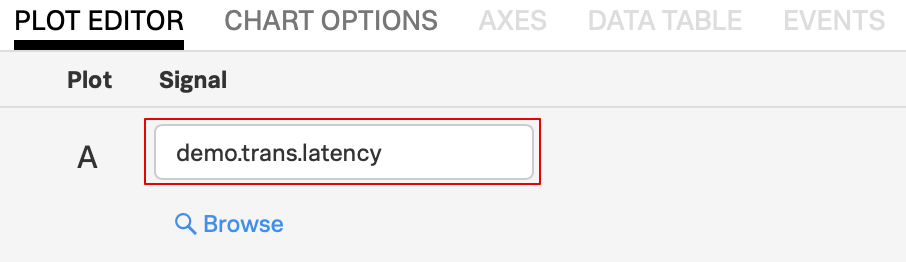
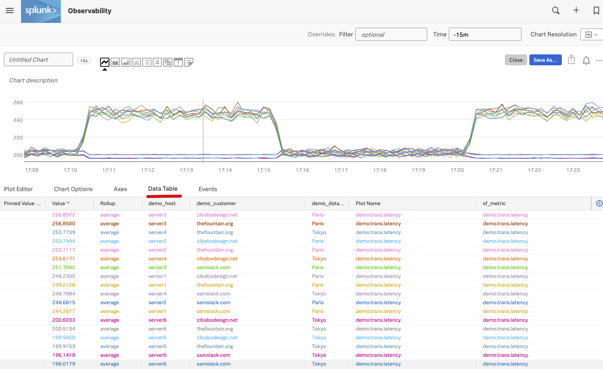

# Editing charts

## 1. Edit Histogram Chart

Click on the three dots **`...`** on the **Latency histogram** chart in the **Sample Data** dashboard and then on **Open** (or you can click on the name of the chart which here is **Latency histogram**).

You will see the plot options, current plot and signal (metric) for the **Latency histogram** chart in the chart edit UI.

Click on the different chart type icons to explore each of the visualizations. Notice their name while you swipe over them.

For Example click on the Heat Map icon

See how the chart changes to a heat map.

!!! note
    You can use different ways to visualize your metrics - you choose which chart type fits best for the visualization you want to have.

    For more info on the different chart types see [Choosing a chart type](https://docs.signalfx.com/en/latest/charts/chart-planning-creating.html#choosing-a-chart-type){: target=_blank}.

Click on the **Line** chart type and you will see the line plot.

You will see a number of **Line** plots. The number **`18 ts`** indicates that we are plotting 18 metric time series in the chart.

You also want to increase the time window of the chart by changing the **Time** to *-15m* by selecting it from the **Time** dropdown in the upper right corner

In the **Plot Editor** tab under **Signal** you see the metric **`demo.trans.latency`** we are currently plotting.

Click on the **DATA TABLE** tab.

You see now all 18 rows, each representing a metics time series with a number of columns. If you swipe over the plot horizontally you will see the metrics in these columns at different times.

In the **`demo_datacenter`** column you see that there are two data centers, **Paris** and **Tokyo**, for which we are getting metrics.

---
Now click on **Plot editor** again to close the Data Table and let's save this chart into a dashboard for later use!

