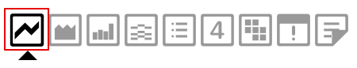
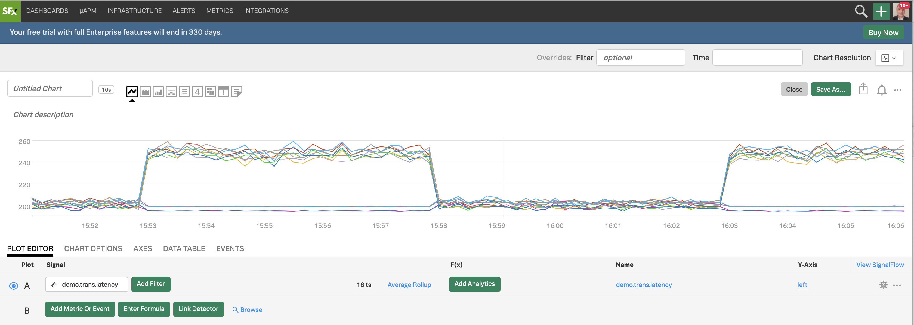
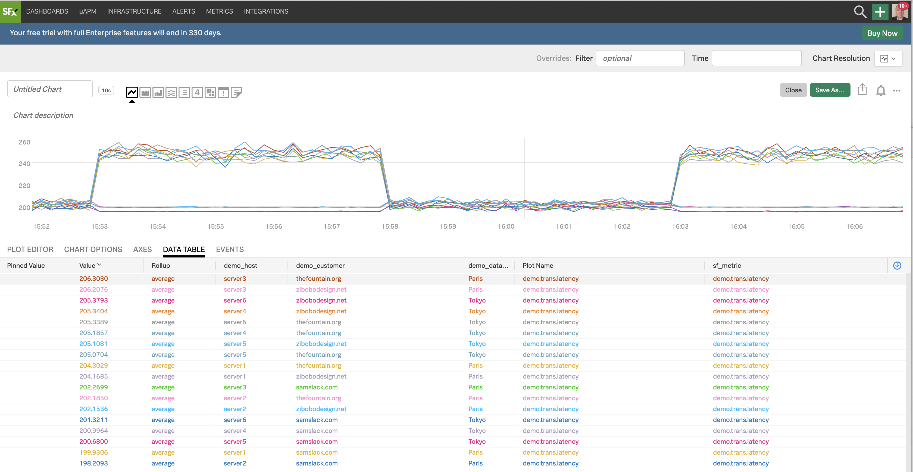

# Editing charts

## 1. Edit Histogram Chart

Click on the three dots **`...`** on the **Latency histogram** chart in the **Sample Data** dashboard and then on **Open** (or you can click on the name of the chart which here is **Latency histogram**).

{: .zoom}

You will see the plot options, current plot and signal (metric) for the **Latency histogram** chart.

{: .zoom}

Click on the different chart type icons to explore each of the visualizations. Notice their name while you click on or swipe over them.

See how the chart changes.

!!! note
    You can use different ways to visualize your metrics - you choose which chart type fits best for the visualization you want to have.

    For more info on the different chart types see [Choosing a chart type](https://docs.signalfx.com/en/latest/charts/chart-planning-creating.html#choosing-a-chart-type){: target=_blank}.

Click on the **Line** chart type and you will see the line plot.

In the **Plot Editor** tab under **Signal** you see the metric **`demo.trans.latency`** we are currently plotting.

{: .zoom}

---

## 2. Creating a new chart

Let's now create a new chart and save it in a new dashboard!

Click on the plus icon (top right of the UI) and from the drop down, click on **Chart**.

{: .zoom}

You will now see a chart template like the following.

{: .zoom}

Let's enter a metric to plot. We are going to use the metric **`demo.trans.latency`**.

In the **Plot Editor** tab under **Signal** enter **`demo.trans.latency`**.

You will instantly see a number of **Line** plots, like below. The number **`18 ts`** indicates that we are plotting 18 metric time series in the chart.

{: .zoom}

Click on the **DATA TABLE** tab.

{: .zoom}

You see now 18 rows, each representing a metics time series with a number of columns. If you swipe over the plot horizontally you will see the metrics in these columns at different times.

In the **`demo_datacenter`** column you see that there are two data centers, **Paris** and **Tokyo**, for which we are getting metrics.
