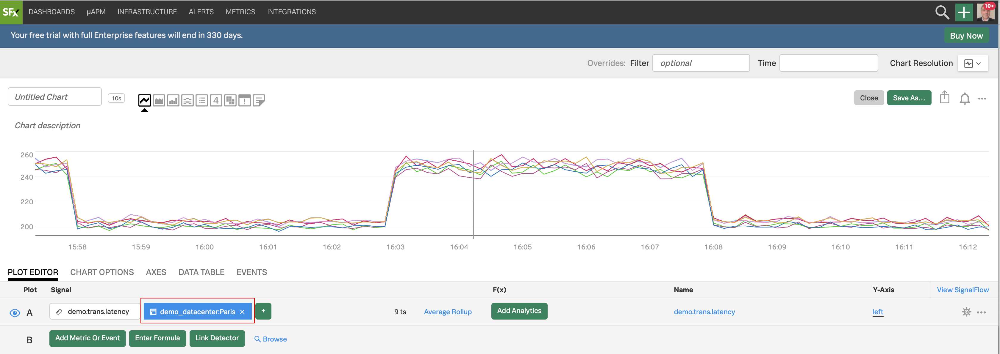
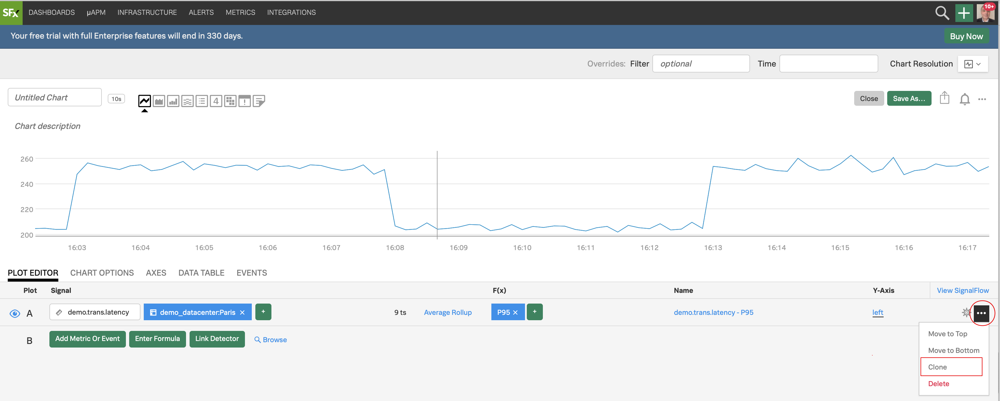

# Using Filters

## 1. Filtering and Analytics

Let's now select the **Paris** datacenter to do some analytics - for that we will use a filter.

Let's go back to the **Plot Editor** tab and click on **Add Filter**{: .label-button .sfx-ui-button-blue}, wait until it automatically populates, choose **`demo_datacenter`**, and then **`Paris`**.

{: .zoom}

In the **F(x)** column, add the analytic function **`Percentile:Aggregation`**, and leave the value to **`95`** (click outside to confirm).

{: .zoom}

For info on the **Percentile** function and the other functions see [Analytics reference](https://docs.signalfx.com/en/latest/reference/analytics-docs/analytics-reference.html){: target=_blank}.

---

## 2. Using Timeshift analytical function

Let's now compare with older metrics. Click on **`...`** and then on **Clone** in the dropdown to clone Signal **A**.

{: .zoom}

You will see a new row identical to **A**, called **B**, both visible and plotted.

{: .zoom}

For Signal **B**, in the **F(x)** column add the analytic function **Timeshift** and enter **`7d`** (7 days = 1 week), and click outside to confirm.

{: .zoom}

Click on the cog on the far right, and choose a **Plot Color** e.g. pink, to change color for the plot of **B**.

{: .zoom}

Click on **Close**.

Next, click into the field next to **Time** on the Override bar and choose **`Past Day`** from the dropdown.

We now see plots for Signal **A** (the last day) as a blue plot, and 7 days ago in pink.

In order to make this clearer we can click on the **Area chart** icon to change the visualization.

{: .zoom}

We now have a better view of our two plots!
