# Using Filters

---

## 1 Creating a new chart

Let's now create a new chart and save it in our dashboard!

Select the plus icon (top right of the UI) and from the drop down, choose the option **Chart**.
or click on the **+ New Chart**{: .label-button .sfx-ui-button-blue} Button to create a new chart.

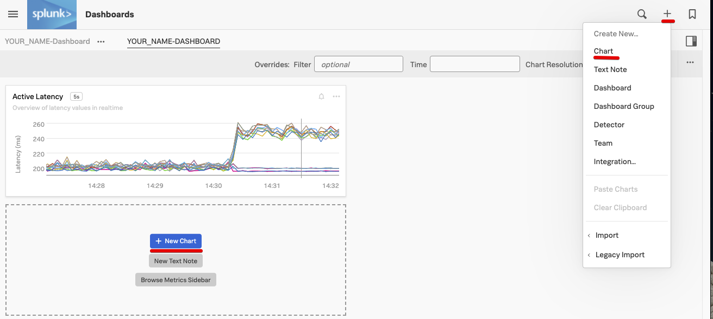

You will now see a chart template like the following.

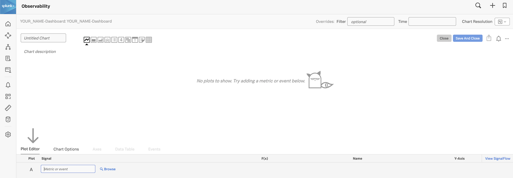

Let's enter a metric to plot. We are still going to use the metric **`demo.trans.latency`**.

In the **Plot Editor** tab under **Signal** enter **`demo.trans.latency`**.

You should now have a familair line chart.

## 2. Filtering and Analytics

Let's now select the **Paris** datacenter to do some analytics - for that we will use a filter.

Let's go back to the **Plot Editor** tab and click on **Add Filter**{: .label-button .sfx-ui-button-blue}, wait until it automatically populates, choose **`demo_datacenter`**, and then **`Paris`**.

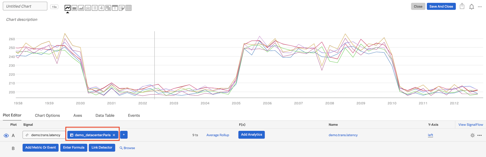

In the **F(x)** column, add the analytic function **`Percentile:Aggregation`**, and leave the value to **`95`** (click outside to confirm).

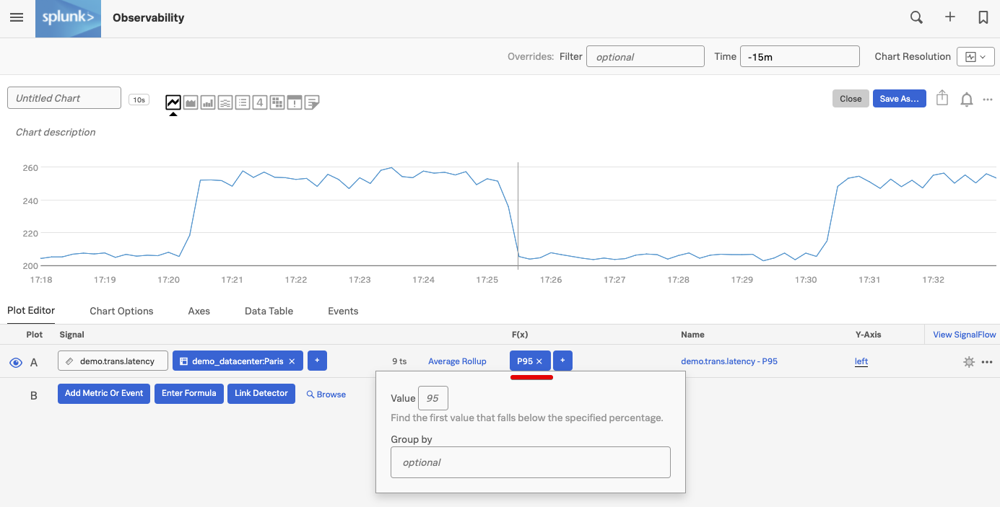

For info on the **Percentile** function and the other functions see [Analytics reference](https://docs.signalfx.com/en/latest/reference/analytics-docs/analytics-reference.html){: target=_blank}.

---

## 2. Using Timeshift analytical function

Let's now compare with older metrics. Click on **`...`** and then on **Clone** in the dropdown to clone Signal **A**.

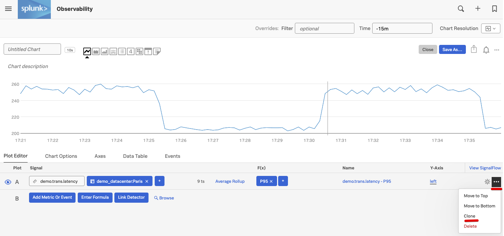

You will see a new row identical to **A**, called **B**, both visible and plotted.

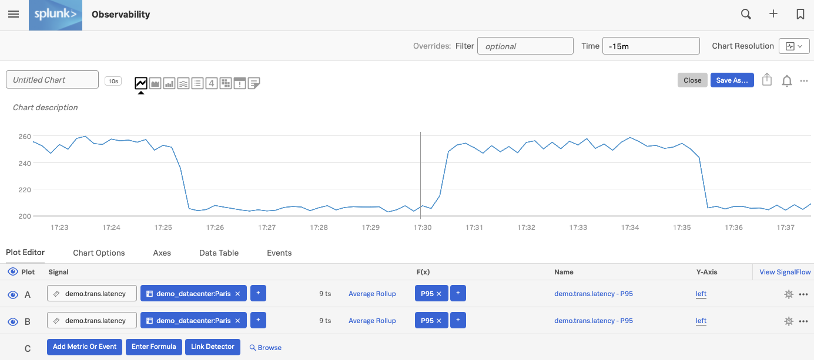

For Signal **B**, in the **F(x)** column add the analytic function **Timeshift** and enter **`1w`** (or  7d for 7 days), and click outside to confirm.

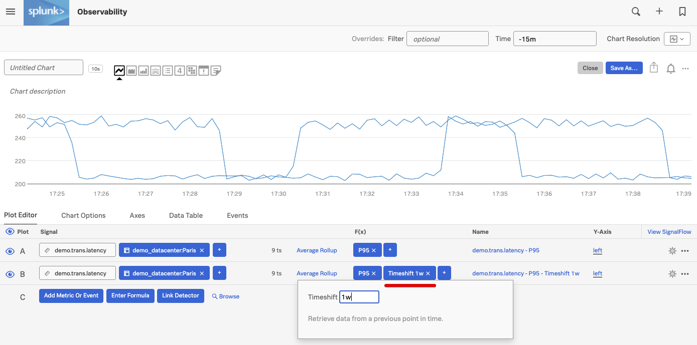

Click on the cog on the far right, and choose a **Plot Color** e.g. pink, to change color for the plot of **B**.

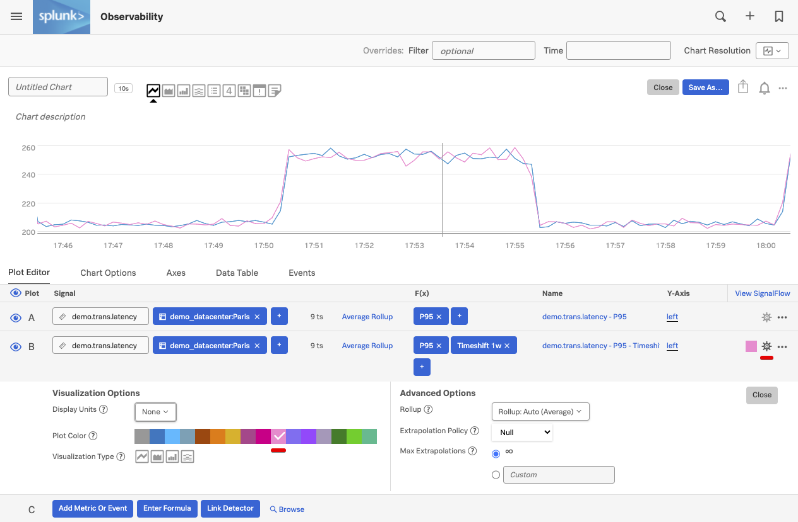

Click on **Close**.

Next, click into the field next to **Time** on the Override bar and choose **`Past Hour`** from the dropdown.

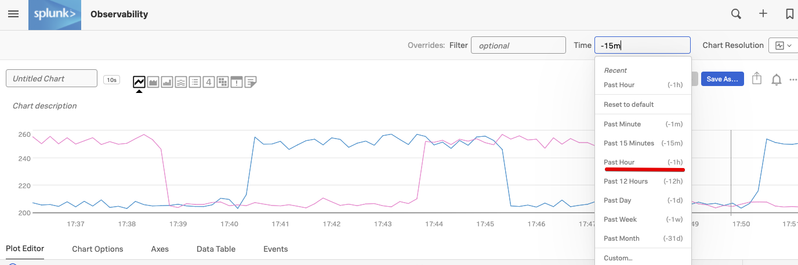

We now see plots for Signal **A** (the past hour) as a blue plot, and the plots from a week ago in pink.

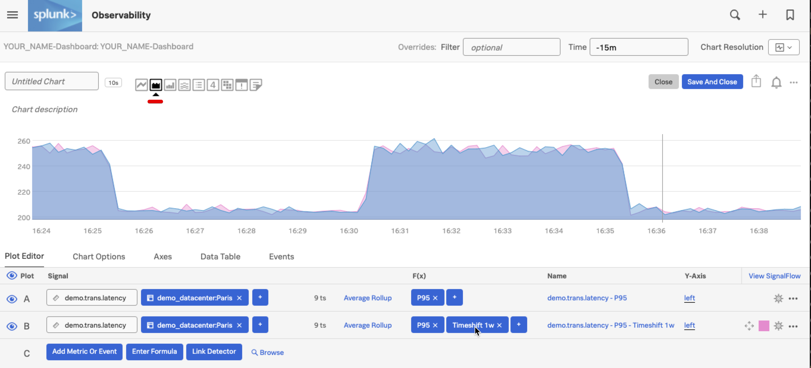

In order to make this clearer we can click on the **Area chart** icon to change the visualization.

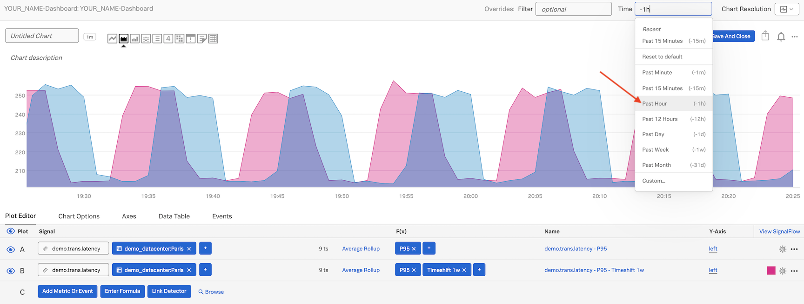

We now have a better view of our two plots!
