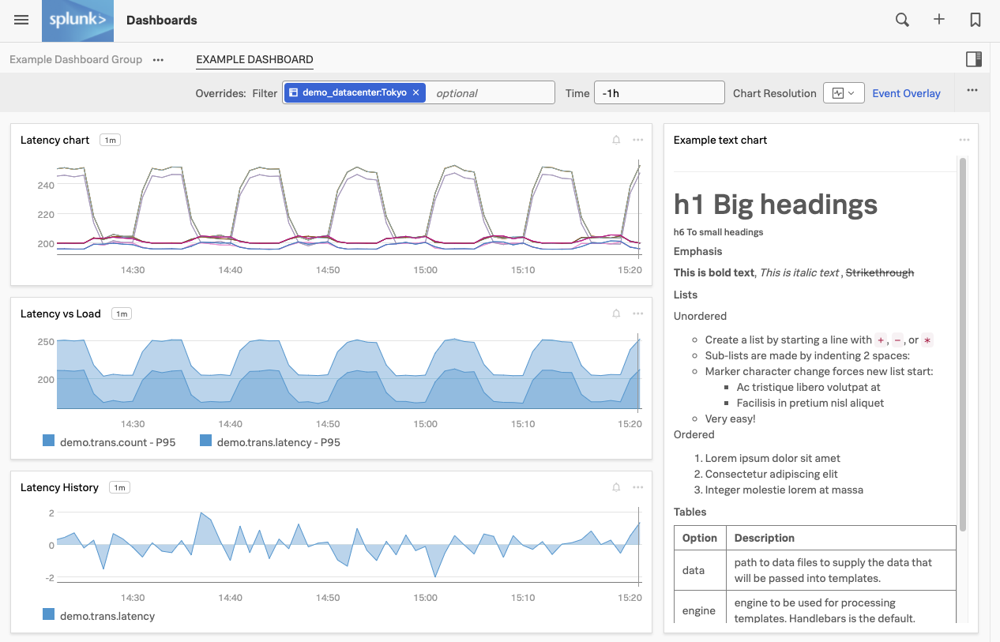

# Working with Dashboards, Charts and Metrics

* Introduction to the Dashboards and charts
* Editing and creating charts
* Filtering and analytical functions
* Using formulas
* Saving charts in a dashboard
* Introduction to SignalFlow

---
## 1. Goal of the Chart & Dashboard section

 During this section we are going to create the following charts and dashoard and connect it to your Teams page.. 

---
## 2. Getting to your Teams' Page

Logon to the Organization you have been invited to. and visit your teams landing page.
You can find this by going to the top left hamburger menu  then selecting **Dashboards** from the side menu. 

This will bring you to your teams dashboard, we use the team ***Observability*** as an example here. The one  in your workshop will likely be different.

This page shows the total number of team members, how many alerts are there outstanding for your team and all dashboards that are assigned to your team.

Right now they are no dashboards assigned but as stated before, we will add the new dashboard that you will create to your Teams's Page later.

---
## 3.  Taking a quick tour though the Dashboards & Charts Samples

To continue, click on **All Dashboards** on the top right corner of the screen.
This brings you to the a view that shows all the available dashboards, included the prebuilt ones 

If you are already receiving metrics from a Cloud API integration or another service through the Splunk Agent you will see relevant dashboards for these services.

---

## 4. Inspecting the Sample Data

Among the dashboards you will see a Dashboard group called **Sample Data**. Expand the **Sample Data** dashboard group by clicking on it, and then click on the **Sample Charts** dashboard.

In the Sample Charts dashboard you can see a selection of charts that show a sample of the various styles, colors and formats you can apply to your charts in the dashboards.

