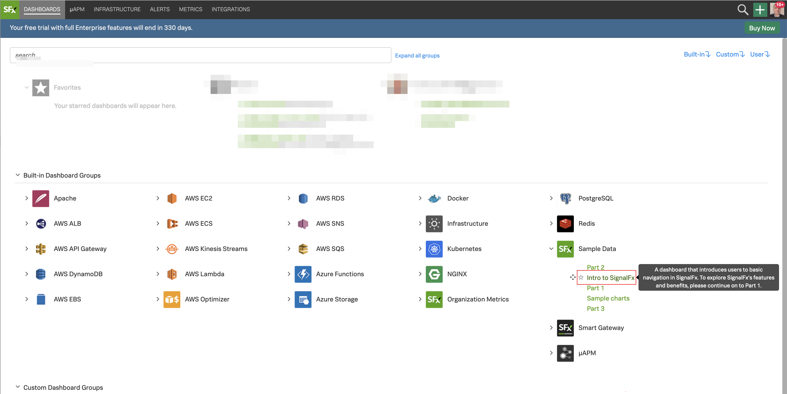
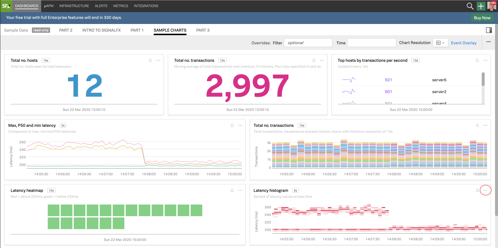

# Working with Dashboards, Charts and Metrics

* Introduction to the SignalFx Dashboards and charts
* Editing and creating charts
* Filtering and analytical functions
* Using formulas
* Introduction to SignalFlow

---

## 1. Introduction to the SignalFx UI

Logon to the SignalFx organization you have been invited to.

Hover over **Dashboards** in the top menu, and then click on **All Dashboards**. A number of prebuilt dashboards are provided for you in your default view.

{: .zoom}

If you are already receiving metrics through a Cloud API integration or the Smart Agent you will see relevant dashboards for these services in SignalFx.

Among the dashboards you will see a Dashboard group called **Sample Data**. This group exists by default in all SignalFx accounts. Let's take a closer look at it.

---

## 2. Inspecting the Sample Data

In this dashboard view expand the **Sample Data** dashboard group by clicking on it, and then click on the **Intro to SignalFx** dashboard.

{: .zoom}

You will see a selection of sample charts. To learn more about charts you can click on the other sample dashboards (**PART 1**, **PART 2** and **PART 3**).

Let's take a look at the Sample charts.

Click on the **SAMPLE CHARTS** dashboard name.

{: .zoom}

In the Sample Charts dashboard you can see a selection of charts that show a sample of the various styles, colors and formats you can apply to your charts in the dashboards.
