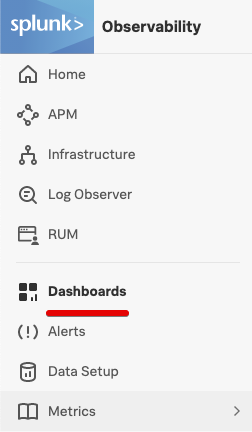
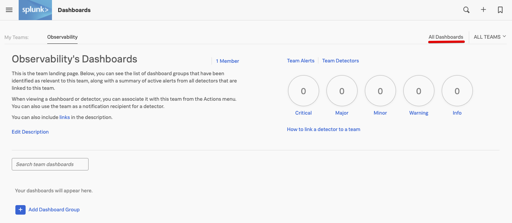
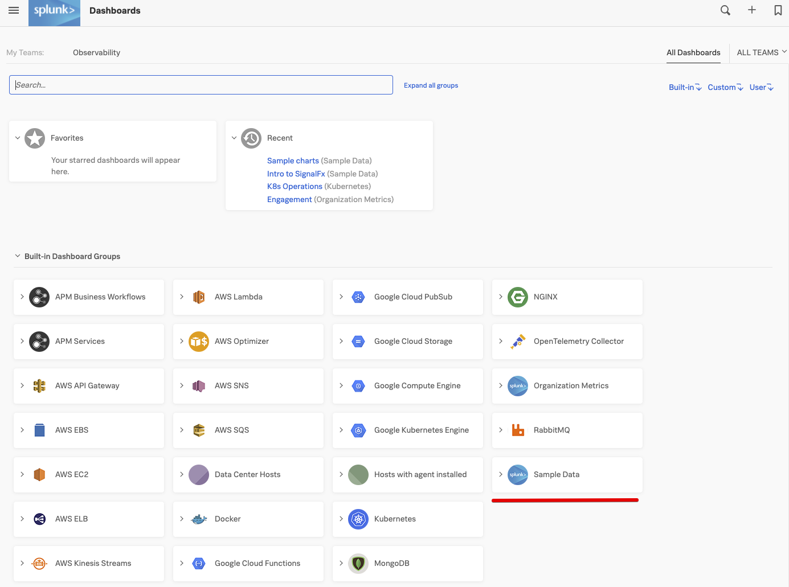
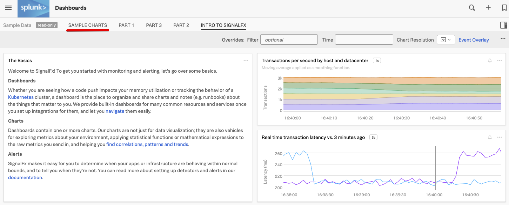
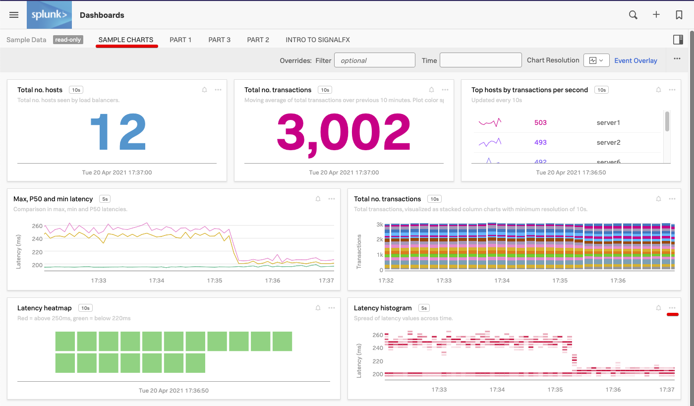

# Working with Dashboards, Charts and Metrics

* Introduction to the Dashboards and charts
* Editing and creating charts
* Filtering and analytical functions
* Using formulas
* Saving charts in a dashboard
* Introduction to SignalFlow

---

## 1. Introduction to the Observability Suite UI

Logon to the Organization you have been invited to.

You can find all the dashboards from the top left hamburger menu then selecting **Dashboards** in the top menu. 

This will bring you to your teams dashboard, We use the team Observability as an example. 

It show the total number of team members, how many alerts are there for your team and all dashboards that are assigned to your team.

Of course at the start of the workshop these are none, so to continue click on **All Dashboards** on the top right corner of the screen.
This brings you to the a view that shows  all the available  dashboards, included the prebuilt ones 

If you are already receiving metrics from a Cloud API integration or another service through the Splunk Agent you will see relevant dashboards for these services.

Among the dashboards you will see a Dashboard group called **Sample Data**. Let's take a closer look at it!

---

## 2. Inspecting the Sample Data

In this dashboard view expand the **Sample Data** dashboard group by clicking on it, and then click on the **Intro to SignalFx** dashboard.

You will see a selection of sample charts. To learn more about charts you can click on the other sample dashboards (**PART 1**, **PART 2** and **PART 3**).

Let's take a look at the Sample charts.

Click on the **SAMPLE CHARTS** dashboard name.

In the Sample Charts dashboard you can see a selection of charts that show a sample of the various styles, colors and formats you can apply to your charts in the dashboards.
