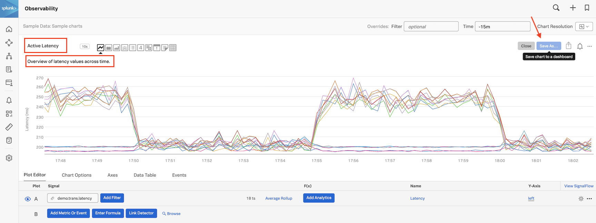
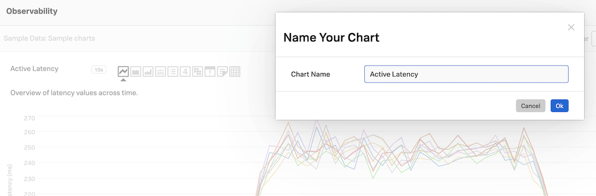
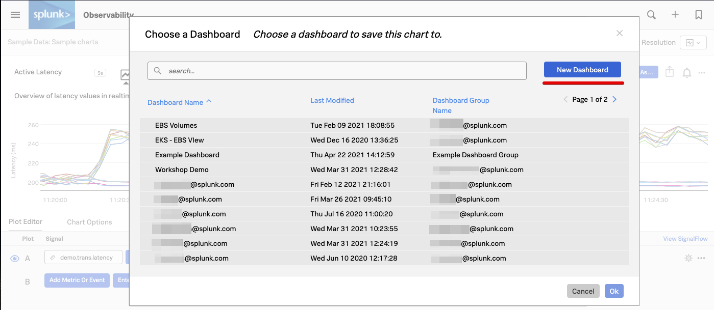
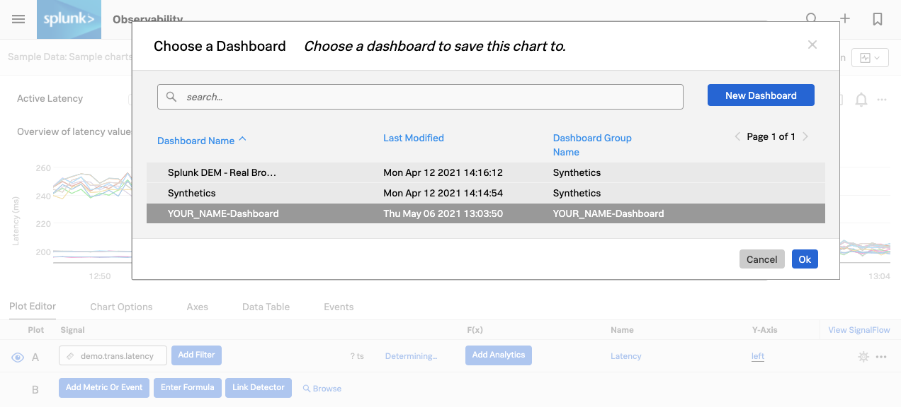
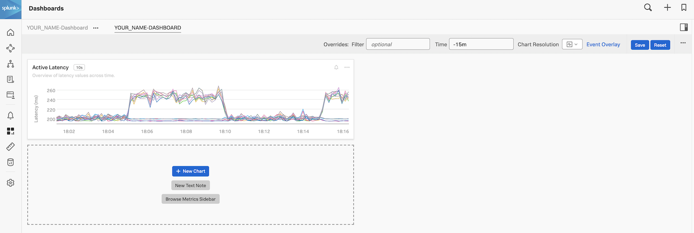
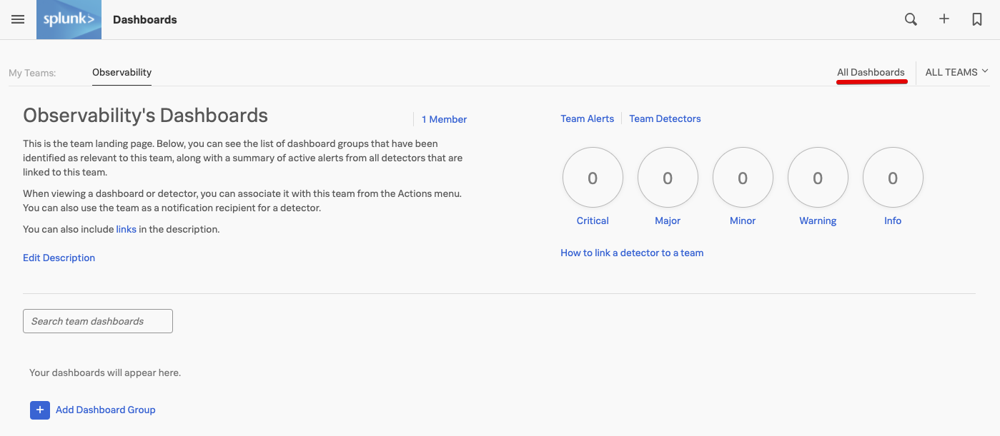
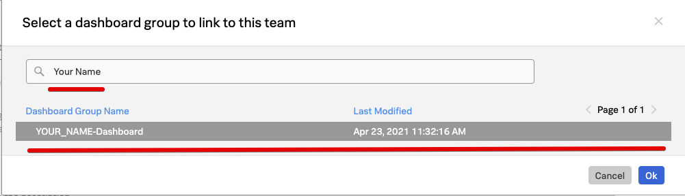
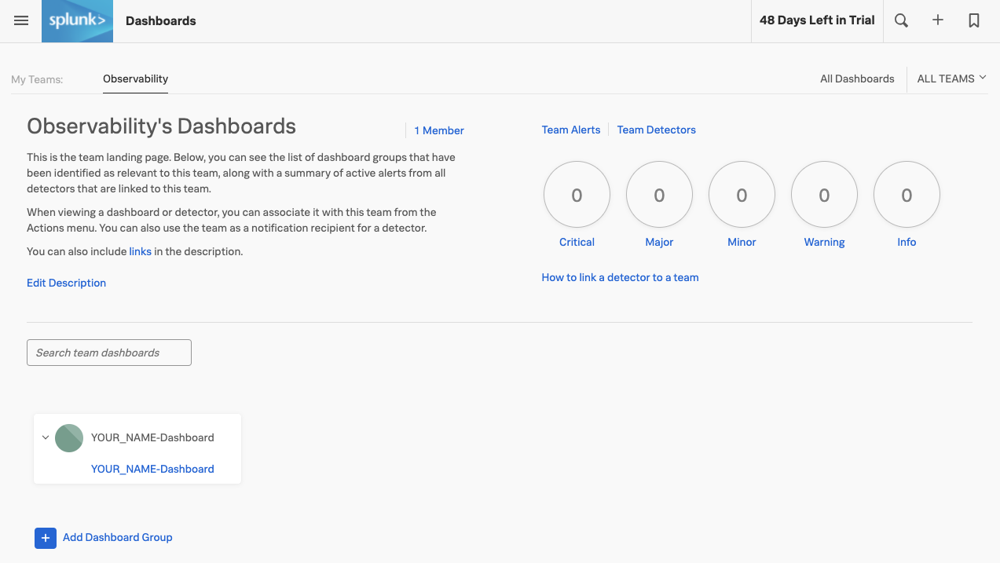

# Saving charts

## 1. Saving a chart

To start saving your chart, lets give it a name and description. Click the name of the chart **Copy of Latency Histogram** and rename it to **"Active Latency"**.

To change the description click on **Spread of latency values across time.** and change this to **Overview of latency values in real-time.**

Click the **Save As**{: .label-button .sfx-ui-button-blue} button. Make sure your chart has a name, it will use the name **Active Latency** the you defined in the previous step, but you can edit it here if needed.

Press the **Ok**{: .label-button .sfx-ui-button-blue} button to continue.

## 2. Creating a dashboard

In the **Choose dashboard** dialog, we need to create a new dashboard, click on the **New Dashboard**{: .label-button .sfx-ui-button-blue} button.

You will now see the **New Dashboard** Dialog. In here you can give you dashboard a name and description, and set **Write Permissions**.

Please use your own name in the following format to give your dashboard a name e.g. **YOUR_NAME-Dashboard**.

Please replace **YOUR_NAME** with your own name and then remove the tick from the *Anyone in this organization can edit* tick box to set up edit permissions.

You should see you own login information displayed, meaning you are now the only one who can edit this dashboard. Of course you have the option to add other users or teams from the drop box below that may edit your dashboard and charts, but for now make sure you **re-tick** the *Anyone in this organization can edit* box to remove any restrictions and press the **Create**{: .label-button .sfx-ui-button-blue} Button to continue.

Your new dashboard is now available and selected so you can save your chart in your new dashboard.

Make sure you have your dashboard selected and press the **Ok**{: .label-button .sfx-ui-button-blue} button.

You will now be taken to your dashboard like below. You can see at the top left that your **YOUR_NAME-DASHBOARD** is part of a Dashboard Group **YOUR_NAME-Dashboard**. You can add other dashboards to this dashboard group.

---

## 3. Add to Team page

It is common practice to link dashboards that are relevant to a Team to a teams page. So let's add your dashboard to the team page for easy access later. Use the top left hamburger menu select **Dashboards** from the side menu again.

This will bring you to your teams dashboard, We use the team ***Observability*** as an example here, the workshop one will be different.

Press the **+**{: .label-button .sfx-ui-button-blue} *Add Dashboard Group* button to add you dashboard to the team page.

This will bring you to the **Select a dashboard group to link to this team** dialog.
Type your name (that you used above) in the search box to find your Dashboard. Select it so its highlighted and click the **Ok** button to add your dashboard.

Your dashboard group will appear as part of the team page. Pleasu note during the course of the workshop many more will appear here.

---

Now click on the link for your Dashboard to add more charts!
