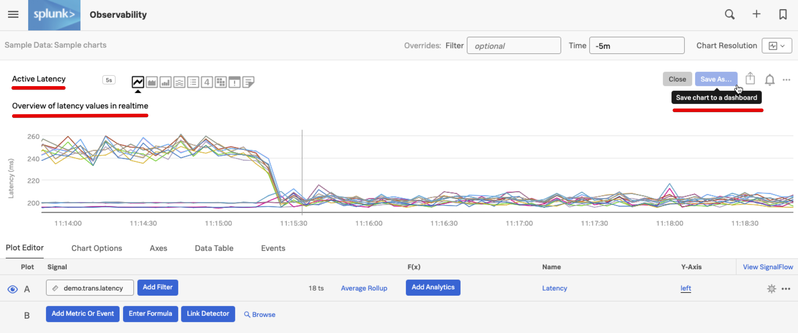
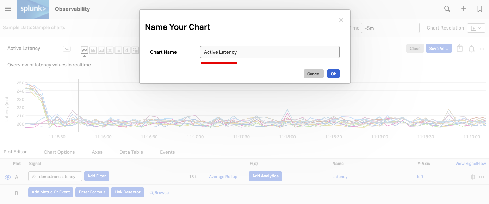
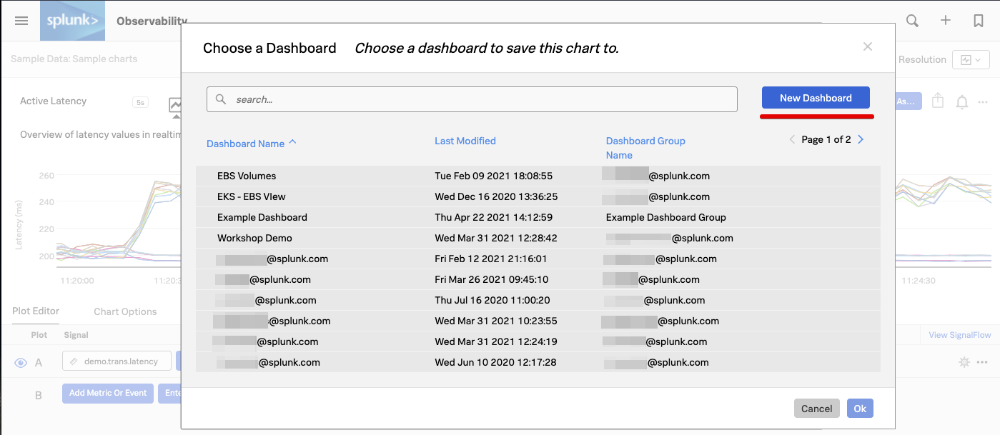
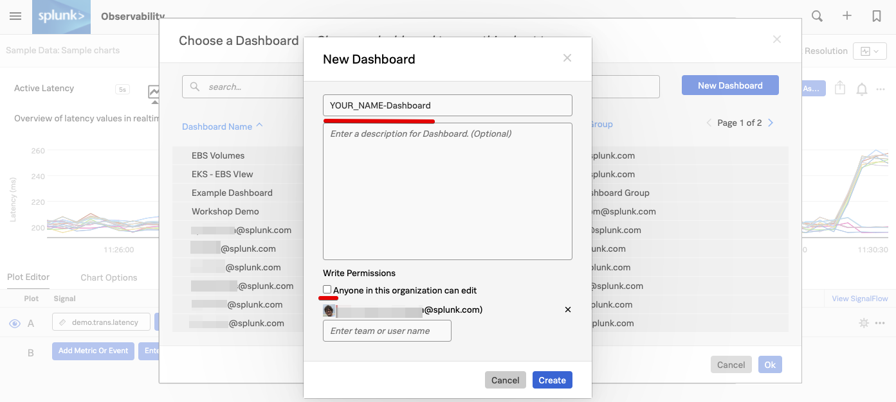
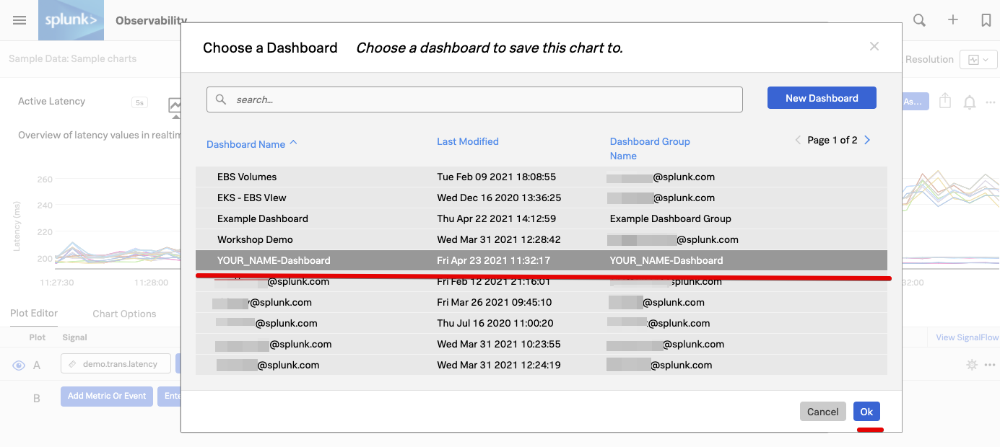
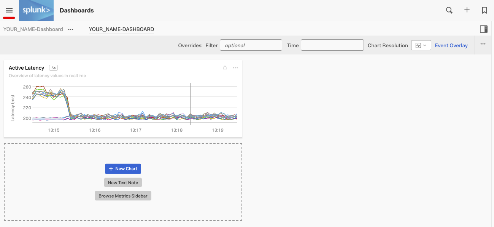
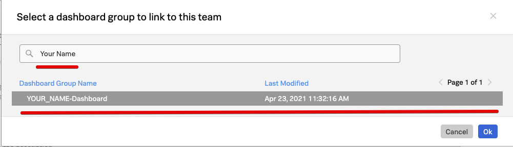
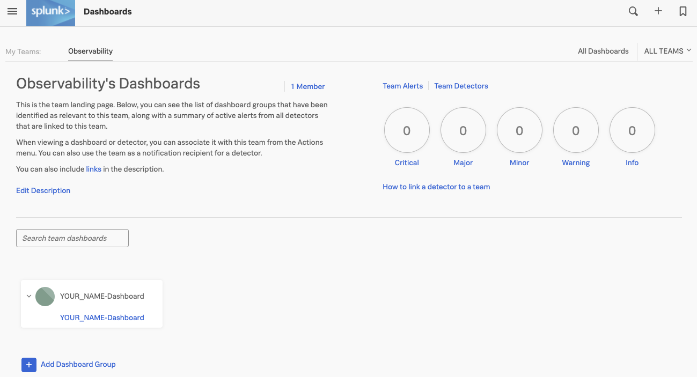

# Saving charts

## 1. Creating your own dashboard

To start saving your chart, lets give it a name and description.

Change the name of the Dashboard from "*Copy of Latency histogram*" to **"Active Latency"**.

Change the description from "*Spread of latency values across time.*" to **"Overview of latency values in realtime."** .

Press the **Save As Button**{: .label-button .sfx-ui-button-blue} to begin saving your chart.

Make sure your chart has a name, it will use he name you have given it in the previous step, but you can edit it here if needed.

Press the **Ok**{: .label-button .sfx-ui-button-blue} button to continue.

This will show you the **Choose dashboard** dialog. As we are going to create a new dashboard, click on the **New Dashboard**{: .label-button .sfx-ui-button-blue} button.

You will now see the **New DashBoard** Dialog. In here you can give you dashboard a Name and Desciption, and set some edit priviliges.

Please use your own name in the following format to give your dashboard a name: **YOUR_NAME-Dashboard**. 

Please replace YOUR_NAME with your name and then remove the tick from the *Anyone in this organization can edit* tick box to set up edit permissions.

You should see you own login information displayed, meaning you are now the only one who can edit this dashboard. Of course you have the option to add other users or teams from the drop box below that may edit your dashboard and charts, but for now just press the **Create**{: .label-button .sfx-ui-button-blue} Button to continue.

Your new dashboard is now availble and selected so you can save your chart in your new dashboard.

Make sure you have your dashboard selected and press the **Ok**{: .label-button .sfx-ui-button-blue} button.

You will now be taken to your dashboard like below. You can see at the top right, that your  **YOUR_NAME-Dashboard** is part of a Dashboard Group **YOUR_NAME-DASHBOARD**. You can add other dashboards to this Dashboard group, 

---

## 2. Adding dashboards to Team page

It is common practice to link dashboards that are relevant to a Team to a teams page. So lets add your dashboard to the team page for easy acess later.

Use the top left hamburger menu   to selecting **Dashboards** from the side menu again. 

This will bring you to your teams dashboard, We use the team **Observability** as an example here, the workshop one will be different.  

Press the **+**{: .label-button .sfx-ui-button-blue} *Add Dashboard Group* button to add you dashboard to the team page.

This will bring you to the *Select a dashboard group to link to this team* Dialog.
Type *[Your Name] in the search box and you should be able to find  your Dashboard. Select it so its highlighted, then press the **Ok** button to add your dashboard.

Your dashboard group will appear as part of the team page, of course in a workshop many more will appear here.

---

Now click on the link for your Dashboard to add more charts to our dashboard!
