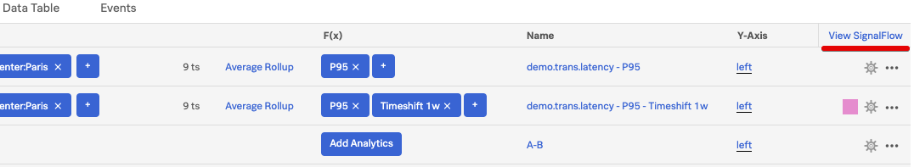
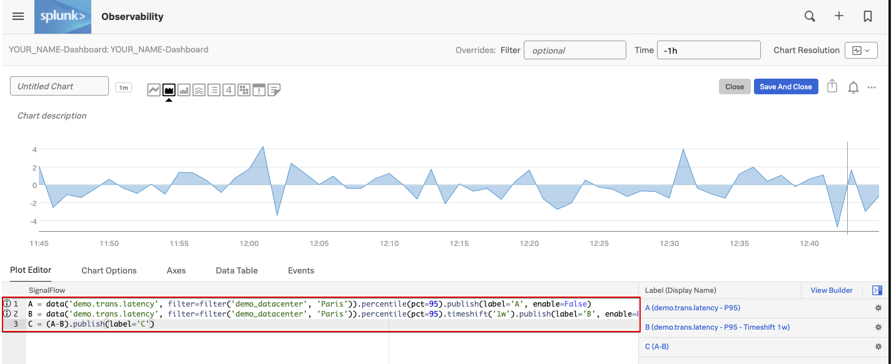
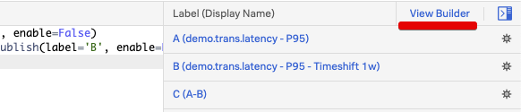

# SignalFlow

Let's take a look at **SignalFlow** - the analytics language of Observability Cloud that can be used to setup monitoring as code.

Click on **View SignalFlow**.



You will see the **SignalFlow** code that composes the chart we were working on.



=== "SignalFlow"

    ```Python
    A = data('demo.trans.latency', filter=filter('demo_datacenter', 'Paris')).percentile(pct=95).publish(label='A')
    B = data('demo.trans.latency', filter=filter('demo_datacenter', 'Paris')).percentile(pct=95).timeshift('1w').publish(label='B', enable=False)
    C = (A-B).publish(label='C')
    ```

**SignalFlow** is the analytics language of Observability Cloud. Among other benefits, it can be used to setup monitoring as code.

For more info on SignalFlow see [Getting started with SignalFlow](https://docs.signalfx.com/en/latest/getting-started/concepts/analytics-signalflow.html#signalflow-analytics-language){: target=_blank}.

Click on **View Builder** to go back to the Chart **Builder** UI.




Let's save this new chart to our Dashboard!
