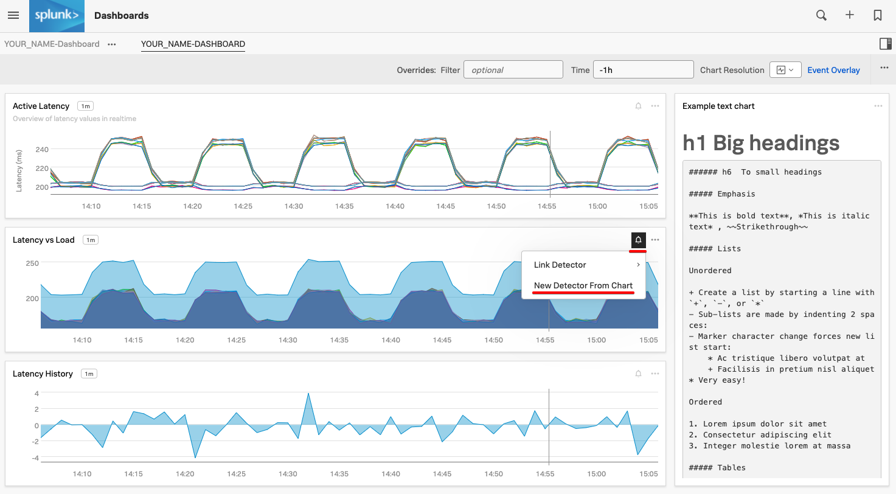
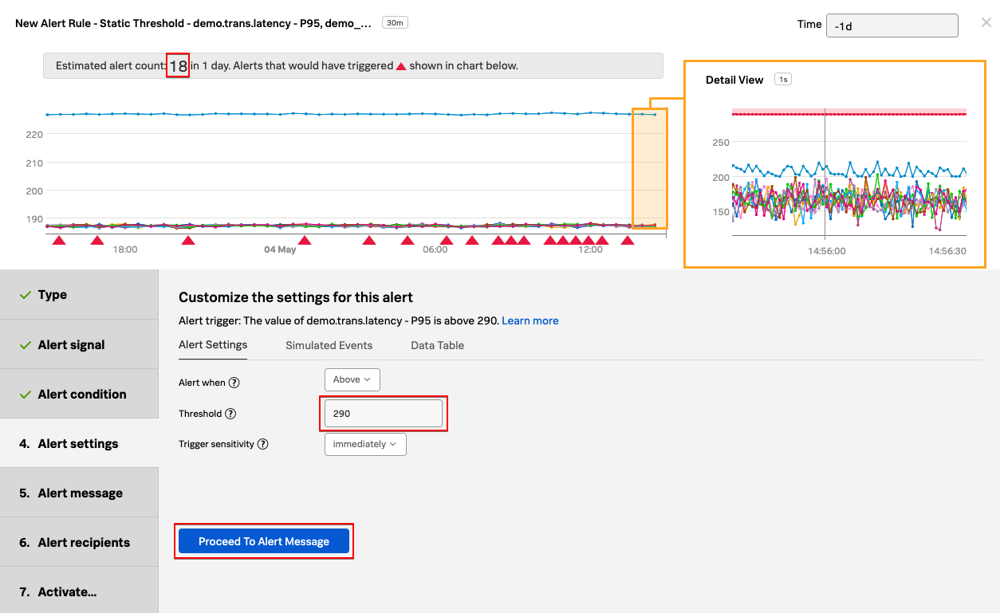
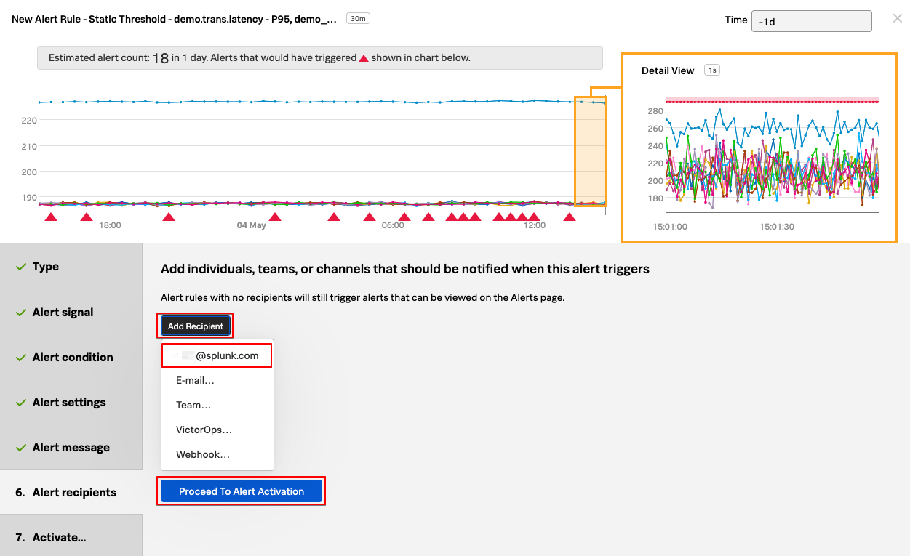
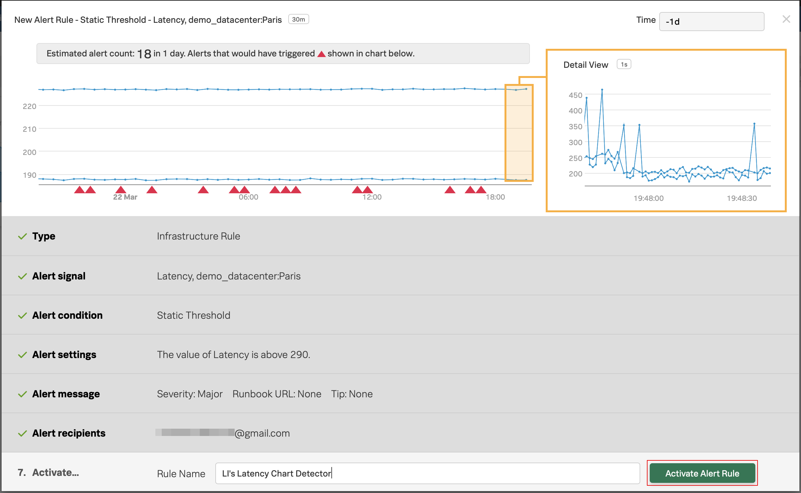

# Working with Detectors - Lab Summary

* Create a Detector from one of your charts
* Setting Alert conditions
* Running a pre-flight check
* Working with muting rules

---

## 1. Introduction

A detector monitors a signal for conditions or issues that you care about.

Those conditions or issues are expressed as one or more rules that trigger an alert when the conditions in the rules are met. Individual rules in a detector are labeled according to criticality: Info, Warning, Minor, Major, and Critical.

For example, a detector that monitors the latency of an API call may go into a critical state when the latency is significantly higher than normal, as defined in the detector rules.

## 2. Create a detector from one of your charts

In **Dashboards** click on your dashboard group (the one with your email address) and then on the dashboard name where the chart you created in the previous lab resides or search for your previously created dashboard's name, and click on that dashboard's name in the results.

{: .zoom}

We are now going to create a new detector from this chart.

Once you see the chart, click on the bell icon on your chart and then on **New Detector From Chart**.

{: .zoom}

In the text field next to **Detector Name**, **ADD YOUR INITIALS** before the proposed detector name.

!!! important "Naming the detector"
    It's important that you add your initials in front of the proposed detector name.
    It should be something like this: **LI's Latency Chart Detector**.

Click on **Create Alert Rule**{: .label-button .sfx-ui-button-blue}

{: .zoom}

In the Detector window, inside **Alert signal**, the Signal we will alert on is marked with a (blue) bell in the **Alert on** column. The bell indicates which Signal is being used to generate the alert.

Click on **Proceed to Alert Condition**{: .label-button .sfx-ui-button-blue}

{: .zoom}

---

## 3. Setting Alert condition

In **Alert condition**, click on **Static Threshold** and then on **Proceed to Alert Settings**{: .label-button .sfx-ui-button-blue}

{: .zoom}

In **Alert Settings**, enter the value **`290`** in the **Threshold** field. In the same window change **Time** on top right to past day (**-1d**).

---

## 4. Alert pre-flight check

SignalFx will now perform a pre-flight check after 5 seconds. See the **Estimated alert count**. Based on the current alert settings, the amount of alerts we would’ve received in 1 day would have been approx. **18**.

{: .zoom}

!!! note "About pre-flight checks"
    Once you set an alert condition, SignalFx shows how many alerts you would get based on the current settings, and in the timeframe set on the upper right corner - in this case, the past day.

    Immediately, the platform will start analyzing the signals with the current settings, and perform something we call a Pre-flight Check. This enables you to test the alert conditions using the historical data in the platform, to ensure the settings are logical and will not inadvertently generate an alert storm, removing the guess work from configuring alerts in a simple but very powerful way, only available using SignalFx.

    To read more about detector previewing, please visit this link
    [Setting up detectors](https://docs.signalfx.com/en/latest/detect-alert/set-up-detectors.html#previewing-the-results-of-a-detector){: target=_blank}.

Click on **Proceed to Alert Message**{: .label-button .sfx-ui-button-blue}

---

## 5. Configuring the alert message

In **Alert message**, under **Severity** choose **Major**.

{: .zoom}

Click on **Proceed to Alert Recipients**{: .label-button .sfx-ui-button-blue}

Click on **Add Recipient** and then on your email address displayed as the first option.

{: .zoom}

!!! note "Notification Services"
    That's the same as entering that email address OR you can enter another email address by clicking on **E-mail...**.

    That's just one example of the many **Notification Services** SignalFx has available. You can check this out by going to the **Integrations** tab of the top menu, and see **Notification Services**.

---

## 6. Activating the alert

Click on **Proceed to Alert Activation**{: .label-button .sfx-ui-button-blue}

In **Activate...** click on **Activate Alert Rule**{: .label-button .sfx-ui-button-blue}

{: .zoom}

If you want to get alerts quicker you can click back on **Alert Settings** and lower the value from **`290`** to say **`280`**.

If you change the **Time** to **-1h** you can see how many alerts you might get with the threshold you have chosen based on the metics from the last 1 hour.

Hover over **Alerts** in the top menu and then click on **Detectors**.

You will see you detector listed here. If you don't then please refresh your browser.

{: .zoom}

**Congratulations**! You have created your first detector and activated it!
