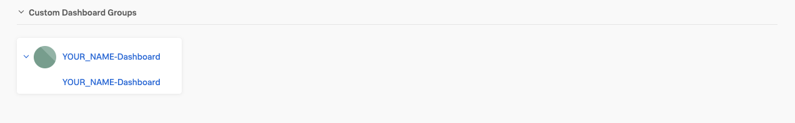
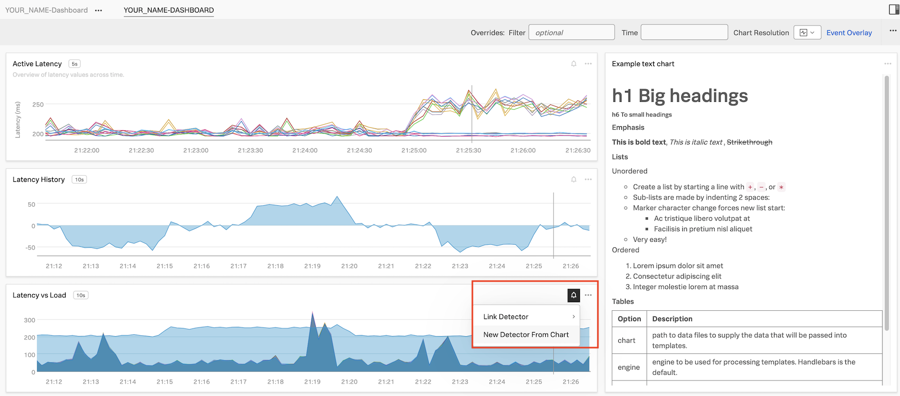
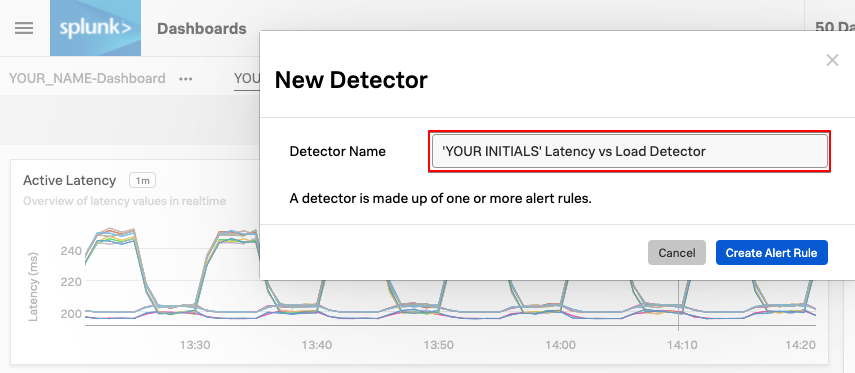
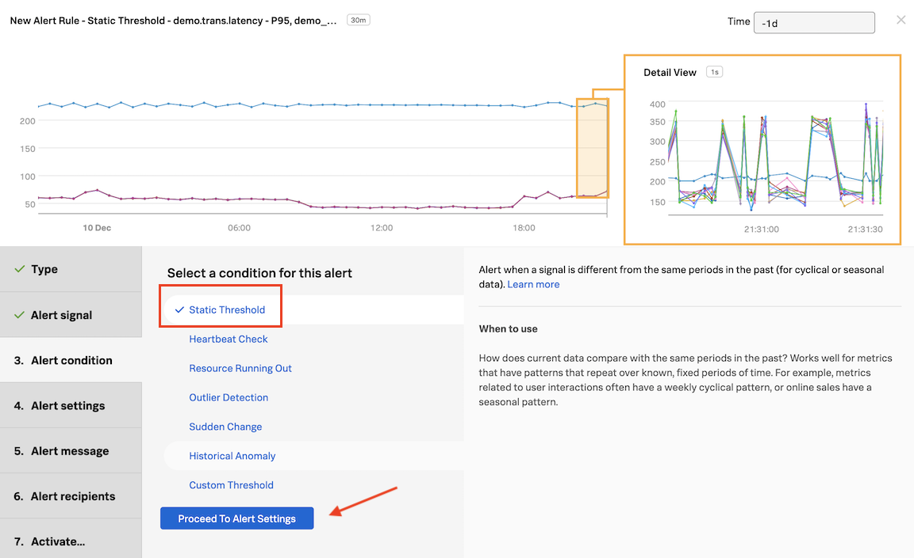
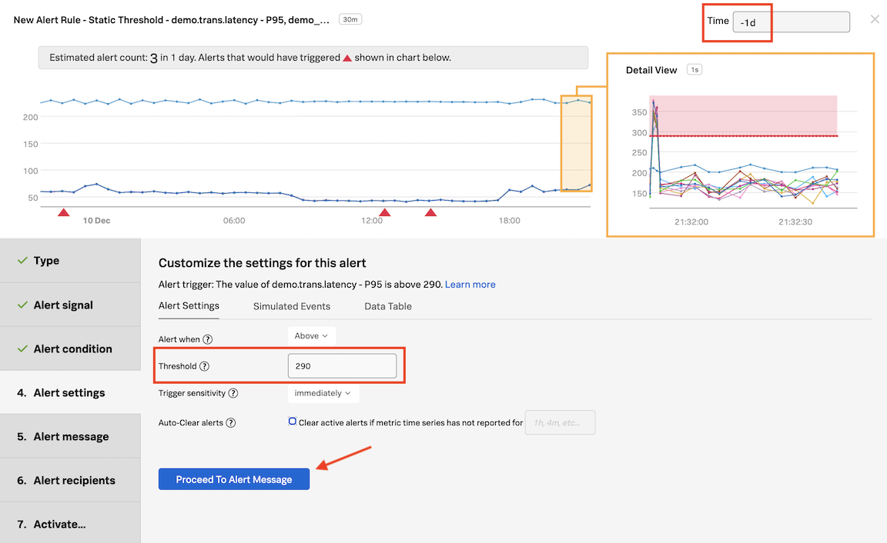
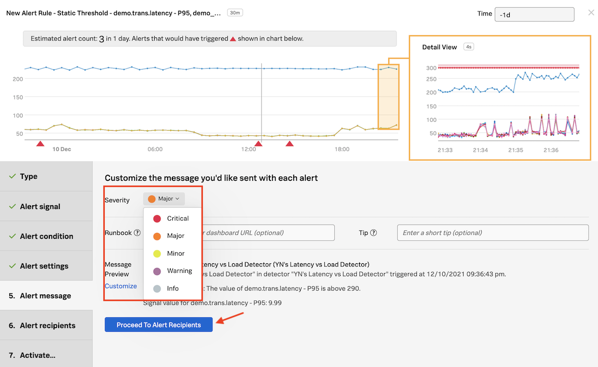
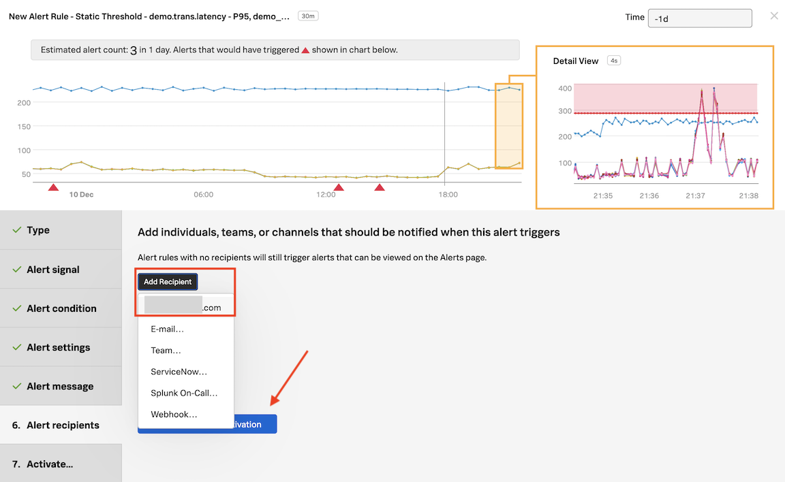
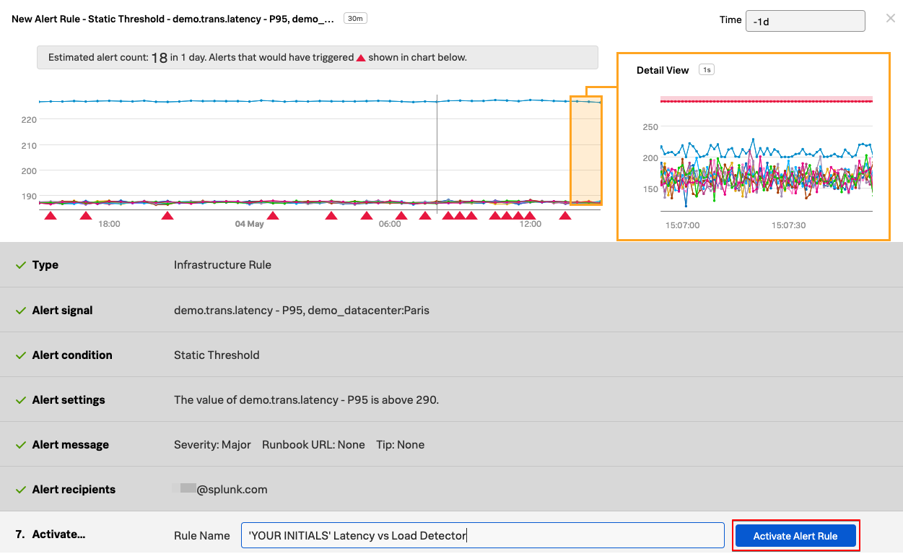
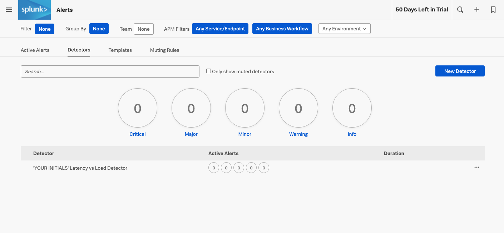

# Working with Detectors - Lab Summary

* Create a Detector from one of your charts
* Setting Alert conditions
* Running a pre-flight check
* Working with muting rules

---

## 1. Introduction

Splunk Observability Cloud uses detectors, events, alerts, and notifications to keep you informed when certain criteria are met. For example, you might want a message sent to a Slack channel or to an email address for the Ops team when CPU Utilization has reached 95%, or when the number of concurrent users is approaching a limit that might require you to spin up an additional AWS instance.

These conditions are expressed as one or more rules that trigger an alert when the conditions in the rules are met. Individual rules in a detector are labeled according to criticality: Info, Warning, Minor, Major, and Critical.

## 2. Creating a Detector

In **Dashboards** click on your **Custom Dashboard Group** (that you created in the previous module) and then click on the dashboard name.

We are now going to create a new detector from a chart on this dashboard. Click on the bell icon on the **Latency vs Load** chart, and then click **New Detector From Chart**.

In the text field next to **Detector Name**, **ADD YOUR INITIALS** before the proposed detector name.

!!! important "Naming the detector"
    It's important that you add your initials in front of the proposed detector name.
    It should be something like this: **XYZ's Latency Chart Detector**.

Click on **Create Alert Rule**{: .label-button .sfx-ui-button-blue}

In the Detector window, inside **Alert signal**, the Signal we will alert on is marked with a (blue) bell in the **Alert on** column. The bell indicates which Signal is being used to generate the alert.

Click on **Proceed to Alert Condition**{: .label-button .sfx-ui-button-blue}

---

## 3. Setting Alert condition

In **Alert condition**, click on **Static Threshold** and then on **Proceed to Alert Settings**{: .label-button .sfx-ui-button-blue}

In **Alert Settings**, enter the value **`290`** in the **Threshold** field. In the same window change **Time** on top right to past day (**-1d**).

---

## 4. Alert pre-flight check

A pre-flight check will take place after 5 seconds. See the **Estimated alert count**. Based on the current alert settings, the amount of alerts we would have received in 1 day would have been **3**.

!!! note "About pre-flight checks"
    Once you set an alert condition, the UI estimates how many alerts you might get based on the current settings, and in the timeframe set on the upper right corner - in this case, the past day.

    Immediately, the platform will start analyzing the signals with the current settings, and perform something we call a Pre-flight Check. This enables you to test the alert conditions using the historical data in the platform, to ensure the settings are logical and will not inadvertently generate an alert storm, removing the guess work from configuring alerts in a simple but very powerful way, only available using the Splunk Observability Cloud.

    To read more about detector previewing, please visit this link
    [Preview detector alerts](https://docs.splunk.com/Observability/alerts-detectors-notifications/preview-detector-alerts.html#nav-Preview-detector-alerts){: target=_blank}.

Click on **Proceed to Alert Message**{: .label-button .sfx-ui-button-blue}

---

## 5. Alert message

In **Alert message**, under **Severity** choose **Major**.

Click on **Proceed to Alert Recipients**{: .label-button .sfx-ui-button-blue}

Click on **Add Recipient** and then on your email address displayed as the first option.

!!! note "Notification Services"
    That's the same as entering that email address OR you can enter another email address by clicking on **E-mail...**.

    This is just one example of the many **Notification Services** the suite has available. You can check this out by going to the **Integrations** tab of the top menu, and see **Notification Services**.

---

## 6. Alert Activation

Click on **Proceed to Alert Activation**{: .label-button .sfx-ui-button-blue}

In **Activate...** click on **Activate Alert Rule**{: .label-button .sfx-ui-button-blue}

If you want to get alerts quicker you edit the rule and lower the value from **`290`** to say **`280`**.

If you change the **Time** to **-1h** you can see how many alerts you might get with the threshold you have chosen based on the metrics from the last 1 hour.

Click on the  in the navbar and then click on **Detectors**. You can optionally filter for your initials.

You will see you detector listed here. If you don't then please refresh your browser.

**Congratulations**! You have created your first detector and activated it!
