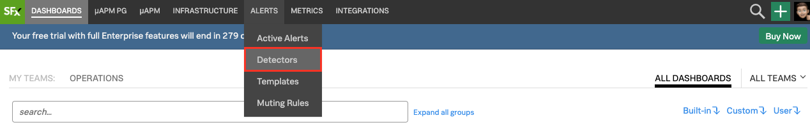
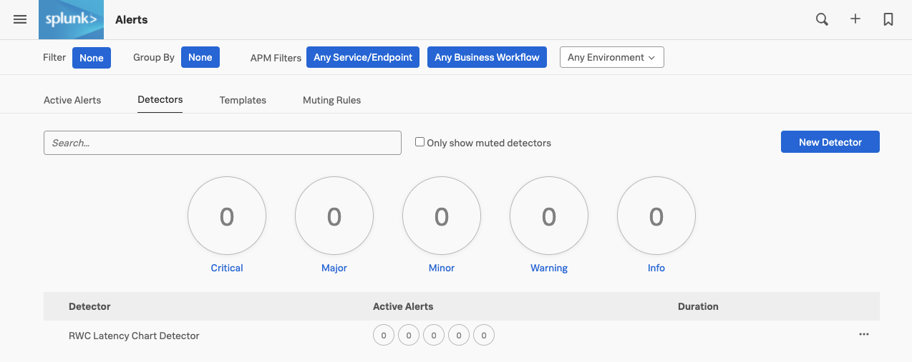
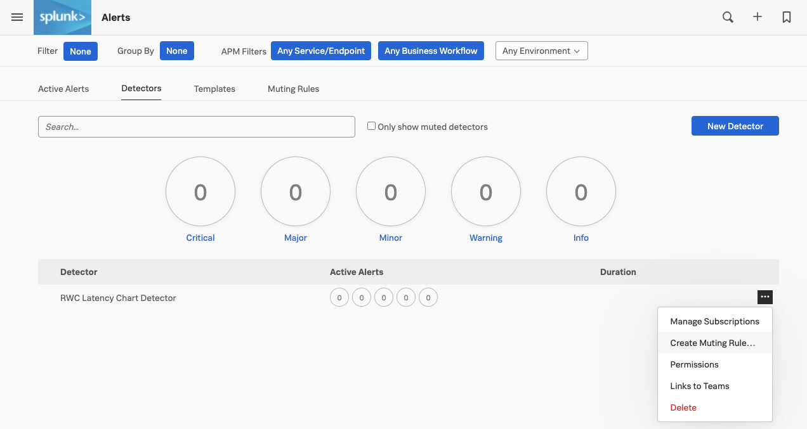
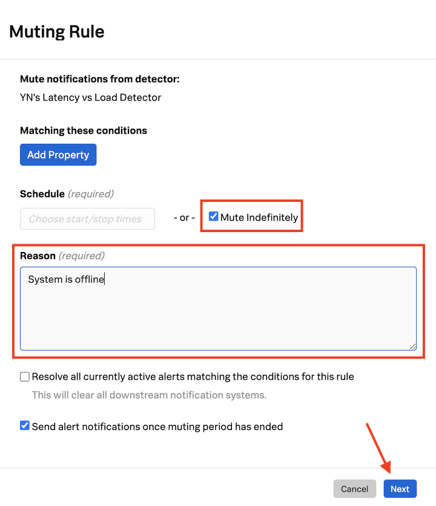
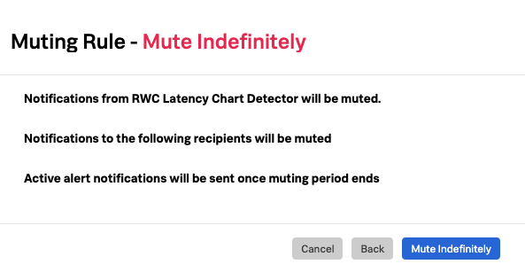
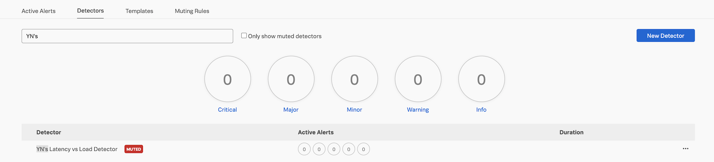
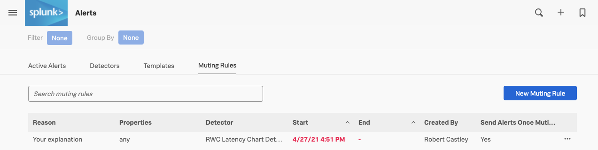
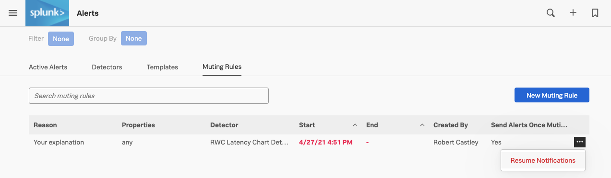
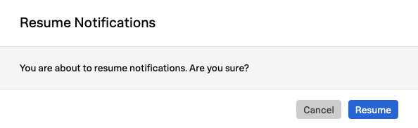

# Working with Muting Rules - Lab Summary

* Learn how to configure Muting Rules
* Learn how to resume notifications
  
---

## 1. Configuring Muting Rules

There will be times when you might want to mute certain notifications. For example, if you want to schedule downtime for maintenance on a server or set of servers, or if you are testing new code or settings etc. For that you can use muting rules in Splunk Observability Cloud. Let's create one!

From the top left hamburger menu icon click **Alerts** in the menu and then select **Detectors**.

You will see a list of active detectors.

If you created an detector in **Creating a Detector** you can click on the three dots **`...`** on the far right for that detector; if not, do that for another detector.  

From the drop-down click on **Create Muting Rule...**

In the **Muting Rule** window check **Mute Indefinitely** and enter a reason.

!!! important
    This will mute the notifications permanently until you come back here and un-check this box or resume notifications for this detector.

{: .shadow .center}

Click **Next** and in the new modal window confirm the muting rule setup.

{: .shadow .center}

Click on **Mute Indefinitely**{: .label-button .sfx-ui-button-blue} to confirm.

You won't be receiving any email notifications from your detector until you resume notifications again. Let's now see how to do that!

---

## 2. Resuming notifications

To Resume notifications, click on **Muting Rules**, you will see the name of the detector you muted notifications for under **Detector** heading.

Click on the thee dots **`...`** on the far right.

Click on **Resume Notifications**.

Click on **Resume**{: .label-button .sfx-ui-button-blue} to confirm and resume notifications for this detector.

{: .shadow .center}

**Congratulations!** You have now resumed your alert notifications!
