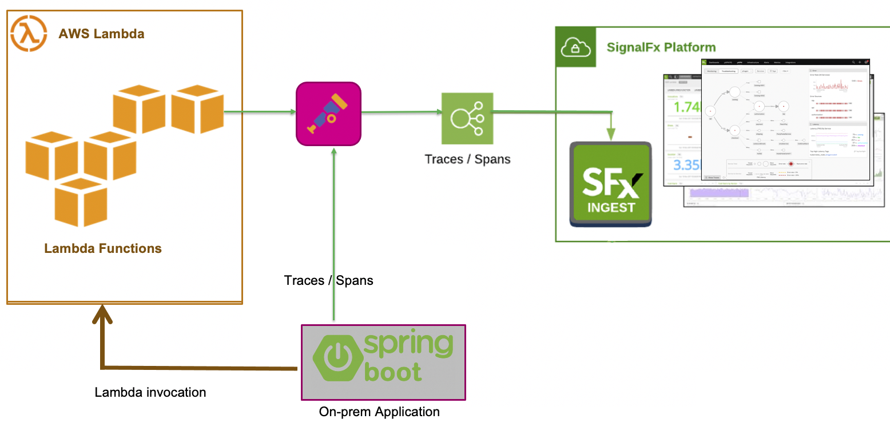

# APM with AWS Lambda (Developer Focused)

!!! important "Enabling APM"

    **If you recently signed up for the 14 day free trial then this section of the workshop cannot be completed!**
    
    An Organization needs to be pre-provisioned as a APM entitlement is required for the purposes of this module. Please contact someone from Splunk's Observability team to get a trial instance with APM enabled if you don’t have one already.

    To check if you have an Organization with APM enabled, just login to Splunk's observability suite and check that you have the APM tab on the top navbar next to Dashboards.

---

## 1. AWS Lambda exercise & APM overview

This workshop section is focused on developer's of serverless/Lambda application/functions. This workshop is going to guide them through the steps to add Tracing to Python and Node-Js Lambda Functions, and see traces flow from an on-prem Java application though the various Python and Node-Js Lambda Functions in Splunk APM.

Splunk APM captures end-to-end distributed transactions from your applications, including serverless apps (Lambda's) with trace spans sent directly to Splunk or via an optional OpenTelemetry Collector that  act as a central aggregation point prior to sending trace spans to Splunk. (recommended, and show in the workshop).

In addition to proxying spans and infrastructure metrics, the OpenTelemetry Collector can also perform other functions, such as redacting sensitive tags prior to spans leaving your environment.

The following illustration shows the recommended deployment model: Splunk's auto-instrumentation libraries send spans to the OpenTelemetry Collector; the OpenTelemetry Collector forwards the spans to Observability Cloud.

---

## 2. AWS Lambda exercise requirements flow

During this workshop you will perform the following activities:

* Perform a test run of the Splunk Mobile Phone Web shop and its services
* Enable Tracing on local SpringBoot App
* Enable Tracing on First Python & Node-js Lambda Functions
* Enable Tracing on the other functions
* Enrich the spans
* Look at configuring options for the OpenTelemetry Collector

---

## 3. AWS Lambda exercise requirements

This workshop section assumes that you have access to the following features as they are required for the workshop:

* AWS account:
* Access to EC2 Instances
* Ability to create/run AWS Lambda's
