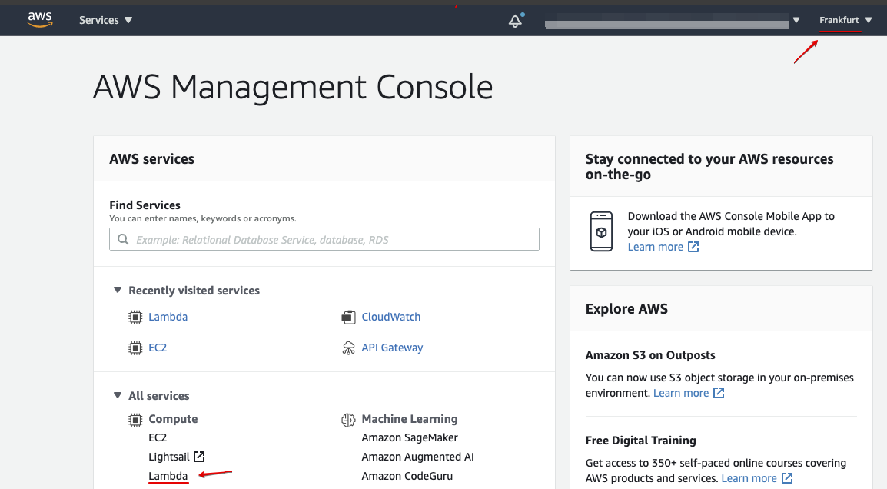
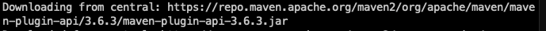
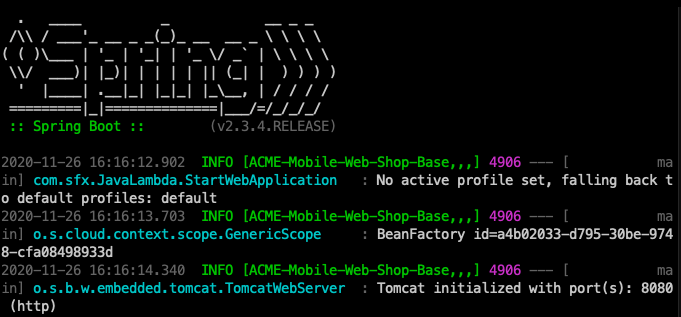
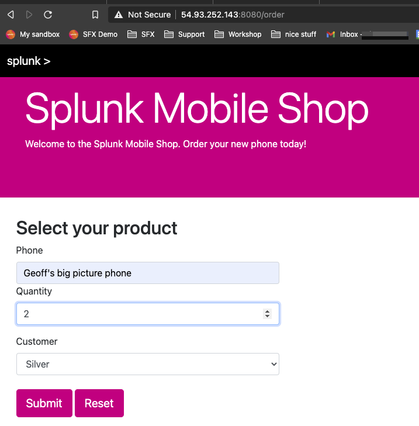
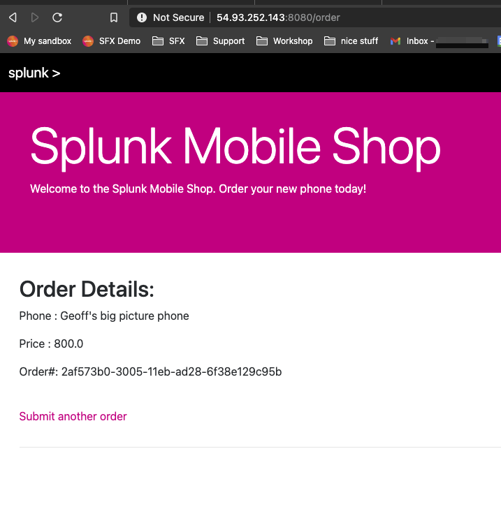

# Initial run of Splunk Mobile Shop Application

The goal of this session is to make you familiar with the various components that are used in the workshop.

!!! important "Required information"
    **You should have the following information at hand as you will need this in various places throughout the workshop**

    - Access to the AWS account that is used to setup the workshop
    - The region the Workshop is using to run the workshop (i.e. Ireland, Frankfurt,
      Ohio, Tokio ..)
    - A unique `UID` string allowing you to identify your services
    - IP address & password of the EC2 instance assigned to you

---

## 1. Validate availability of Lambda Functions

Please log into the AWS account that has been used to create the workshop and select the region that is used by the workshop - the Splunk SE or your organisations lead will confirm this at the start of the Workshop.  In the example below the Region is Frankfurt, but we may be using a different one for this Workshop.



Once the Lambda service have been selected you should see a list of available Lambda Functions.  To find the ones that are assigned to you, use the filter option with the the Unique ID you have been allocated, you should have something similar to:

- **UID**_RetailOrder
- **UID**_RetailOrderLine
- **UID**_RetailOrderPrice
- **UID**_RetailOrderDiscount

(Where **UID**  represents the Unique ID you have been provided - **ACME** in our example)


---

## 2. Verify CloudWatch Logs Location

To investigate issues that may occur during the run, we need to check the CloudWatch logs.  Open CloudWatch Log Groups in a new browser tab so you can easily switch between the Lambda Functions and the Logs.


The activity to pick in CloudWatch is the Log Group section.


If there are logs present, you can filter on your preset like before. The result should be that there are no logs visible (see below). If there are logs, even after filtering on your preset, make sure they are not related to the 4 service above, or delete them if possible). Once you have deleted the logs, the filter option will be disabled until there are new logs.  


---

## 3. Connect to your EC2 instance

Next open a Terminal window and log into the EC2 instance you have been assigned.

!!! Note
    If you need help with this, here are the instructions how to access you pre-configured [AWS/EC2 instance](../../../otel/connect-info/).

If you need help with this, here are the instructions on how to access you pre-configured [AWS/EC2 instance](../../../otel/connect-info/){: target=_blank}.  (If you can, open a second ssh window to you EC2 instance, as this will be useful later in the workshop)

Please return here after you have successfully connected to your instance.

Once connected move into the correct directory to run the Java SpringBoot application by running the following command within your instances shell session:

=== "Shell Command"

    ```text
    cd ~/SplunkLambdaAPM/MobileShop/Base
    ```

From here we will start the Java SpringBoot application that contains our simple web shop application.
Run the application by issuing the following command:

=== "Shell Command"

    ```text
    mvn spring-boot:run 
    ```

On the first run SpringBoot will download a lot of packages like in the image below, be patience!

The next runs will be much faster.


but as soon as everything is loaded, you should see the SpringBoot logo.



We are now ready to test the app.

---

## 4. Test the Splunk Mobile Phone Shop App

Open another new browser tab and navigate to *http://**[ec2_ip]**:8080/order* (where **[ec2_ip]** is the public ip address of your EC2 instance)

=== "URL"

    ```
    http://[ec2_ip]:8080/order
    ```



To test your environment enter the following information:

- Name of a phone: for example *Geoff's big pictures phone*
- Quantity:  *2*
- Select a customer type: *Silver*

And hit submit to run a test though your system.

The result should be similar to this :



You can use The ***Submit another order***  to go back and reorder a new phone!

---

## 5. Verify Logs in CloudWatch

Even if there are no errors and you have the above result, check the Cloudwatch logs to verify they have been created.
Go to the CloudWatch tab you opened in step 2 and refresh, confirm that all four logs have been generated.


Assuming you have all four logs groups listed, you are now ready to add Traces and Spans, however if there are not four logs listed then we have a problem, so please bring this to the attention of the Splunk SE running the Workshop.
