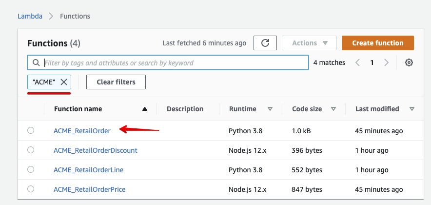

# Enable APM in the RetailOrder Function
## 1. Edit UID_RetailOrder Lambda in your AWS environment

To add APM to our lambda function, we need to got to the browser Tab with your lambda functions seclected in  the first excercise. or follow the original [Validate Lambda Functions](..//initial_run_env/#1-validate-availability-of-lambda-functions) instructions.
Once filtered with your **UID** you should have something like this:

{: .zoom}

Now select the Lambda Function **UID**_RetailOrder to open the browser based editor environment for Lambda functions.

{: .zoom}

Now scroll down so you have the full editor visible.

{: .zoom}

To enable APM, we need to import the Splunk SignalFx Lambda wrapper.
We already included this for you, but if you  can find the detaisl on how to set this up  yourself [here](https://github.com/signalfx/lambda-python){: target=_blank}
Secondly we also import the opentracing library, we will use this later to customize the span information we send to splunk's APM

Add the follow two line at the top of the file and add an empty line.

=== "RetailOrder Updates"

    ```text
    import signalfx_lambda
    import opentracing

    ```

Add the following two lines above the line stating ***def lambda_handler(event,context):***
This will enable the wrapper.

=== "RetailOrder Updates"

    ```text
    @signalfx_lambda.emits_metrics()
    @signalfx_lambda.is_traced()
    ```

 Verify that he top of the file look like this now:
 
 
=== "RetailOrder Updates"

    ```text
    import signalfx_lambda
    import opentracing

    import os
    import json
    import boto3
    import requests

    # The Environment Tag is used by Splunk APM to filter Environments in UI
    APM_ENVIRONMENT = os.environ['SIGNALFX_APM_ENVIRONMENT']
    PRICE_URL       = os.environ['PRICE_URL']
    ORDER_LINE      = os.environ['ORDER_LINE']

    # Define the client to interact with AWS Lambda
    client = boto3.client('lambda')

    @signalfx_lambda.emits_metrics()
    @signalfx_lambda.is_traced()
    def lambda_handler(event,context):
        print("event received :", event)
    ```
To save your work, you must press on the **Deploy**{: .label-button .label-button.AWS-orange} button above the editor as show here.

{: .zoom}

---

## 2. Order a phone again !

To
 Continue to the next section.