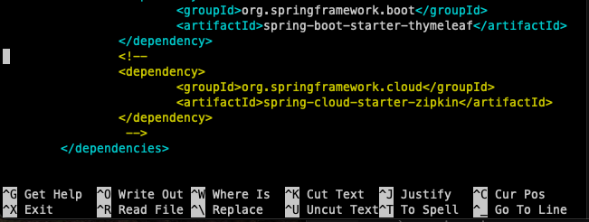
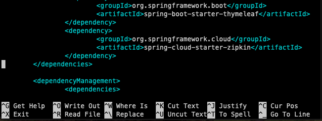

# Enable APM in the RetailOrder Function
## 1. Edit UID_RetailOrder Lambda in your AWS environment

To add APM to our lambda function, we need to got to the browser Tab with your lambda functions seclected in  the first excercise. or follow the original [Validate Lambda Functions](..//initial_run_env/#1-validate-availability-of-lambda-functions) instructions.
Once filtered with your **UID** you should have something like this:

{: .zoom}

Now select the Lambda Function **UID**_RetailOrder to open the browser based editor environment for Lambda functions.

 ****

{: .zoom}

This will bring you to the APM monitoring page, depending how many services you are currently monitoring with Splunk APM, you may or may not see a list of services.

Once you have run the applications with APM enabled, you can filter the environment by entering your unique id you have been provided. This should then show just your APM environment. 

{: .zoom}

So lets start enabling APM in our environment.

---

## 2. Update the settings in the spring boot app

To enable APM on the Spring boot application we need to update the FrameWork (pom.xml), update the application settings en add enable some lines in the code.

### 2.1 Update the FrameWork by updating POM.XML

Connect back into your EC2 instance and stop the running Spring boot application by pressing ++ctrl+c++. 

Once the application is stopped, open an editor and edit the pom.xml file
=== "Shell Command"

    ```text
    nano pom.xml
    ```

Scroll down until you find the following section
{: .zoom}

and remove the comment marks lines *(<-- & -->)* by placing the cursor on the line with the remark and press ++ctrl+k++

Afterwards the section will look like this:
{: .zoom}

Make sure the lines are properly aligned and save the file by pressing ++ctrl+o++ followed by ++enter++ to write the file pom.xml to disk.

You can now leave the nano editor by pressing ++ctrl+x++. This should bring you back to the command line.

### 2.2 Update the application property file

Edit the application property file of the springboot application in the nano editor by enter in the following command:
=== "Shell Command"

    ```text
    nano src/main/resources/application.properties
    ```

Remove the comment marks \#\# on the following 2 lines:
**\#\#spring.sleuth.sampler.probability=1.0**

**\#\#spring.zipkin.baseUrl=http://localhost:9080**


 Continue to the next section.