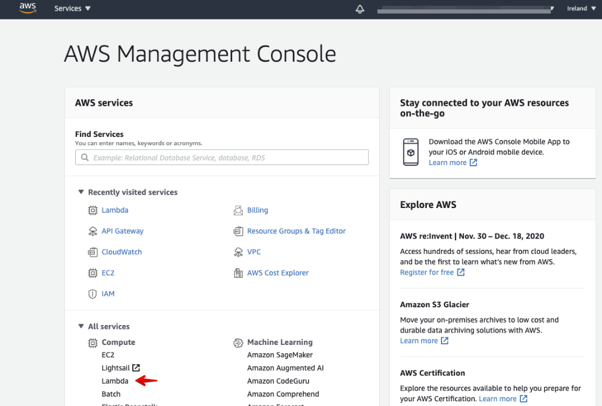
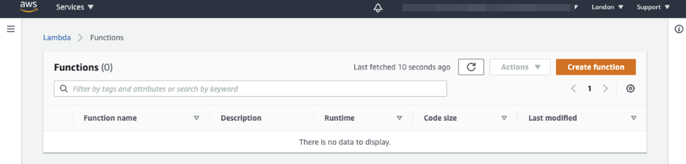
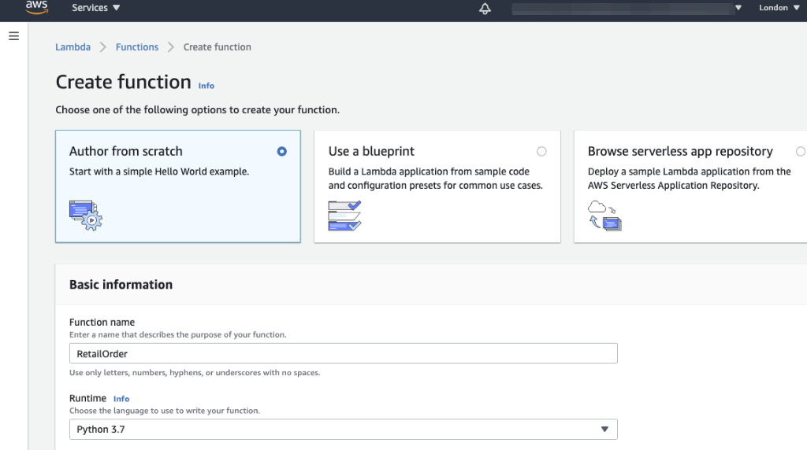

# Setting up your Initial Lambda

## 4. Create Initial Lambda
With the Security Role created, we now can create the first Lambda function we are going to use. 
To do this, Select the Lambda Service in the AWS management Console . 

{: .zoom}

This should bring you to the Lambda Function page:
{: .zoom}
For clarity we picked a region with no existing Lambda's but you can use any region.

In the AWS Lambda Function menu, Click the **Create function**{: .label-button  .AWS-yellow} button
to create the first Lambda.

For function name  please use **RetailOrder** 

!!! Note
    You can use another name if needed, just remember to replace the references to **RetailOrder** with yours where applicable.

For the runtime choose **Python 3.7**

{: .zoom}
